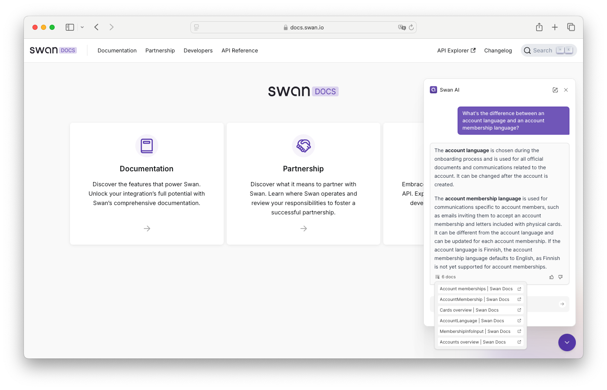

### New feature

🤖 **Try AI** on *docs.swan.io* for faster, comprehensive answers from the Documentation, API Reference, and Support Center.
**Ask questions in any language** and receive an answer with direct links to relevant sections make sure you're never lost.

### Improvements

💳  We upgraded the design and quality of our [standard black cards](/topics/cards/design/#black) with silver ink, recycled plastic, a sleek matte finish, and added particles to minimize scratches.

### Upcoming breaking change

⚠️ Starting on **November 28**, we’ll start enforcing [two required fields for ultimate beneficial owners](/topics/onboarding/company/#country-reqs-ubo) (UBO)—`direct` and `indirect`—for the mutations `onboardCompanyAccountHolder` and `createCapitalDepositCase`.