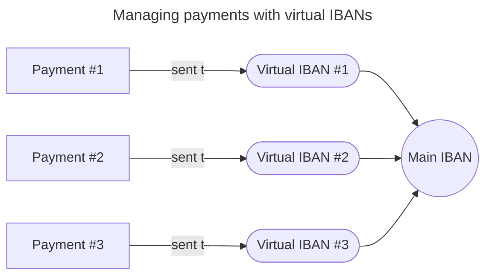

# About Swan

Hello

:::info
you can write information in here
:::

Graphs can be done using [Mermaid](https://mermaid.js.org/intro/)

```mermaid
---
title: Managing payments with virtual IBANs
---
flowchart LR
    A[Payment #1] --sent to--> B([Virtual IBAN #1])
    C[Payment #2] --sent to--> D([Virtual IBAN #2])
    E[Payment #3] --sent to--> F([Virtual IBAN #3])
    B & D & F --> G((Main IBAN))
```