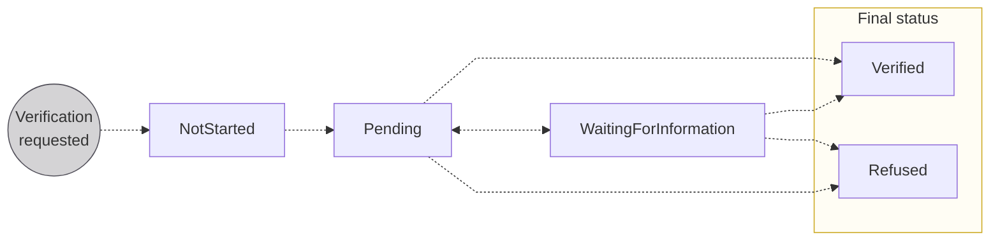

# Verification statuses

The lifecycle of <Term id="account-holder">account holder</Term> verification, from `NotStarted` through to a final `Verified` or `Refused`.

## Statuses {#statuses}

| Account holder verification status | Explanation |
|---|---|
| `NotStarted` | Verification process hasn't started yet. The account holder's legal representative needs to complete [identification](/users/concepts/identifications) before starting account holder verification. |
| `Pending` | Swan is reviewing the account holder's information before activating or refusing the account. |
| `WaitingForInformation` | Swan is waiting for information from the account holder, such as a [first transfer](/accounts/concepts/account-holders/first-transfer), [supporting documents](/accounts/concepts/documents), or something else. |
| `Verified` | Swan verified the account holder and the process is complete. |
| `Refused` | Swan won't onboard this account holder. |

## Waiting for information requirements {#waiting-for-info}

If the account holder verification status is `WaitingForInformation`, the account holder must meet one or more of the following requirements.
[Check the Dashboard or call the API](/accounts/guides/account-holders/get-verification-status) to learn which requirement they're missing.

| Requirement | Explanation |
| --- | --- |
| `FirstTransferRequired` | Account holder needs to send a [first transfer](/accounts/concepts/account-holders/first-transfer) to their Swan account. |
| `LegalRepresentativeDetailsRequired` | More information is required about the account's legal representative, or about the account member acting as the legal representative with Power of Attorney. |
| `OrganizationDetailsRequired` | More information is required about the organization. |
| `SupportingDocumentsRequired` | Provide the requested [supporting documents](/accounts/concepts/documents). |
| `TaxIdRequired` | Provide the Tax ID for both the account holder and the organization. |
| `UboDetailsRequired` | More information is required about the organization's ultimate beneficial owner or owners (UBO). |
| `Other` | Swan contacts your account holder directly about additional requirements. |

To see how the actors interact during verification, review the [sequence diagram](/accounts/concepts/account-holders/verification#verification-process-diagram) on the verification concept page.
