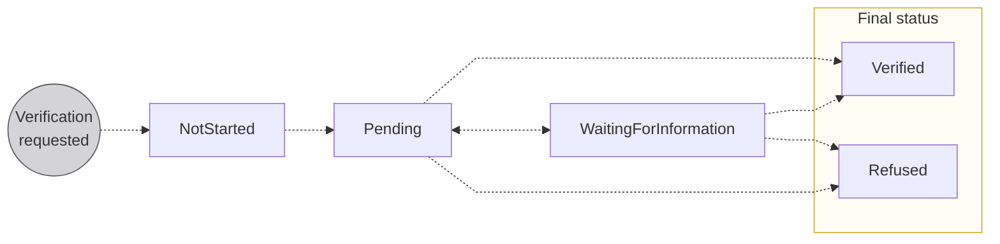
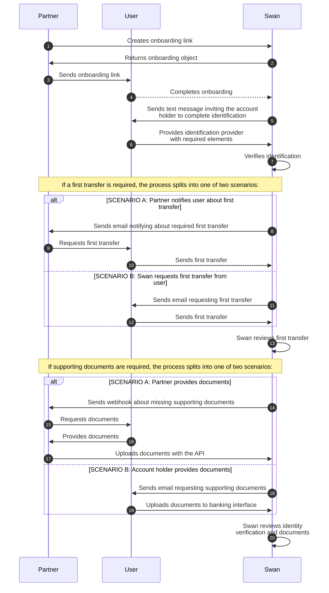

# Account holder verification

## Account holder verification process {#verification-process}

The verification process for a new account holder is thorough, and Swan provides a streamlined process through which each account holder proves they're who they claim to be.

Account holders can access their account immediately after creation.
However, while account holder verification is in progress, there are [limitations on the account](/accounts/concepts/account/type-and-level).
IBANs might be issued before limitations are removed from the account.

The account holder verification process can include the following elements:

1. **Onboarding**: Process is finalized for either an [**individual**](/accounts/guides/onboarding/individual) or a [**company**](/accounts/guides/onboarding/company), which creates a user, an account holder, an account, and an <Term id="account-membership">account membership</Term> linking the user to the account.
1. [**Identification**](/topics/users/identifications/): User that opened the [individual](/accounts/guides/onboarding/individual/requirements#identification-recommendations) or [company](/accounts/guides/onboarding/company/requirements#identification-recommendations) account completes identification with an ID document and a picture or video.
1. [**First transfer**](/accounts/concepts/account-holders/first-transfer): Users may need to send a first transfer to their new Swan account.
1. [**Document collection**](/accounts/concepts/documents): Swan collects required documents.
1. **Clarification**: Swan might contact the user to clarify details from onboarding, identification, or document collection.
1. **Review**: Swan reviews all provided elements.

After Swan **validates the review**, the account holder is verified and their account receives its primary IBAN.

### Statuses {#verification-process-statuses}

| Account holder verification status | Explanation |
|---|---|
| `NotStarted` | Verification process hasn't started yet. The account holder's legal representative needs to complete [identification](/topics/users/identifications/) before starting account holder verification. |
| `Pending` | Swan is reviewing the account holder's information before activating or refusing the account. |
| `WaitingForInformation` | Swan is waiting for information from the account holder, such as a [first transfer](/accounts/concepts/account-holders/first-transfer), [supporting documents](/accounts/concepts/documents), or something else. |
| `Verified` | Swan verified the account holder and the process is complete |
| `Refused` | Swan won't onboard this account holder |

### Waiting for information status {#waiting-for-info}

If the account holder verification status is `WaitingForInformation`, the account holder must meet one or more of the following requirements.
[Call the API](/accounts/guides/onboarding/account-holder-tasks#get-status) to learn which requirement they're missing.

| Requirement | Explanation |
| --- | --- |
| `FirstTransfer`   `Required` | Account holder needs to send a [first transfer](/accounts/concepts/account-holders/first-transfer) to their Swan account. |
| `LegalRepresentative`   `DetailsRequired` | More information is required about the account's legal representative, or about the account member acting as the legal representative with Power of Attorney. |
| `Organization`   `DetailsRequired` | More information is required about the organization. |
| `SupportingDocuments`   `Required` | Provide the requested [supporting documents](/accounts/concepts/documents). |
| `TaxId`   `Required` | Provide the Tax ID for both the account holder and the organization. |
| `UboDetails`   `Required` | More information is required about the organization's ultimate beneficial owner or owners (UBO). |
| `Other` | Swan contacts your account holder directly about additional requirements. |

## Verification sequence diagram {#verification-process-diagram}

This diagram **details a common flow** of how Swan, the account holder, and you interact during verification.
Note that the flow includes alternate scenarios (A or B) where the path is determined by your integration choices. Your final integration might flow differently.

