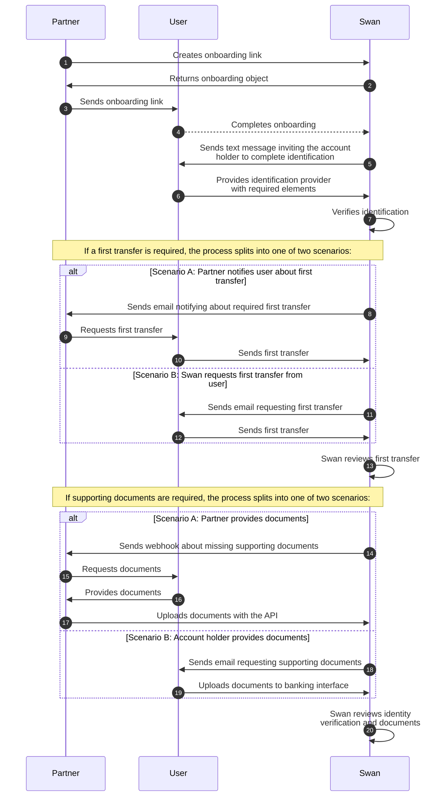

# Account holder verification

The verification process for a new <Term id="account-holder">account holder</Term> is thorough, and Swan offers a streamlined process through which each account holder proves they're who they claim to be.

Account holders can access their account immediately after creation.
But while account holder verification is in progress, there are [limitations on the account](/accounts/concepts/account/type-and-level).
<Term id="ibans">IBANs</Term> might be issued before limitations are removed from the account.

The account holder verification process can include the following elements:

1. **Onboarding**: Process is finalized for either an [**individual**](/accounts/guides/onboarding/individual) or a [**company**](/accounts/guides/onboarding/company), which creates a user, an account holder, an account, and an <Term id="account-membership">account membership</Term> linking the user to the account.
1. [**Identification**](/users/concepts/identifications): User who opened the [individual](/accounts/guides/onboarding/individual/requirements#identification-recommendations) or [company](/accounts/guides/onboarding/company/requirements#identification-recommendations) account completes identification with an ID document and a picture or video.
1. [**First transfer**](/accounts/concepts/account-holders/first-transfer): Users may need to send a first transfer to their new Swan account.
1. [**Document collection**](/accounts/concepts/documents): Swan collects required documents.
1. **Clarification**: Swan might contact the user to clarify details from onboarding, identification, or document collection.
1. **Review**: Swan reviews all provided elements.

After Swan **validates the review**, the account holder is verified and their account receives its primary IBAN.
Track progress with the [verification statuses](/accounts/concepts/account-holders/verification-statuses).

## Verification sequence diagram {#verification-process-diagram}

This diagram **details a common flow** of how Swan, the account holder, and you interact during verification.
The flow includes alternate scenarios (A or B) where the path is determined by your integration choices. Your final integration might flow differently.

```mermaid
sequenceDiagram
autonumber
participant P as Partner
participant U as User
participant S as Swan
    P ->> S: Creates onboarding link
    S ->> P: Returns onboarding object
    P ->> U: Sends onboarding link
    U -->> S: Completes onboarding
    S ->> U: Sends text message inviting the account<br/>holder to complete identification
    U ->> S: Provides identification provider<br/>with required elements
    S ->> S: Verifies identification

    note over P,S: If a first transfer is required, the process splits into one of two scenarios:
    alt Scenario A: Partner notifies user about first transfer
        S ->> P: Sends email notifying about required first transfer
        P ->> U: Requests first transfer
        U ->> S: Sends first transfer
    else Scenario B: Swan requests first transfer from user
        S ->> U: Sends email requesting first transfer
        U ->> S: Sends first transfer
    end
    S ->> S: Swan reviews first transfer

    note over P,S: If supporting documents are required, the process splits into one of two scenarios:
    alt Scenario A: Partner provides documents
        S ->> P: Sends webhook about missing supporting documents
        P ->> U: Requests documents
        U ->> P: Provides documents
        P ->> S: Uploads documents with the API
    else Scenario B: Account holder provides documents
        S ->> U: Sends email requesting supporting documents
        U ->> S: Uploads documents to banking interface
    end
    S ->> S: Swan reviews identity<br/>verification and documents
```
