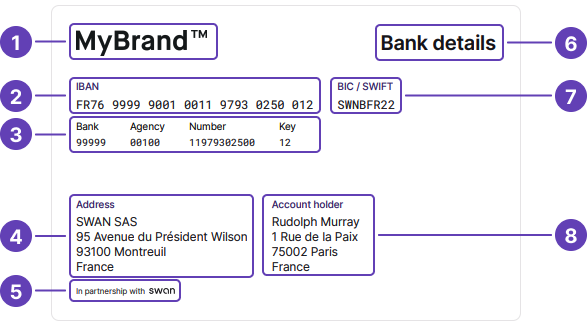

# Bank details document

You can [get a PDF with your bank details](/accounts/guides/account-operations/bank-details) using the API and from Swan's interfaces.
Bank details are available for main and virtual <Term id="ibans">IBANs</Term>.
In French, this document is called a **RIB**, or a *relevé d'identité bancaire*.

## Generation {#generation}

The PDF is generated automatically after the account's main IBAN is assigned, meaning the account must have the payment level `Unlimited` and the account type `PaymentService`.
Refer to the [account type and level section](/accounts/concepts/account/type-and-level) for more information about these values.

The automatic generation might take a few minutes.
The document is generated in the [account language](/accounts/concepts/account/language).
If an account's bank details document wasn't generated automatically, call the API to generate it.

## Contents {#contents}

Bank details documents include:

- Your logo
- Account's main IBAN
- Bank code
- Your company's information
- Disclaimer: "In partnership with Swan"
- Title of the document
- BIC/SWIFT code
- <Term id="account-holder">Account holder</Term>'s information

:::info Swan partnership disclaimer
The Swan partnership disclaimer is required because [Swan assumes responsibility](/get-started/become-a-partner/licence-regulatory-status#license) for all sensitive banking operations.
It's similar to the [statement printed on physical cards](/cards/concepts/design#standard) indicating that cards are issued by Swan.
:::

