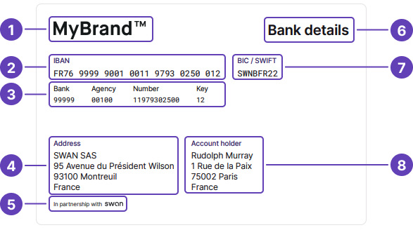

import TransactionStatements from '../../../topics/partials/_transaction-statements.mdx';

# Account documents

## Account statements {#account-statements}

Each month, Swan **generates account statements** automatically for **all Swan accounts** using Coordinated Universal Time +1 (UTC +1).
Statements include all `Booked` transactions from the previous month, ordered by [`sequenceNumber`](/topics/payments/#sequence-number).

Access account statements with the API by calling the `account` query and adding the `statement` object.
They're also available from your **Dashboard** > **Data** > **Accounts**, and, if you're using it, Swan's Web Banking interface.

Account statements are available in `.pdf` or `.csv` format by default.
Statements with **more than 10,000 transactions** are generated as `.csv` files, even if you request `.pdf`.

All account statements have a `period` attribute.

- If `period` = `Monthly`, Swan generated the statement.
- If `period` = `Custom`, the statement was generated following your request.

### Generating statements {#statements-generate}

You can [generate account statements](/accounts/guides/account-operations/generate-statement) for a period of up to **three months** with the `generateAccountStatement` mutation.
These statements always have `period` = `Custom`.

If you generate two statements with identical parameters (`language`, `openingDate`, `closingDate`), Swan only generates one statement.
For the second statement, Swan provides the link to the first statement generated.

If the `language` parameter changes, however, a new statement is generated in the updated language.

### Producing custom statements {#statements-custom}

You can also access the raw data and **produce custom statements**.

For example, you might:

- Need a provide a format Swan doesn't support.
- Want to customize the style.
- Prefer to use a different timezone than Central European [Summer] Time (CET/CEST).

Note that even if you use custom statements, Swan generates statements each month.
If audited, Swan's account statement is the official version.

:::caution Custom statement approval
As a regulated financial institution, account statements fall under compliance rules.
You might need to **get your custom statements approved**. Please work with your dedicated PIM (Product Integration Manager) before releasing a custom account statement.
:::

## Bank details document {#bank-details}

You can [get a PDF with your bank details](/accounts/guides/account-operations/bank-details) using the API and from Swan's interfaces.
Bank details are available for main and virtual IBANs.
In French, this document is called a **RIB**, or a *relevé d'identité bancaire*.

The PDF is generated automatically after the account's main IBAN is assigned, meaning the account must have the payment level `Unlimited` and the account type `PaymentService`.
Refer to the [account type and level section](/accounts/concepts/account/type-and-level) for more information about these values.

Note that the automatic generation might take a few minutes.
The document is generated in the [account language](/accounts/concepts/account/language).
If an account's bank details document wasn't generated automatically, call the API to generate it.

Bank details documents include:

1. Your logo.
1. Account's main IBAN.
1. Bank code.
1. Your company's information.
1. Disclaimer: "In partnership with Swan".
:::info Swan partnership disclaimer
The Swan partnership disclaimer is required because [Swan assumes responsibility](/get-started/become-a-partner/licence-regulatory-status#license) for all sensitive banking operations.
It's similar to the [statement printed on physical cards](/topics/cards/design/#standard) indicating that cards are issued by Swan.
:::

6. Title of the document.
1. BIC/SWIFT code.
1. Account holder's information.

## Transaction statements {#transaction-statements}

<TransactionStatements />

Refer to the [transactions section](/topics/payments/#transactions-statements) for more information.
