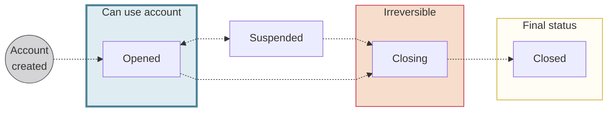

# Account statuses

Every Swan account moves through the following statuses over its lifetime.

## Status flow {#status-flow}

## Status definitions {#status-definitions}

| Status | Explanation |
| --- | --- |
| `Opened` | Account is open and can be used |
| `Suspended` | Swan can suspend an account if there's suspicion of fraud. While suspended, the account can't be used. This results in the following events:    1. All card payments are `Rejected`.   2. SEPA Credit Transfers:   &nbsp;&nbsp;&nbsp;&nbsp; ◦ Incoming Credit Transfers are `Accepted`.   &nbsp;&nbsp;&nbsp;&nbsp; ◦ Outgoing Credit Transfers are `Rejected`.   3. SEPA Direct Debits (SDD):   &nbsp;&nbsp;&nbsp;&nbsp; ◦ Incoming SDDs are `Booked`.   &nbsp;&nbsp;&nbsp;&nbsp; ◦ Outgoing SDDs are `Rejected` or `Returned` on the scheduled date.   4. Funds available in the account can't be used while Swan reviews the suspension.   5. Some previously authorized transactions are `Booked`.   6. For merchant accounts: received French check payments are `Returned`. |
| `Closing` | While an account is closing, the following events occur:  <ol><li>All cards are instantly canceled.</li><li>All virtual IBANs are instantly canceled.</li><li>All standing orders are instantly canceled.</li><li>Incoming SEPA Credit Transfers are automatically returned.</li><li>All payment mandates for incoming SEPA Direct Debits are canceled, and any attempted incoming SEPA Direct Debit is rejected.</li><li>Your users must cancel all outgoing SEPA Direct Debits. Swan has no control over those payment mandates.</li></ol>The account status remains `Closing` until:  <ul><li>The `Booked` balance is zero.∗</li><li>The last incoming SEPA Credit Transfer happened more than 30 days ago.</li><li>The last outgoing SEPA Credit Transfer happened more than 5 days ago.</li></ul> |
| `Closed` | For all `Closed` accounts, access and account statements remain available for one year through the API or with Swan's Web Banking interface. |

:::caution Remaining funds in Closing account ∗
As long as the `Booked` balance doesn't equal zero:

1. The account status can't pass from `Closing` to `Closed`.
1. The account holder can still log into their Swan Web Banking interface.
1. The account holder can send SEPA Credit Transfers.

If funds remain in a `Closing` account **after 10 years**, Swan transfers the funds to France's *Caisse des dépôts et consignations* (Deposits and Consignments Fund).
:::
