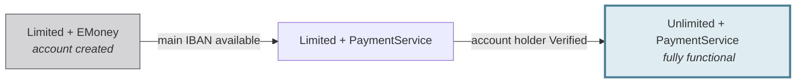

# Account type and level

Swan accounts are defined by a payment **level** and payment **account type**.
There are two possible values for each:

- [`PaymentLevel`](https://api-reference.swan.io/enums/payment-level) → `Limited` and `Unlimited`
- [`PaymentAccountType`](https://api-reference.swan.io/enums/payment-account-type/) → `EMoney` and `PaymentService`

Find an account's current payment level on your **Dashboard**: go to **Data** > **Accounts**, then click the account. The payment level is part of the account's general information.

Accounts start with the level `Limited` and the account type `EMoney`.
The level changes from `Limited` to `Unlimited` when the [account holder verification status](/accounts/concepts/account-holders/verification-statuses) changes to `Verified`.
The account type changes from `EMoney` to `PaymentService` when the [account's main IBAN](/accounts/concepts/ibans/main) is available to the <Term id="account-holder">account holder</Term>.
Accounts with the level `Unlimited` and the account type `PaymentService` are fully functional accounts.

## Level and type lifecycle {#lifecycle}

## Capabilities {#capabilities}

Swan accounts have different capabilities determined by the combination of these values.

| Level + Type | Capabilities |
| --- | --- |
| `Limited` + `EMoney` | <Yes /> The account can be used for certain actions, such as inviting account members and adding virtual cards.  <No /> Account holder verification isn't complete. <No /> The account's main IBAN isn't displayed. <No /> Payments can't be made from the account. |
| `Limited` + `PaymentService` | <Yes /> The account's main IBAN is displayed. <Yes /> Money can be added to the account.  <No /> Account holder verification isn't complete. <No /> Payments can't be made from the account. <No /> Incoming SEPA Credit Transfers exceeding €50 are automatically rejected. <No /> Maximum cumulative balance is €150. <No /> Incoming International Credit Transfers are automatically rejected regardless of amount. |
| `Unlimited` + `PaymentService` | <Yes /> Account holder verification status is `Verified`. <Yes /> Payments can be made from the account. <Yes /> The account's main IBAN is displayed. <Yes /> All account functions are possible. |

## Limited account transfer restrictions {#limited-account-restrictions}

`Limited` accounts are subject to incoming transfer restrictions to comply with regulations.

### Transfer amount restrictions {#transfer-amount-restrictions}

- Any incoming SEPA Credit Transfer (instant or regular) exceeding €50 received on a limited account is automatically rejected.
- Any incoming International Credit Transfer, regardless of its amount, received on a limited account is automatically rejected.

### Balance restrictions {#balance-restrictions}

A limited account can't receive more than €150 in SEPA Credit Transfers over its lifetime.
This means the cumulative sum of all incoming SEPA Credit Transfers can't exceed €150.
Swan rejects an incoming transfer that would cause this balance to exceed €150.

### Impact of fees {#impact-fees}

Swan fees don't count toward the €150 limit.
For example, if a user receives a €150 SEPA Credit Transfer and is charged a €2 Swan fee, their balance is €148.
Even though the fee reduced their balance, the €150 received counts toward their limit.
Swan automatically rejects any further transfers sent to the account.

These restrictions primarily impact the [first transfer](/accounts/concepts/account-holders/first-transfer) sent while the account holder completes verification.
