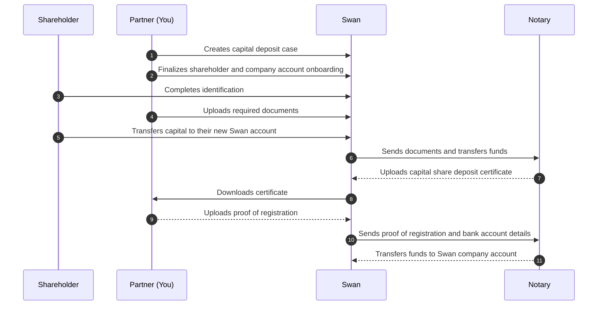

# Capital deposit process

A <Term id="capital-deposit">capital deposit</Term> involves four parties:

- **You**, the partner driving the integration.
- **Your client**: their future company and its [shareholders](/accounts/concepts/capital-deposits/shareholders).
- **Swan**, through the Swan API.
- Swan's partner **notary**.

Together we complete a few main actions, from opening the case to wiring the funds to the new company.

## Main actions {#actions}

```flowmap
{
  "mode": "pathway",
  "items": [
    { "type": "Guide", "title": "Create a capital deposit case", "to": "/accounts/guides/capital-deposits/create-case", "desc": "Open the case object that collects the company, accounts, shareholders, and documents." },
    { "type": "Guide", "title": "Create Swan accounts", "to": "/accounts/guides/onboarding", "desc": "Onboard the future company and each shareholder so they each get a Swan account." },
    { "type": "Concept", "title": "Verify identities", "to": "/accounts/concepts/account-holders/verification", "desc": "Each shareholder completes identification and account holder verification." },
    { "type": "Guide", "title": "Upload documents", "to": "/accounts/guides/capital-deposits/upload-documents", "desc": "Provide the required documents for the shareholders and the future company." },
    { "type": "Concept", "title": "Transfer funds", "to": "/accounts/concepts/capital-deposits/shareholders#transfer-requirements", "desc": "Each shareholder transfers their capital to their temporary Swan account." }
  ]
}
```

## Capital deposit case {#case}

The [`CapitalDepositCase`](https://api-reference.swan.io/objects/capital-deposit-case) API object is the spine of the process: it compiles everything for a single deposit.

- Details about the future company
- Company account
- [Shareholder](/accounts/concepts/capital-deposits/shareholders) information
- [Capital deposit documents](#documents)

The case moves through several [statuses](/accounts/concepts/capital-deposits/statuses), and a reason code explains any cancelation. See [case statuses](/accounts/reference/capital-deposits#case-statuses) and [cancelation reason codes](/accounts/reference/capital-deposits#cancelation-reason-codes).

## Required documents {#documents}

Processing a capital shares deposit **requires several documents** from shareholders and the future company, [uploaded with the API](/accounts/guides/capital-deposits/upload-documents). A document that doesn't meet Swan's requirements is assigned the status `Refused` and must be uploaded again. See the [list of required documents](/accounts/reference/capital-deposits#documents-list) and [document statuses](/accounts/reference/capital-deposits#documents-statuses).

## Sequence diagram {#diagram}

The full choreography between you, the shareholders, Swan, and the notary, from creating the case to the notary transferring funds to the company account:


