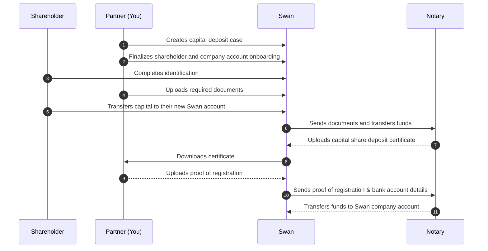

# Capital deposit process

Several key stakeholders are involved in the <Term id="capital-deposit">capital deposit</Term> process: **you**; **your client**, their future company, and their shareholders; **Swan** (and Swan's API); and Swan's partner **notary**.

The capital deposit process consists of a few main actions:

- Creating a Swan capital deposit case to collect everything
- Creating Swan accounts
- Verifying identities
- Uploading documents
- Transferring funds

## Capital deposit case {#case}

The [`CapitalDepositCase`](https://api-reference.swan.io/objects/capital-deposit-case) API object compiles all information for a capital deposit case, including:

1. Details about the future company
1. Company account
1. Shareholder information
1. Capital deposit documents

A capital deposit case moves through several statuses, and a reason code explains any cancelation. See [case statuses](/accounts/reference/capital-deposits#case-statuses) and [cancelation reason codes](/accounts/reference/capital-deposits#cancelation-reason-codes).

## Required documents {#documents}

Processing a capital shares deposit **requires several documents** from shareholders and the future company, uploaded with the API. A document that doesn't meet Swan's requirements is assigned the status `Refused` and must be uploaded again. See the [list of required documents](/accounts/reference/capital-deposits#documents-list) and [document statuses](/accounts/reference/capital-deposits#documents-statuses).

## Sequence diagram {#diagram}

