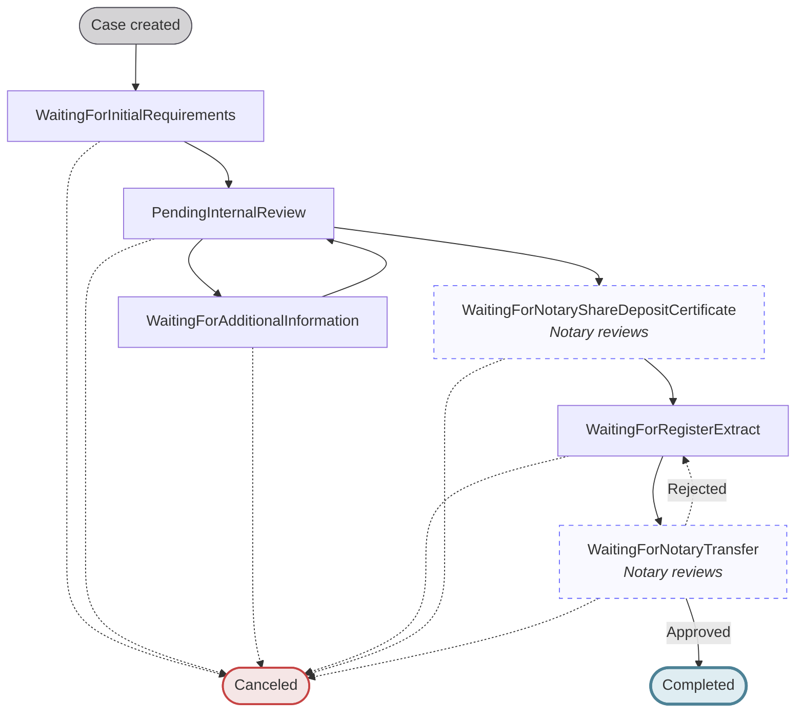
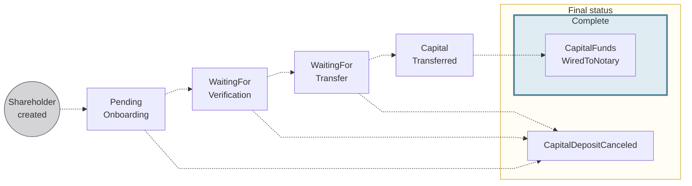
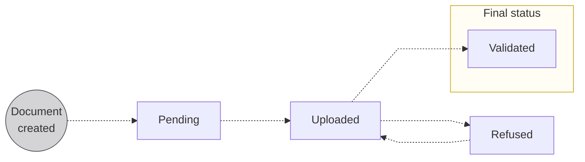

# Capital deposit statuses

A <Term id="capital-deposit">capital deposit</Term> tracks three interlocking state machines: the **case**, each **shareholder**, and each **document**. They advance together, and the case status reflects where the whole deposit stands.

## The three status machines {#machines}

The case is the master clock for the whole deposit: it can't pass a step until the shareholders and documents it depends on are ready.

## Case statuses {#case}

The [`CapitalDepositCase`](https://api-reference.swan.io/objects/capital-deposit-case) status paces the whole deposit. It moves from initial requirements through Swan's review and the notary steps to `Completed`, or to `Canceled` at any point.

| Case status | Explanation |
| --- | --- |
| `WaitingForInitialRequirements` | The case has been initiated and is waiting for shareholder verification, fund transfers, document uploads, and completion of company onboarding. |
| `PendingInternalReview` | Swan is reviewing the information and documents provided. |
| `WaitingForAdditionalInformation` | After review, Swan has requested additional details or corrections from the customer and is awaiting their response. |
| `WaitingForNotaryShareDepositCertificate` | **Notary reviews** the deposited funds and submitted documents, then creates the certificate and uploads it to Swan. |
| `WaitingForRegisterExtract` | The end-user uploads their register extract for notary review. |
| `WaitingForNotaryTransfer` | **Notary reviews** the register extract. If the document is rejected by either Swan or the notary, the case will move back to `WaitingForRegisterExtract`. |
| `Canceled` | The case was canceled before completion by either you or Swan. A [cancelation reason code](/accounts/reference/capital-deposits#cancelation-reason-codes) is available in the `CapitalDepositCaseCanceledStatusInfo` type. |
| `Completed` | Notary reviewed and approved all elements and transferred the funds to the new company; the process is complete. |

## Shareholder statuses {#shareholders}

Each [shareholder](/accounts/concepts/capital-deposits/shareholders) carries their own status reflecting how far they've onboarded and transferred funds: from `PendingOnboarding`, through verification and transfer, to `CapitalFundsWiredToNotary`. The case only completes once every shareholder reaches that final state.

| Shareholder status | Explanation |
| --- | --- |
| `PendingOnboarding` | Default status after the shareholder is created; shareholder must **complete their onboarding** and their **account must be created** to continue. |
| `WaitingForVerification` | Possible status if the account holder verification isn't complete at the moment the shareholder's account is created.  Status bypassed if the [account holder status](/accounts/concepts/account-holders/verification) is already `Verified`. |
| `WaitingForTransfer` | Waiting for the shareholder to deposit the full share capital in their Swan account created during onboarding, which **must** be transferred from an account belonging to the shareholder. The transfer must be a [SEPA Credit Transfer](/accounts/concepts/capital-deposits/shareholders#transfer-requirements); international credit transfers aren't accepted and are rejected automatically. |
| `CapitalTransferred` | Waiting for the rest of the capital deposit case to be ready and the funds to be transferred to the notary. |
| `CapitalFundsWiredToNotary` | Still waiting for the rest of the capital deposit case to be ready, but now the funds are with the notary. |
| `CapitalDepositCanceled` | When a [`CapitalDepositCase` is `Canceled`](#case), the shareholder status changes to `CapitalDepositCanceled`.  If an account was already created for the shareholder, the account is also closed automatically. |

## Document statuses {#documents}

Each required document moves from `Pending` to `Uploaded`, then to `Validated` or `Refused`. A `Refused` document must be re-uploaded before the case can move forward.

| Document status | Explanation |
| --- | --- |
| `Pending`   | Place for the document is created, but the document isn't uploaded yet. |
| `Uploaded`  | Document successfully uploaded; you can change and re-upload the document as long as it retains the status `Uploaded`.  **Next step**: Swan reviews the document and either validates or refuses it. |
| `Validated` | Swan validated the document. |
| `Refused`   | Document doesn't meet requirements. Review `reasonCode` for a refusal category and the optional `reason` for a plain-text explanation. Both are visible on your Dashboard and available through the API.  **Next step**: Upload a new document, then the status returns to `Uploaded`. |

## How statuses cascade {#cascade}

The three models aren't independent. Beyond the forward gating between the [case](#case), [shareholders](#shareholders), and [documents](#documents), the dependency also runs in reverse: when a `CapitalDepositCase` is `Canceled`, every shareholder status flips to `CapitalDepositCanceled`, and any temporary account already opened for a shareholder is closed automatically.
