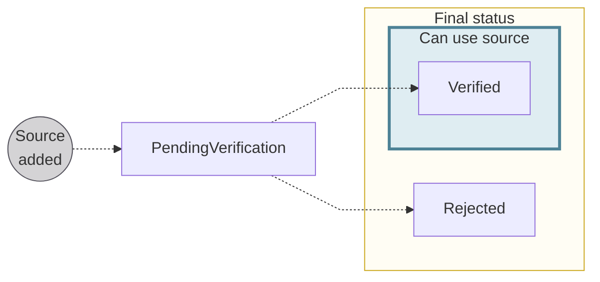

# Account verification for funding sources {#account-verification}

Swan is required to confirm that an <Term id="account-holder">account holder</Term> or eligible account member has access to the external account they'd like to use to fund a Swan account.
Swan refers to this process as account verification for funding sources.

:::note
Account verification for funding sources **isn't related** to [account holder verification status](/accounts/concepts/account-holders/verification#verification-process-statuses) used during account onboarding, or the general [account status](/accounts/concepts/account/statuses).
:::

## Account verification statuses {#account-verification-statuses}

| Account verification status | Explanation |
|:---:|---|
| `PendingVerification` | The funding source was added, and account verification for the funding source is in progress.  *Please note that the funding source status can be `Enabled` even if the account verification status is `PendingVerification`.* |
| `Verified` | Swan verified that the external account used for funding is accessible to the account holder or eligible account member funding the Swan account. This typically means that a first account funding attempt was successful. |
| `Rejected` | Swan couldn't verify that the external account used for funding is accessible to the account holder or eligible account member funding the Swan account. |

*API Reference: [`AccountVerificationStatusInfo`](https://api-reference.swan.io/interfaces/account-verification-status-info)*
