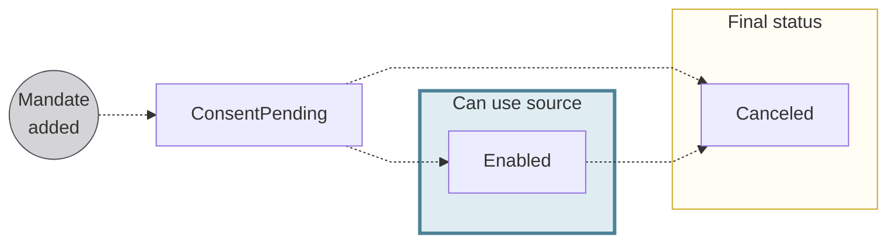

import PaymentMandateDefinition from '../../../topics/definitions/_payment-mandate.mdx';

# Payment mandates {#mandates}

> <PaymentMandateDefinition />

For account funding, the Swan <Term id="account-holder">account holder</Term> or eligible account member gives Swan explicit permission to pull money from their non-Swan account.
For SEPA Direct Debit B2B the signed payment mandate or payment mandate information must be declared to the user's non-Swan banking institution.

Consenting to the direct debit mandate updates the status to `Enabled` for both the mandate and the funding source.

## Signing payment mandates {#mandates-signature}

The Swan account holder or eligible account member consents to the account funding source payment mandate through [Strong Customer Authentication (SCA)](/topics/users/consent/#sca).
Swan takes the SCA validation time as the `signatureDate` for the payment mandate.

## Payment mandate statuses {#mandates-statuses}

| Payment mandate status | Explanation |
| :---: |---|
| `ConsentPending` | Payment mandate was added while [adding a direct debit funding source](/accounts/guides/funding/add-source) with the `addDirectDebitFundingSource` mutation.  **Next steps**: <ul><li>If the debtor consents to the mandate, the status moves to `Enabled`.</li><li>If the debtor doesn't consent, the status remains `ConsentPending`.</li></ul> |
| `Enabled` | Payment mandate is active and valid, and the corresponding funding source (if also `Enabled`) can be used to fund the account.  *The account holder or eligible account member **must declare** the payment mandate to their debtor institution.*  |
| `Canceled` | When a funding source is `Canceled`, the associated payment mandate status also changes to `Canceled`. |
| `Rejected` | The `Rejected` status isn't used for account funding. |

*API Reference: [`PaymentMandateStatusInfo`](https://api-reference.swan.io/interfaces/payment-mandate-status-info)*
