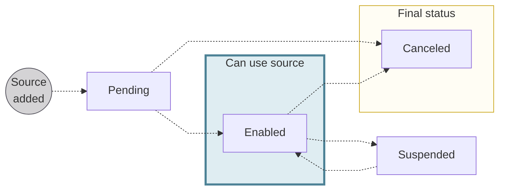

# Funding sources {#sources}

Fund a Swan account with SEPA Direct Debit B2B.
You can also use credit transfers.

:::info Credit transfers
Funding your account with a credit transfer is straightforward with no risk.
You can use any type of [credit transfer](/topics/payments/credit-transfers/) supported by Swan.
When funding an account with a credit transfer, a `SepaCreditTransferIn` transaction with the status `Booked` appears on your transaction history.
:::

## SEPA Direct Debit B2B {#methods-dd}

You can fund your account with one pull option: SEPA Direct Debit B2B (business-to-business).
SEPA Direct Debit B2B can only be used to fund company accounts, and no refunds are authorized for this funding source.

There are several steps to fund an account with SEPA Direct Debit B2B:

1. Add the SEPA Direct Debit B2B funding source.
1. Consent to adding the funding source.
1. Get the payment mandate with the API.
1. Declare the payment mandate to the external account provider.
1. Initiate an account funding payment request.

[Add a SEPA Direct Debit B2B funding source](/accounts/guides/funding/add-source) discusses steps 1-4 in detail.
For more information about step 5, refer to the guide to [initiate a funding request](/accounts/guides/funding/initiate-request).

:::caution SDD Core
SEPA Direct Debit Core isn't supported for account funding.
:::

## Funding source statuses {#funding-source-statuses}

| Funding source status | Explanation |
|:---:|---|
| `Pending` | A SEPA Direct Debit B2B funding source was added with the API mutation `addDirectDebitFundingSource`, but consent hasn't been received yet. |
| `Enabled` | The account funding source is consented to and can be used. |
| `Suspended` | Swan can suspend a funding source if there's suspicion of fraud. While suspended, the funding source can't be used. |
| `Canceled` | The account funding source is canceled and no longer available for use. Swan account holders and eligible account members can cancel a funding source. The associated payment mandate is also `Canceled`. |

*API Reference: [`FundingSourceStatusInfo`](https://api-reference.swan.io/interfaces/funding-source-status-info)*
