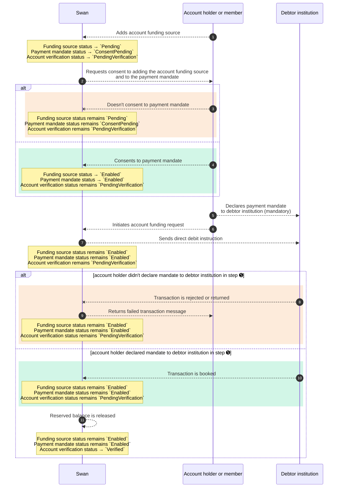

# Interaction between statuses {#status-interaction}

Account funding involves three distinct statuses: [funding sources](/accounts/concepts/funding/sources#funding-source-statuses), [payment mandates](/accounts/concepts/funding/payment-mandates#mandates-statuses), and [account verification](/accounts/concepts/funding/account-verification#account-verification-statuses).

## Sequence diagram

Review the following sequence diagram to understand how statuses interact with each other.
Note one key action for the <Term id="account-holder">account holder</Term> or eligible account member: they **must declare the <Term id="payment-mandate">payment mandate</Term>** to their debtor institution ➎.

