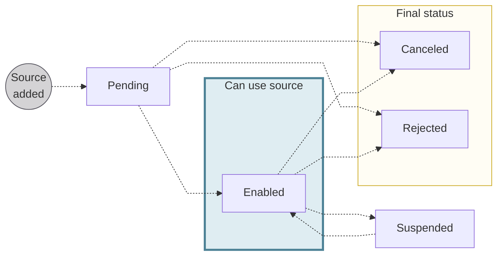
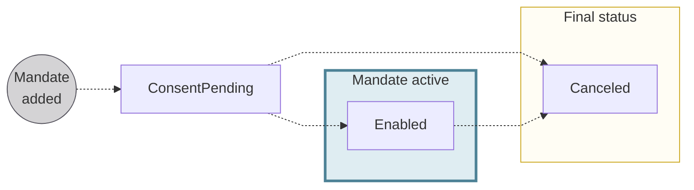
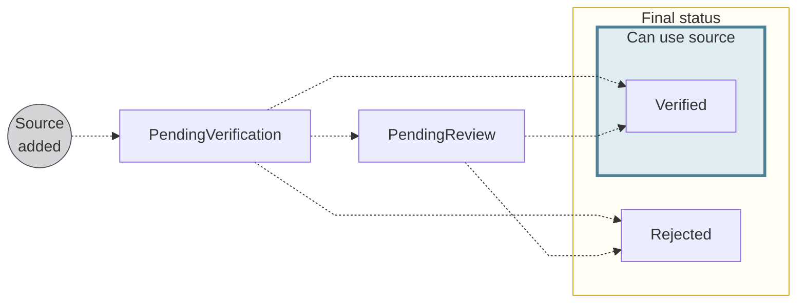

# Account funding statuses

<Term id="account-funding">Account funding</Term> tracks three status machines that move together: the funding source, its payment mandate, and account verification.
For how the three interact, review the [status interaction](/accounts/concepts/funding/status-interaction) concept.

## Funding source statuses {#funding-source-statuses}

| Funding source status | Explanation |
|:---:|---|
| `Pending` | A SEPA Direct Debit B2B funding source was added with the API mutation `addDirectDebitFundingSource`, but consent hasn't been received yet.  **Next steps**:<ul><li>If the account holder consents, the status moves to `Enabled`.</li><li>If the funding source is canceled, the status moves to `Canceled`.</li><li>If account verification is rejected, the status moves to `Rejected`.</li></ul> |
| `Enabled` | The account funding source is consented to and can be used.  **Next steps**:<ul><li>If there's suspicion of fraud, Swan can suspend the funding source and the status moves to `Suspended`.</li><li>If the funding source is canceled, the status moves to `Canceled`.</li><li>If account verification is rejected, the status moves to `Rejected`.</li></ul> |
| `Suspended` | Swan can suspend a funding source if there's suspicion of fraud. While suspended, the funding source can't be used.  **Next steps**: If Swan lifts the suspension, the status returns to `Enabled`. |
| `Canceled` | The account funding source is canceled and no longer available for use. Swan account holders and eligible account members can cancel a funding source. The associated payment mandate is also `Canceled`. |
| `Rejected` | The funding source was rejected because [account verification](/accounts/concepts/funding/account-verification) was rejected (reason code `AccountVerificationRejected`). The funding source can't be used. |

*API Reference: [`FundingSourceStatusInfo`](https://api-reference.swan.io/interfaces/funding-source-status-info)*

## Payment mandate statuses {#mandates-statuses}

| Payment mandate status | Explanation |
| :---: |---|
| `ConsentPending` | Payment mandate was added while [adding a direct debit funding source](/accounts/guides/funding/add-source) with the `addDirectDebitFundingSource` mutation.  **Next steps**: <ul><li>If the account holder consents to the mandate, the status moves to `Enabled`.</li><li>If the account holder doesn't consent, the status remains `ConsentPending`.</li><li>If the funding source is canceled, the status moves to `Canceled`.</li></ul> |
| `Enabled` | Payment mandate is active and valid, and the corresponding funding source (if also `Enabled`) can be used to fund the account.  The account holder or eligible account member must declare the payment mandate to their debtor institution.  **Next steps**: If the funding source is canceled, the status moves to `Canceled`. |
| `Canceled` | When a funding source is `Canceled`, the associated payment mandate status also changes to `Canceled`. |

The `PaymentMandateStatus` enum also includes `Rejected`, which isn't used for account funding.

*API Reference: [`PaymentMandateStatusInfo`](https://api-reference.swan.io/interfaces/payment-mandate-status-info)*

## Account verification statuses {#account-verification-statuses}

| Account verification status | Explanation |
|:---:|---|
| `PendingVerification` | The funding source was added, and account verification for the funding source is in progress.  The funding source status can be `Enabled` even if the account verification status is `PendingVerification`.  **Next steps**:<ul><li>If Swan matches the first funding attempt to the external account automatically, the status moves to `Verified`.</li><li>If Swan can't match it automatically, the status moves to `PendingReview`.</li><li>If verification fails, the status moves to `Rejected`.</li></ul> |
| `PendingReview` | Swan couldn't automatically match the external account's IBAN from the last received transfer, and a manual review is underway.  **Next steps**: Moves to `Verified` or `Rejected` after the review. |
| `Verified` | Swan verified that the external account used for funding is accessible to the account holder or eligible account member funding the Swan account. This typically means that a first account funding attempt was successful. |
| `Rejected` | Swan couldn't verify that the external account used for funding is accessible to the account holder or eligible account member funding the Swan account. |

*API Reference: [`AccountVerificationStatusInfo`](https://api-reference.swan.io/interfaces/account-verification-status-info)*
