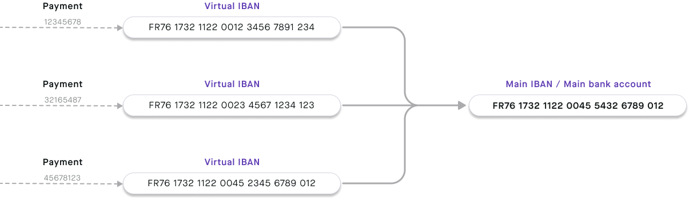

import IbanDefinition from '../../topics/definitions/_iban.mdx';

# IBANs

Swan provides main and virtual IBANs that account holders use to send and receive SEPA payments, with local country prefixes available across several markets.

## Overview {#overview}

<IbanDefinition />

With IBANs, you can send and receive SEPA Credit Transfers and SEPA Direct Debit transactions.

Swan provides two types of IBANs:

- **Main IBANs**: Each Swan account is assigned a single primary IBAN.
- **Virtual IBANs**: Swan accounts can add an unlimited number of virtual IBANs.

Additionally, Swan IBANs begin with one of several country prefixes, making them **local** to those countries.

### Verifying IBANs

Swan [verifies specific beneficiary IBANs](/topics/payments/credit-transfers/sepa/#beneficiary-verification) to help reduce errors and potential fraud.

Additionally, the **format** of your IBANs must be correct when you use them with Swan's API.
Use the `ibanValidation` query the confirm that your [IBAN follows the expected format](/accounts/guides/ibans/validate).

## Main IBANs {#main}

Every Swan account has one main IBAN.
All virtual IBANs are connected to the main IBAN.

When the `PaymentAccountType` changes from `EMoney` to `PaymentService`, it means the account's main IBAN is displayed.
Note that the account's `PaymentLevel` can be `Limited` even if the main IBAN is available.
Learn more about `PaymentAccountType` and `PaymentLevel` in the [accounts overview section](/accounts/concepts/account/type-and-level).

## Local IBAN details {#local}

Local IBANs aren't a different type of IBAN, but rather a **characteristic** of main (and virtual) IBANs.
With local IBANs, you can choose—within regulations—the country prefix for your Swan IBANs.

The country prefix for local IBANs is determined by the [account country](/accounts/concepts/account/country).
Swan must comply with different requirements depending on local laws.
Bank Identifier Codes (BIC) are also unique to each account country.

Local IBANs are available for the following countries.
Refer to [Swan's public roadmap](https://swanio.notion.site/Swan-Public-Roadmap-385e4b2e91b3409786a6c8e885654a22) to see which local IBANs are on the way.

<Tabs>
<TabItem value="france" label="🇫🇷 France">

#### France → IBAN: `FR76 1732 8844 00XX XXXX XXXX XYY` | BIC: `SWNBFR22`

French IBANs consist of 34 letters and numbers. 
Each set of characters represents a different account detail.

| Character set | Explanation |
| ---: | :--- |
| **FR** | France's country code |
| **76** | Check digits |
| **17328** | Swan's French bank code |
| **84400** | Swan's French branch code for main IBANs (virtual IBANs: **89900**) |
| **XXXX XXXX X** | 11-digit account number (not applicable for virtual IBANs) |
| **YY** | Two-digit RIB key RIB, or *relevé d'identité bancaire*, are [Swan's bank details PDF](/accounts/concepts/account/documents#bank-details) |
| **SWNBFR22** | Swan's French Bank Identifier Code (BIC) |

</TabItem>

<TabItem value="belgium" label="🇧🇪 Belgium">

#### Belgium → IBAN: `BEYY ZZZZ XXXX XXYY` | BIC: `SWNBBE22`

Belgian IBANs consist of 16 letters and numbers. 
Each set of characters represents a different account detail.

| Character set | Explanation |
| ---: | :--- |
| **BE** | Belgium's country code |
| **YY** | Check digits |
| **ZZZZ** | Swan's Belgian bank code for main IBANs (virtual IBANs: different bank code) |
| **XXXX XX** | Account number (not applicable for virtual IBANs) |
| **YY** | Check digits |
| **SWNBBE22** | Swan's Belgian Bank Identifier Code (BIC) |

</TabItem>

<TabItem value="germany" label="🇩🇪 Germany">

#### Germany → IBAN: `DEYY 1001 4000 XXXX XXXX XX` | BIC: `SWNBDEBB`

German IBANs consist of 22 letters and numbers. 
Each set of characters represents a different account detail.

| Character set | Explanation |
| ---: | :--- |
| **DE** | Germany's country code |
| **YY** | IBAN check digits |
| **1001 4000** | Swan's German bank code for main IBANs (virtual IBANs: **1001 4001**) |
| **XXXX XXXX XX** | 10-digit account number (not applicable for virtual IBANs) |
| **SWNBDEBB** | Swan's German Bank Identifier Code (BIC) |

</TabItem>

<TabItem value="italy" label="🇮🇹 Italy">

#### Italy → IBAN: `ITXX Y368 3201 600X XXXX XXXX XXX` | BIC: `SWNBITM2`

Italian IBANs consist of 27 letters and numbers. 
Each set of characters represents a different account detail.

| Character set | Explanation |
| ---: | :--- |
| **IT** | Italy's country code |
| **XX** | IBAN check digits |
| **Y** | Italian national check code |
| **368 32** | Swan's Italian bank code (ABI code). ABI, or *Associazione Bancaria Italiana*, is the official Italian Bank Code |
| **01600** | Swan's Italian branch code for main IBANs (virtual IBANs: **01601**) |
| **X XXXX XXXX XXX** | 12-digit account number (not applicable for virtual IBANs) |
| **SWNBITM2** | Swan's Italian Bank Identifier Code (BIC) |

</TabItem>

<TabItem value="netherlands" label="🇳🇱 Netherlands">

#### Netherlands → IBAN: `NLYY SWNB ZXXX XXXX XX` | BIC: `SWNBNL22`

Dutch IBANs consist of 18 letters and numbers. 
Each set of characters represents a different account detail.

| Character set | Explanation |
| ---: | :--- |
| **NL** | Netherland's country code |
| **YY** | IBAN check digits |
| **SWNB** | Swan's bank code |
| **Z** | IBAN type (1-4: main IBAN; 5-9: virtual IBAN) |
| **XXX XXXX XX** | 10-digit account number (not applicable for virtual IBANs) |
| **SWNBNL22** | Swan's Dutch Bank Identifier Code (BIC) |

</TabItem>

<TabItem value="spain" label="🇪🇸 Spain">

#### Spain → IBAN: `ESYY 6724 8440 ZZXX XXXX XXXX` | BIC: `SWNBESB2`

Spanish IBANs consist of 24 letters and numbers. 
Each set of characters represents a different account detail.

| Character set | Explanation |
| ---: | :--- |
| **ES** | Spain's country code |
| **YY** | IBAN check digits |
| **6724** | Swan's Spanish bank code |
| **8440** | Swan's Spanish branch code for main IBANs (virtual IBANs: **8990**) |
| **ZZ** | Bank check digits |
| **XX XXXX XXXX** | 10-digit account number (not applicable for virtual IBANs) |
| **SWNBESB2** | Swan's Spanish Bank Identifier Code (BIC) |

</TabItem>
</Tabs>

## Virtual IBANs {#virtual}

You can create multiple virtual IBANs for one account, which can be used to accept payments.
Differentiate between main and virtual IBANs thanks to different branch codes.
Note that virtual IBANs can't be used to make payments.

Add virtual IBANs from your **Dashboard** > **Account** > **Virtual IBANs**, or with the [API](/accounts/guides/ibans/add-virtual). 
To add virtual IBANs, `PaymentAccountType` must be `PaymentService` and the `PaymentLevel` must be `Unlimited`.
Virtual IBANs can be canceled, but they can't be suspended.

View an account's virtual IBANs on your **Dashboard** > **Data** > **Accounts** > **Virtual IBANs**, or with the API by querying `account` > `virtualIbanEntries`.
If you use [Swan's Web Banking frontend](https://swan-io.github.io/swan-partner-frontend/specs/banking/account#virtual-ibans), your users can view their virtual IBANs on **Account** > **Virtual IBANs**.

Account holders can use virtual IBANs to receive SEPA Credit Transfers and to set up outgoing SEPA Direct Debit transactions.

 

:::note Example
Use virtual IBANs to make paying invoices with credit transfers smoother by providing a different virtual IBAN to each client. You'll know exactly who is paying you, plus when and how much, simplifying reconciliation.
:::
