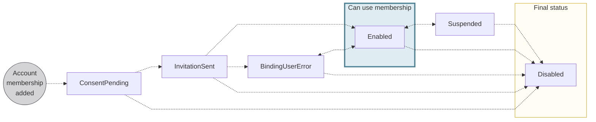
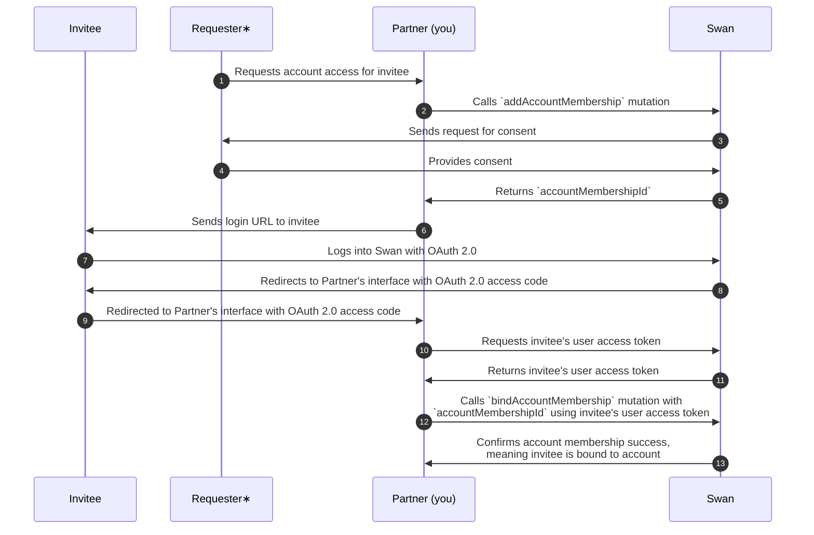

# Account memberships

> Representation of the rights, also referred to as access and permissions, of Swan users to an account.
> While location is restricted for account *holders*, accounts *members* can be located anywhere in the world.

## Overview {#overview}

The Swan user who performs the account's onboarding is the first account member and becomes the **account's legal representative**.
All Swan accounts have at least one account member: the legal representative.
The legal representative can grant other Swan users permission to perform certain actions for the account; each of these users is an **account member**.

:::info Consider a real-life example
A grandparent wants their grandchild to have access to an account to purchase groceries.
The grandparent is the legal representative (and an account member), and the grandchild is an account member.
:::

### Inviting members {#invite}

The invitation process allows you to grant account access to new users. When you invite someone to become an account member, they receive an email notification asking them to accept the invitation and bind their Swan user to their account membership in order to grant access to the account on which you invited them.

You can invite account members by phone number or by verified email.
Use the API to add one membership or multiple memberships.
If you use Swan's Web Banking interface, your users can [invite members](https://support.swan.io/hc/en-150/articles/17648698750877-Add-a-member-to-your-account) directly from the app.

**Invitation flow**:

1. A user with an account membership (the inviter) with the `canManageAccountMembership` permission creates a new account membership (for the invitee) using the API or our Web Banking interface.
1. The new membership is created with the status `ConsentPending` or `InvitationSent`, depending on whether consent is required.
1. We send an email invitation to the invited member (depending on your [notification configuration](#notifications)).
1. The invited member clicks the link in the email, signs in or signs up to Swan, and accepts the invitation.
1. The user is bound to the account membership and the status changes to `Enabled` or `BindingUserError`.

| Method | Explanation |
| --- | --- |
| Inviter provides phone number and email | <ul><li>Account member's mobile SIM card serves as the [authentication factor](/dev-tools/using-api/authentication#url-parameters-optional).</li><li>Account member can be assigned all [membership permissions](/accounts/reference/membership-permissions#permissions).</li><li>Swan confirms the member's phone number during the [sign-up process](/topics/users/#signup).</li></ul> |
| Inviter provides email only | <ul><li>Account member's verified email serves as the [authentication factor](/dev-tools/using-api/authentication#url-parameters-optional). The membership isn't enabled until user verifies their email.</li><li>Account member can only be assigned the `canViewAccount` and `canManageCards` [memberships permissions](/accounts/reference/membership-permissions#permissions).</li><li>Swan confirms the member's email during the [sign-up process](/topics/users/#signup).</li><li>Swan collects the user's phone number during the sign-up process so the member can perform sensitive operations such as initiating payments, ordering cards, and viewing sensitive card information.</li></ul> |

### Company accounts {#company-members}

Account memberships are **especially useful for company accounts**.
The legal representative grants permissions to other employees.
Employees can then manage their own payments, such as software or sales expenses, independently.
The company's accountant can use their membership to access account statements.
With enough permissions, managers can add cards for their team.
How you use account memberships and the corresponding permissions is up to you—the possibilities are almost endless to fulfill your use case.

### Unlimited memberships {#unlimited-memberships}

Swan users can have memberships to an **unlimited** number of Swan accounts.

Consider the following example, where Sasha Oliveira has account memberships to accounts for MyBrand and eFounders.
Based on their [membership permissions](/accounts/reference/membership-permissions#permissions), Sasha can access and manage memberships for both accounts, but only manage cards for one.

## Changing the account administrator {#admin-change}

For company accounts, Swan provides a dedicated process to change the account administrator: the account membership holding the legal representative capacity.
The account administrator change applies to all accounts belonging to the same account holder.

This process is useful when:

- The current administrator leaves the company.
- An internal reorganization changes who manages the accounts.
- A general assembly or board decision appoints a new administrator.

Swan's KYC team reviews the change request and, once approved, sets the new administrator as the legal representative on all of the account holder's accounts.

:::info
Account administrator changes are only available for company account holders with a `Verified` verification status.
Individual accounts and self-employed account holders aren't eligible.
:::

Refer to the dedicated [account administrator change](/accounts/guides/memberships/change-admin) page for the full process, eligibility rules, required documents, and API reference.

## Membership permissions {#permissions}

Account members can be assigned **different rights to an account**, allowing access to only the desired actions and information.
These rights are referred to as **permissions** in the Swan API and Web Banking interface.

Swan doesn't offer role-base access control (RBAC).
Instead, you choose exactly what each account member can see and do on a member-by-member basis.

For the full list of permissions, how to grant them, the card-management matrix, and adding members with no permissions, see the [membership permissions reference](/accounts/reference/membership-permissions).

## Country requirements for account memberships

Required and optional membership fields vary by IBAN country. See the [membership fields reference](/accounts/reference/membership-fields#country-req).

## Validation rules

Field-format rules, including the first and last name pattern, are in the [membership fields reference](/accounts/reference/membership-fields#validation).

## Membership language {#language}

You can choose and update the language used for account memberships.
The following communications use the account membership language:

1. The **email** your account members receive inviting them to accept an account membership.
1. The **letter** included with the account member's physical card.
1. When using their physical card, **payment terminals** and point of service (POS) screens.

By default, account memberships inherit the [same language as the account](/accounts/concepts/account/language).
It's possible, however, that not all account members prefer the language chosen by the account holder.

You can update the language for **each** account membership with the API.
If you use Swan's Web Banking interface, eligible account members can choose the preferred language when inviting new account members through the app.
Account members can also use the app to update their preferred language independently.

### Supported languages {#language-list}

Several languages are available for account memberships:

- Dutch (`nl`)
- English (`en`)
- Finnish (`fi`)
- French (`fr`)
- German (`de`)
- Italian (`it`)
- Portuguese (`pt`)
- Spanish (`es`)

:::info Finnish (`fi`)
Finnish is a supported [**account language**](/accounts/concepts/account/language) and [**account membership language**](/accounts/concepts/memberships#language) with certain limitations:

<ul>
    <li>Finnish isn't available as a [**card language**](/topics/cards/#language). When the account language is Finnish, the card language defaults to English, which includes card packaging and the language displayed on payment terminals.</li>
    <li>Finnish isn't available for the [**bank details document**](/accounts/concepts/account/documents#bank-details). When the account language is Finnish, the bank details document is generated in English.</li>
</ul>
:::

### Physical cards & membership language {#language-cards}

The language used for physical cards **can't be updated**.
Language choice, just like the four-digit PIN, is coded on the card's chip.
The card's language can't be updated for a renewed card, either, because the expiring card's chip is replicated for the new card and can't be changed.

If an account member has a physical card that doesn't use their preferred language, you or the cardholder needs to complete the following steps:

1. [Update the account membership language](/accounts/guides/memberships/update).
1. [Cancel the physical card](/topics/cards/physical/guide-cancel).
1. [Order a new physical card](/topics/cards/physical/guide-print).

## Account membership statuses {#statuses}

| Account membership status | Explanation |
|---|---|
| `ConsentPending` | An account membership request was sent using the `addAccountMembership` mutation and is waiting for the inviter's consent.  Memberships with the status `ConsentPending` can't be updated. If there's an error in the invited account member's information, cancel the invitation and add a new account membership with the `addAccountMembership` mutation.  **Next steps**:<ul><li>If the invited account member consents, the status moves to `InvitationSent`</li><li>The account membership status moves to `Disabled` if the inviter opens the consent flow but doesn't consent, or if the invitation expires before the invited member consents. </li><li> For `Disabled` memberships because of expired consent, querying `AccountMembershipDisabledStatusInfo` shows the reason as `InvitationExpired`.</li></ul> Subscribe to the `AccountMembership.Disabled` webhook to get notified when a membership moves to `Disabled`. |
| `InvitationSent` | An invitation was sent to the invited account member.  **Next steps**:<ul><li>If the invited account member accepts the invitation and provides personal information that **matches** the information Swan already has about them, the status moves to `Enabled`</li><li>If the invited account member accepts the invitation, but provides personal information that **doesn't match** the information Swan already has about them, the status moves to `BindingUserError`</li><li>If the invited account member declines the membership, the status moves to `Disabled`</li></ul> |
| `Enabled` | All user information matches, the account member has been awarded the correct [identification level](/topics/users/identifications/#levels-processes), and the account member can use their account membership and corresponding permissions. |
| `BindingUserError` | The personal information you submitted about the invited account member doesn't match the information they provide during the [sign-up process](/topics/users/#signup). The mismatch must be solved before continuing.  Refer to the section on [binding user errors](/accounts/guides/memberships/fix-binding-error) for more information. |
| `Suspended` | Account membership is suspended and not available for use.  Account memberships can be suspended for various reasons, including a request from you or the account's legal representative, or a Swan action in the case of suspicious activity.  **Next steps**:<ul><li>Restore the account membership's previous status with the API</li><li>Cancel the account membership with the API</li></ul> |
| `Disabled` | Account membership is disabled, is no longer available for use, and can't be restored.  When an account member's membership is disabled, their recurring `SingleUseVirtualCards` are [automatically reassigned to the account's Legal Representative](/topics/cards/virtual/#suv-recurring).  Subscribe to the `AccountMembership.Disabled` webhook to get notified when a membership moves to `Disabled`. |

### Binding user errors {#binding-errors}

The account membership status can be `BindingUserError` for several reasons, including the following scenarios:

- The information you submitted about the invited account member doesn't match the information they provided when [signing up for an account](/topics/users/#signup).
- The user hasn't completed [identification](/topics/users/identifications/).
- If you [invited the account member](#invite) by verified email, the email you provided might not match the email they used to [sign up](/topics/users/identifications/), or they might not have verified their email yet.

Account members whose membership status is `BindingUserError` can still access basic account and card information, but they can't perform any [sensitive operations](/topics/users/consent/#sensitive), such as making a transfer or viewing their card numbers.

**To fix binding errors**, refer to the [guide to fix a user binding error](/accounts/guides/memberships/fix-binding-error) for detailed resolution steps based on the specific error type.

:::info Updating account members
After an account member's status is `Enabled`, updating their personal details doesn't cause a user binding error.
If fraud is suspected, [suspend the membership](/accounts/guides/memberships/suspend-resume).
:::

## Removing identification {#remove-identification}

Verifying your account members' identity is a required step in most circumstances.
However, with a **detailed agreement with Swan**, you might be allowed to bypass identification for certain membership permissions.

Even if your project is configured to remove identification, memberships with the following permissions **can't bypass** it:

- `canManageAccountMembership`
- `canInitiatePayments`
- `canManageBeneficiaries`

Note that this configuration **is retroactive**. Memberships created before identification was removed no longer need to verify their identity. 
Contact your PIM (Product Integration Manager) to ask about removing identification.

## Closed accounts and memberships {#closed}

When Swan [accounts are closed](/accounts/concepts/account), the account memberships are impacted as well.

As soon as an [account status](/accounts/concepts/account/statuses) changes to `Closing`, account members can no longer manage account memberships and beneficiaries or initiate payments (except to empty the account).
When the account status changes to `Closed`, account members can view the account for one year, after which all memberships to the closed account are `Disabled`.

## Versioning {#versioning}

Account memberships have a `version` attribute.

When a new membership is added, the `version` is `0`, then increases by a factor of 1 with each change.
Changes include suspending, resuming, and updating the membership.

## Sequence diagram  {#diagrams-add}

> **Adding account memberships**

∗ The **requester** can be the account holder, the account's legal representative, or an account member with the `canManageAccountMembership` permission.
The requester provides consent (diagram line 4).

## Notifications {#notifications}

Swan sends email notifications to users when account memberships are managed.

The sender for all notifications is `do-not-reply@swan.io`.
Notifications are branded with your logo and accent colors configured in your **Dashboard** under **Settings** > **Branding**.

### Join your banking space {#notification-invitation}

When you invite someone to become an account member, Swan sends them an email invitation with a link to accept the membership.

**Trigger**: The invitation email is sent when you create a new account membership with the status `InvitationSent`. Depending on your integration approach, this happens automatically through Swan's Web Banking interface or requires an additional API call when using the API.

**Configuration**: The invitation notification is sent based on your integration setup:

- **Swan Web Banking**: Invitations are sent automatically when using Swan's no-code Web Banking interface, unless the `canAddNewMembers` web banking setting is disabled in your **Dashboard**.
- **Swan Web Banking forked**: If you've forked Swan's no-code Web Banking frontend, invitations are sent automatically.

:::caution Forked Web Banking migration
If you forked Swan's Web Banking before the migration to partner-branded notifications on Thursday, March 12, 2026, you must update your forked Web Banking to continue relying on Swan to send the invitation notification by email.
:::

- **API integration**: When using the API directly, call the `sendAccountMembershipInviteNotification` mutation to send invitation notifications. Learn more in the [guide to resend membership invitation notifications](/accounts/guides/memberships/resend-invitation).

The email is sent to the account member's email address in their preferred language (or the account's default language if not set).

If an invited member doesn't receive their invitation, you can resend it up to five times per day using the same mutation, as long as the membership status remains `InvitationSent`.
