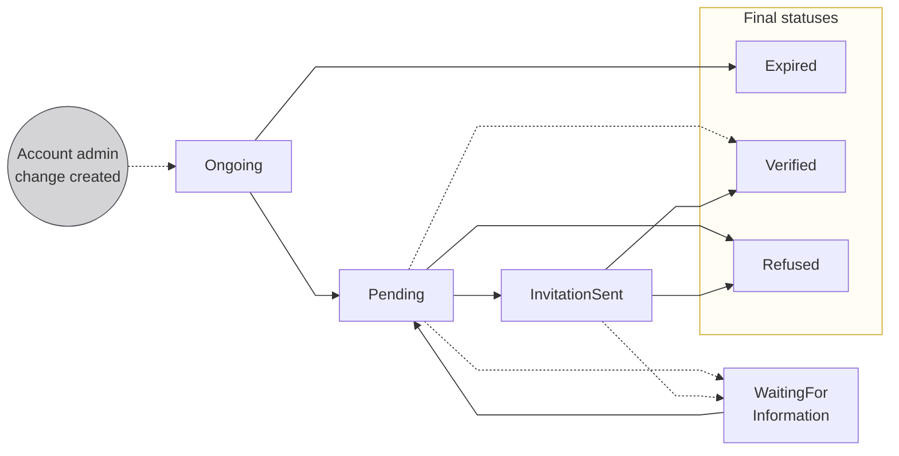

# Account administrator change

For company accounts, Swan offers a dedicated process to change the account administrator: the <Term id="account-membership">account membership</Term> holding the <Term id="legal-representative">legal representative</Term> capacity.
The account administrator change applies to all accounts belonging to the same <Term id="account-holder">account holder</Term>.

## Why and when {#admin-change}

This process is useful when:

- The current administrator leaves the company.
- An internal reorganization changes who manages the accounts.
- A general assembly or board decision appoints a new administrator.

Swan's <Term id="kyc">KYC</Term> team reviews the change request and, once approved, sets the new administrator as the legal representative on all of the account holder's accounts.

## How requests work {#overview}

There can only be one ongoing change per account holder at a time.

The form used to submit the request is **unauthenticated**, meaning the requester doesn't need to be an existing account member.
This allows third parties, such as a company secretary, to submit the request.

## Eligibility {#eligibility}

import AdminChangeEligibility from '../../partials/_admin-change-eligibility.mdx';

<AdminChangeEligibility />

Individual accounts and self-employed account holders aren't eligible.

Follow the [guide to change the account administrator](/accounts/guides/memberships/change-admin) to submit and track a change request.

## Statuses {#statuses}



| Status | Explanation |
| --- | --- |
| `Ongoing` | The change request was created. The requester must submit the form within **7 calendar days**. |
| `Pending` | Swan's KYC team is reviewing the submitted form. No action is required from the requester. |
| `WaitingForInformation` | Swan's KYC team requested additional information or documents. Swan shares a new supporting document collection URL with you to forward to the requester. The original form URL can no longer be used at this stage. |
| `InvitationSent` | Swan's KYC team invited the new administrator to the accounts. The new administrator must accept the invitation and verify their identity. This status is skipped if the new administrator already has access to the accounts. |
| `Expired` | **Final.** The form wasn't submitted within 7 calendar days. The requester needs to start a new request. |
| `Verified` | **Final.** Swan set the new administrator as the legal representative on all accounts. |
| `Refused` | **Final.** The KYC team refused the request. No changes were made. |

:::warning
When a change request expires, all form data becomes inaccessible. Swan doesn't retain the personal information entered on the expired form.
:::

## API reference {#api}

### Query {#api-query}

Use the [`publicAccountAdminChange`](https://api-reference.swan.io/queries/public-account-admin-change) query to retrieve the current state of an account administrator change by its ID.

<a href="https://explorer.swan.io?query=cXVlcnkgcHVibGljQWNjb3VudEFkbWluQ2hhbmdlKCRhY2NvdW50QWRtaW5DaGFuZ2VJZDogSUQhKSB7CiAgcHVibGljQWNjb3VudEFkbWluQ2hhbmdlKGFjY291bnRBZG1pbkNoYW5nZUlkOiAkYWNjb3VudEFkbWluQ2hhbmdlSWQpIHsKICAgIC4uLiBvbiBBY2NvdW50QWRtaW5DaGFuZ2UgewogICAgICBpZAogICAgICBzdGF0dXMKICAgICAgcmVhc29uCiAgICAgIGFkbWluIHsKICAgICAgICBmaXJzdE5hbWUKICAgICAgICBsYXN0TmFtZQogICAgICAgIGVtYWlsCiAgICAgIH0KICAgIH0KICAgIC4uLiBvbiBOb25PbmdvaW5nQWNjb3VudEFkbWluQ2hhbmdlIHsKICAgICAgaWQKICAgICAgc3RhdHVzCiAgICB9CiAgfQp9Cg%3D%3D&tab=api" className="explorer-badge">Open in API Explorer</a>

```graphql
query publicAccountAdminChange($accountAdminChangeId: ID!) {
  publicAccountAdminChange(accountAdminChangeId: $accountAdminChangeId) {
    ... on AccountAdminChange {
      id
      status
      reason
      admin {
        firstName
        lastName
        email
      }
    }
    ... on NonOngoingAccountAdminChange {
      id
      status
    }
  }
}
```

The query returns one of two types:

- `AccountAdminChange`: the full object with all fields, returned when the status is `Ongoing`.
- `NonOngoingAccountAdminChange`: a limited object containing only `id` and `status`, returned for all other statuses. This protects personal information after the form is submitted.

### Mutations {#api-mutations}

| Mutation | Purpose |
| --- | --- |
| [`publicUpdateAccountAdminChange`](https://api-reference.swan.io/mutations/public-update-account-admin-change) | Updates the account administrator change with new information (reason, admin details, requester details). Only works when the status is `Ongoing`. |
| [`publicFinalizeAccountAdminChange`](https://api-reference.swan.io/mutations/public-finalize-account-admin-change) | Submits the completed form for review. Transitions the status from `Ongoing` to `Pending`. Requires all fields and documents to be provided. |

### Rejection types {#api-rejections}

| Rejection | Meaning |
| --- | --- |
| `AccountAdminChangeNotFoundRejection` | The account administrator change ID doesn't exist. |
| `AccountAdminChangeStatusNotEligibleRejection` | The current status doesn't allow this operation. |
| `AccountAdminChangeMissingInformationRejection` | Required fields are missing from the request. |
| `AccountAdminChangeMissingDocumentsRejection` | Required supporting documents haven't been uploaded. |

:::info
The supporting document collection associated with an account administrator change uses the type `AccountAdminChange`. Upload documents to this collection using the [supporting documents](/accounts/concepts/documents) flow.
:::
