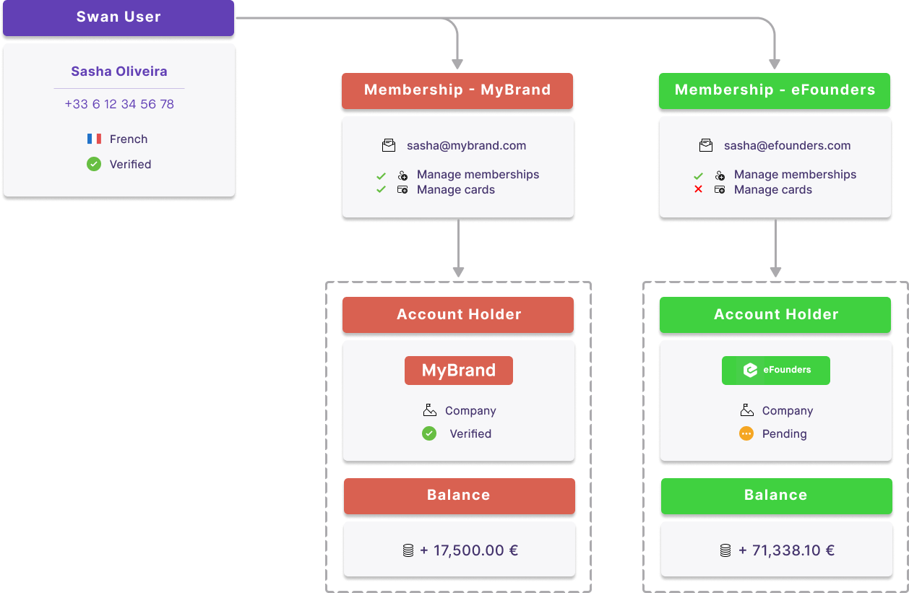

# Account memberships

<p className="ia-lede">An account membership represents a Swan user's rights (their access and permissions) on an account. Unlike <Term id="account-holder">account holders</Term>, whose location is restricted, account members can be located anywhere in the world.</p>

The Swan user who performs the account's onboarding is the first account member and becomes the **account's <Term id="legal-representative">legal representative</Term>**.
All Swan accounts have at least one account member: the legal representative.
The legal representative can grant other Swan users permission to perform certain actions for the account; each of these users is an **account member**.

:::info Consider a real-life example
A grandparent wants their grandchild to have access to an account to buy groceries.
The grandparent is the legal representative (and an account member), and the grandchild is an account member.
:::

## Company accounts {#company-members}

Account memberships are **especially useful for company accounts**.
The legal representative grants permissions to other employees.
Employees can then manage their own payments, such as software or sales expenses, independently.
The company's accountant can use their membership to access account statements.
With enough permissions, managers can add cards for their team.
How you use account memberships and the corresponding permissions is up to you.

## Unlimited memberships {#unlimited-memberships}

Swan users can have memberships to an **unlimited** number of Swan accounts.

Consider the following example, where Sasha Oliveira has account memberships to accounts for MyBrand and eFounders.
Based on their [membership permissions](/accounts/reference/memberships/membership-permissions#permissions), Sasha can access and manage memberships for both accounts, but only manage cards for one.



## Versioning {#versioning}

Account memberships have a `version` attribute.

When a new membership is added, the `version` is `0`, then increases by 1 with each change.
Changes include suspending, resuming, and updating the membership.

## In this section

```flowmap
{
  "mode": "pathway",
  "items": [
    { "title": "Inviting members", "to": "/accounts/concepts/memberships/inviting" },
    { "title": "Permissions", "to": "/accounts/concepts/memberships/permissions" },
    { "title": "Membership language", "to": "/accounts/concepts/memberships/language" },
    { "title": "Statuses and lifecycle", "to": "/accounts/concepts/memberships/statuses" },
    { "title": "Administrator change", "to": "/accounts/concepts/memberships/admin-change" },
    { "title": "Notifications", "to": "/accounts/concepts/memberships/notifications" }
  ]
}
```
