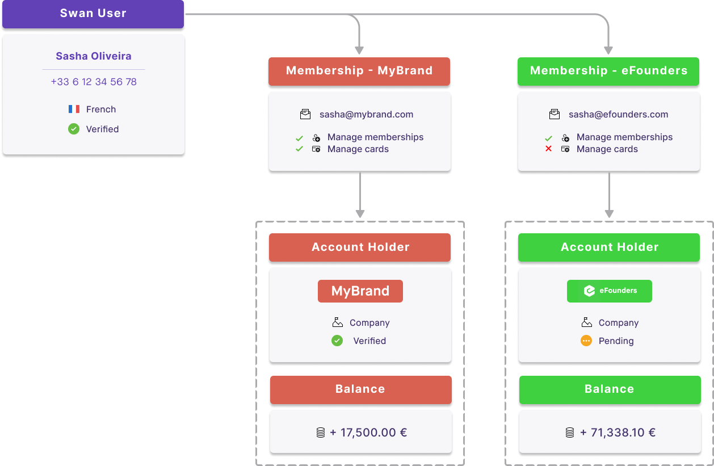

# Inviting members

## Invitation process {#invite}

The invitation process allows you to grant account access to new users. When you invite someone to become an account member, they receive an email notification asking them to accept the invitation and bind their Swan user to their account membership in order to grant access to the account on which you invited them.

You can invite account members by phone number or by verified email.
Use the API to add one membership or multiple memberships.
If you use Swan's Web Banking interface, your users can [invite members](https://support.swan.io/hc/en-150/articles/17648698750877-Add-a-member-to-your-account) directly from the app.

**Invitation flow**:

1. A user with an account membership (the inviter) with the `canManageAccountMembership` permission creates a new account membership (for the invitee) using the API or our Web Banking interface.
1. The new membership is created with the status `ConsentPending` or `InvitationSent`, depending on whether consent is required.
1. We send an email invitation to the invited member (depending on your [notification configuration](/accounts/concepts/memberships/notifications)).
1. The invited member clicks the link in the email, signs in or signs up to Swan, and accepts the invitation.
1. The user is bound to the account membership and the status changes to `Enabled` or `BindingUserError`.

| Method | Explanation |
| --- | --- |
| Inviter provides phone number and email | <ul><li>Account member's mobile SIM card serves as the [authentication factor](/dev-tools/using-api/authentication#url-parameters-optional).</li><li>Account member can be assigned all [membership permissions](/accounts/reference/memberships/membership-permissions#permissions).</li><li>Swan confirms the member's phone number during the [sign-up process](/topics/users/#signup).</li></ul> |
| Inviter provides email only | <ul><li>Account member's verified email serves as the [authentication factor](/dev-tools/using-api/authentication#url-parameters-optional). The membership isn't enabled until user verifies their email.</li><li>Account member can only be assigned the `canViewAccount` and `canManageCards` [memberships permissions](/accounts/reference/memberships/membership-permissions#permissions).</li><li>Swan confirms the member's email during the [sign-up process](/topics/users/#signup).</li><li>Swan collects the user's phone number during the sign-up process so the member can perform sensitive operations such as initiating payments, ordering cards, and viewing sensitive card information.</li></ul> |

## Company accounts {#company-members}

Account memberships are **especially useful for company accounts**.
The <Term id="legal-representative">legal representative</Term> grants permissions to other employees.
Employees can then manage their own payments, such as software or sales expenses, independently.
The company's accountant can use their membership to access account statements.
With enough permissions, managers can add cards for their team.
How you use account memberships and the corresponding permissions is up to you—the possibilities are almost endless to fulfill your use case.

## Unlimited memberships {#unlimited-memberships}

Swan users can have memberships to an **unlimited** number of Swan accounts.

Consider the following example, where Sasha Oliveira has account memberships to accounts for MyBrand and eFounders.
Based on their [membership permissions](/accounts/reference/memberships/membership-permissions#permissions), Sasha can access and manage memberships for both accounts, but only manage cards for one.

