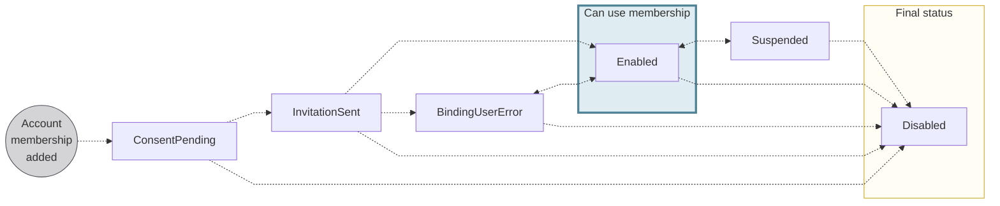
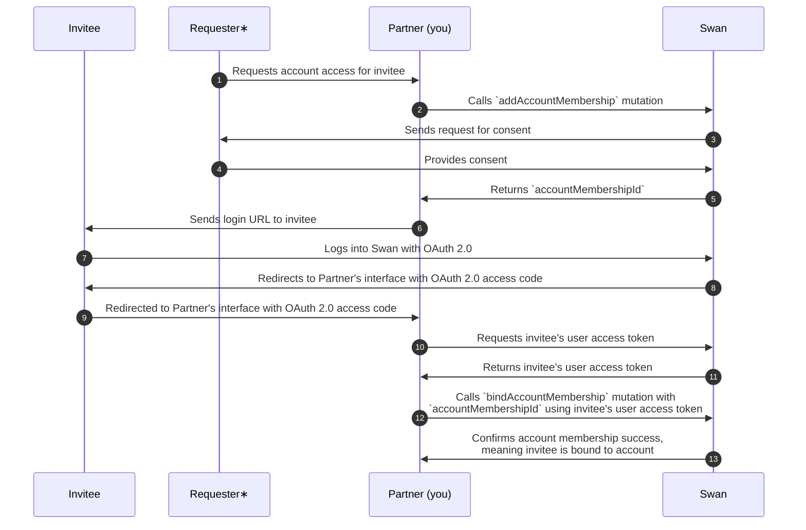

# Statuses and lifecycle

## Account membership statuses {#statuses}

| Account membership status | Explanation |
|---|---|
| `ConsentPending` | An account membership request was sent using the `addAccountMembership` mutation and is waiting for the inviter's consent.  Memberships with the status `ConsentPending` can't be updated. If there's an error in the invited account member's information, cancel the invitation and add a new account membership with the `addAccountMembership` mutation.  **Next steps**:<ul><li>If the invited account member consents, the status moves to `InvitationSent`</li><li>The account membership status moves to `Disabled` if the inviter opens the consent flow but doesn't consent, or if the invitation expires before the invited member consents. </li><li> For `Disabled` memberships because of expired consent, querying `AccountMembershipDisabledStatusInfo` shows the reason as `InvitationExpired`.</li></ul> Subscribe to the `AccountMembership.Disabled` webhook to get notified when a membership moves to `Disabled`. |
| `InvitationSent` | An invitation was sent to the invited account member.  **Next steps**:<ul><li>If the invited account member accepts the invitation and provides personal information that **matches** the information Swan already has about them, the status moves to `Enabled`</li><li>If the invited account member accepts the invitation, but provides personal information that **doesn't match** the information Swan already has about them, the status moves to `BindingUserError`</li><li>If the invited account member declines the membership, the status moves to `Disabled`</li></ul> |
| `Enabled` | All user information matches, the account member has been awarded the correct [identification level](/topics/users/identifications/#levels-processes), and the account member can use their account membership and corresponding permissions. |
| `BindingUserError` | The personal information you submitted about the invited account member doesn't match the information they provide during the [sign-up process](/topics/users/#signup). The mismatch must be solved before continuing.  Refer to the section on [binding user errors](#binding-errors) for more information. |
| `Suspended` | Account membership is suspended and not available for use.  Account memberships can be suspended for various reasons, including a request from you or the account's legal representative, or a Swan action in the case of suspicious activity.  **Next steps**:<ul><li>Restore the account membership's previous status with the API</li><li>Cancel the account membership with the API</li></ul> |
| `Disabled` | Account membership is disabled, is no longer available for use, and can't be restored.  When an account member's membership is disabled, their recurring `SingleUseVirtualCards` are [automatically reassigned to the account's Legal Representative](/topics/cards/virtual/#suv-recurring).  Subscribe to the `AccountMembership.Disabled` webhook to get notified when a membership moves to `Disabled`. |

### Binding user errors {#binding-errors}

The account membership status can be `BindingUserError` for several reasons, including the following scenarios:

- The information you submitted about the invited account member doesn't match the information they provided when [signing up for an account](/topics/users/#signup).
- The user hasn't completed [identification](/topics/users/identifications/).
- If you [invited the account member](/accounts/concepts/memberships/inviting#invite) by verified email, the email you provided might not match the email they used to [sign up](/topics/users/identifications/), or they might not have verified their email yet.

Account members whose membership status is `BindingUserError` can still access basic account and card information, but they can't perform any [sensitive operations](/topics/users/consent/#sensitive), such as making a transfer or viewing their card numbers.

**To fix binding errors**, refer to the [guide to fix a user binding error](/accounts/guides/memberships/fix-binding-error) for detailed resolution steps based on the specific error type.

:::info Updating account members
After an account member's status is `Enabled`, updating their personal details doesn't cause a user binding error.
If fraud is suspected, [suspend the membership](/accounts/guides/memberships/suspend-resume).
:::

## Removing identification {#remove-identification}

Verifying your account members' identity is a required step in most circumstances.
However, with a **detailed agreement with Swan**, you might be allowed to bypass identification for certain membership permissions.

Even if your project is configured to remove identification, memberships with the following permissions **can't bypass** it:

- `canManageAccountMembership`
- `canInitiatePayments`
- `canManageBeneficiaries`

Note that this configuration **is retroactive**. Memberships created before identification was removed no longer need to verify their identity. 
Contact your PIM (Product Integration Manager) to ask about removing identification.

## Closed accounts and memberships {#closed}

When Swan [accounts are closed](/accounts/concepts/account), the account memberships are impacted as well.

As soon as an [account status](/accounts/concepts/account/statuses) changes to `Closing`, account members can no longer manage account memberships and beneficiaries or initiate payments (except to empty the account).
When the account status changes to `Closed`, account members can view the account for one year, after which all memberships to the closed account are `Disabled`.

## Versioning {#versioning}

Account memberships have a `version` attribute.

When a new membership is added, the `version` is `0`, then increases by a factor of 1 with each change.
Changes include suspending, resuming, and updating the membership.

## Sequence diagram  {#diagrams-add}

> **Adding account memberships**

∗ The **requester** can be the account holder, the account's legal representative, or an account member with the `canManageAccountMembership` permission.
The requester provides consent (diagram line 4).
