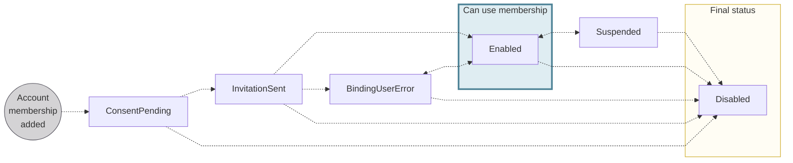
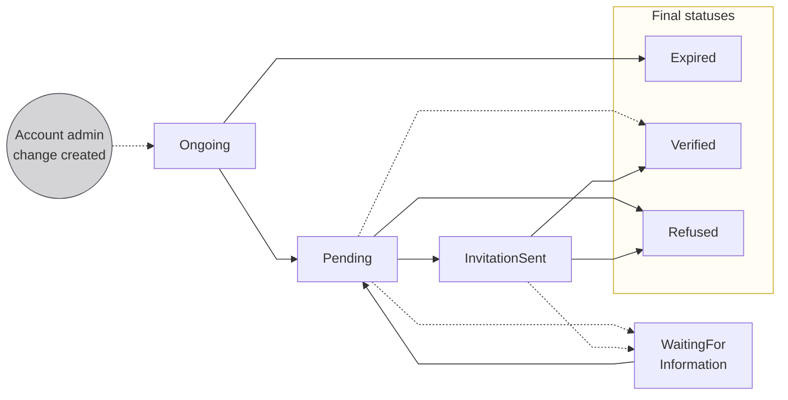

# Statuses and lifecycle

The lifecycle of an <Term id="account-membership">account membership</Term>, from `ConsentPending` through to `Disabled`, and the lifecycle of an [account administrator change](#admin-change) request.

## Statuses {#statuses}

```mermaid
%%{ init: { 'flowchart': { 'curve': 'linear' } } }%%
flowchart LR
    AMA((Account<br/>membership<br/>added)) -.-> CP[ConsentPending]
    CP -.-> IS[InvitationSent]
    CP -.-> D[Disabled]
    IS -.-> E[Enabled]
    IS -.-> B[BindingUserError]
    B <-.-> E
    E <-.-> S[Suspended]
    B -.-> D
    E -.-> D
    S -.-> D
    IS -.-> D
    subgraph U[Can use membership]
        E
    end
    subgraph F[Final status]
        D
    end
    style AMA fill:#D4D3D5,stroke:#514F59
    style F fill:#fffdf4,stroke:#cca922
    style U fill:#dfedf2,stroke:#4d8296, stroke-width:3px
```

| Account membership status | Explanation |
|---|---|
| `ConsentPending` | An account membership request was sent using the `addAccountMembership` mutation and is waiting for the inviter's <Term id="consent">consent</Term>.  Memberships with the status `ConsentPending` can't be updated. If there's an error in the invited account member's information, cancel the invitation and add a new account membership with the `addAccountMembership` mutation.  **Next steps**:<ul><li>If the inviter consents, the status moves to `InvitationSent`.</li><li>The account membership status moves to `Disabled` if the inviter opens the consent flow but doesn't consent, or if the consent request expires before the inviter consents.</li><li> For `Disabled` memberships because of expired consent, querying `AccountMembershipDisabledStatusInfo` shows the reason as `InvitationExpired`.</li></ul> Subscribe to the `AccountMembership.Disabled` webhook to get notified when a membership moves to `Disabled`. |
| `InvitationSent` | An invitation was sent to the invited account member.  **Next steps**:<ul><li>If the invited account member accepts the invitation and provides personal information that **matches** the information Swan already has about them, the status moves to `Enabled`.</li><li>If the invited account member accepts the invitation, but provides personal information that **doesn't match** the information Swan already has about them, the status moves to `BindingUserError`.</li><li>If the invited account member declines the membership, the status moves to `Disabled`.</li></ul> |
| `Enabled` | All user information matches, the account member has been awarded the correct [identification level](/users/concepts/identifications/levels-processes), and the account member can use their account membership and corresponding permissions. |
| `BindingUserError` | The personal information you submitted about the invited account member doesn't match the information they provide during the [sign-up process](/users/concepts/user/sign-up). The [mismatch must be solved](#binding-errors) before continuing. |
| `Suspended` | Account membership is suspended and not available for use.  Account memberships can be suspended for various reasons, including a request from you or the account's <Term id="legal-representative">legal representative</Term>, or a Swan action in the case of suspicious activity.  **Next steps**:<ul><li>Restore the account membership's previous status with the API.</li><li>Cancel the account membership with the API.</li></ul> |
| `Disabled` | Account membership is disabled, is no longer available for use, and can't be restored.  When an account member's membership is disabled, their recurring single-use virtual cards are [automatically reassigned to the account's legal representative](/cards/concepts/virtual/single-use-cards#suv-recurring).  Subscribe to the `AccountMembership.Disabled` webhook to get notified when a membership moves to `Disabled`. |

For the sequence of API calls that adds a membership and binds the invitee to it, review the [invitation sequence diagram](/accounts/concepts/memberships/inviting#invitation-diagram).

### Binding user errors {#binding-errors}

The account membership status can be `BindingUserError` for several reasons, including the following scenarios:

- The information you submitted about the invited account member doesn't match the information they provided when [signing up for an account](/users/concepts/user/sign-up).
- The user hasn't completed [identification](/users/concepts/identifications).
- If you [invited the account member](/accounts/concepts/memberships/inviting#invite) by verified email, the email you provided might not match the email they used to [sign up](/users/concepts/user/sign-up), or they might not have verified their email yet.

Account members whose membership status is `BindingUserError` can still access basic account and card information, but they can't perform any [sensitive operations](/users/reference/sensitive-operations), such as making a transfer or viewing their card numbers.

**To fix binding errors**, refer to the [guide to fix a user binding error](/accounts/guides/memberships/fix-binding-error) for detailed resolution steps based on the specific error type.

:::info Updating account members
After an account member's status is `Enabled`, updating their personal details doesn't cause a user binding error.
If fraud is suspected, [suspend the membership](/accounts/guides/memberships/suspend).
:::

[Closing or closed accounts affect memberships](/accounts/concepts/memberships#closed): management and payments stop at `Closing`, and memberships are `Disabled` one year after `Closed`.

## Account administrator change statuses {#admin-change}

An [account administrator change](/accounts/concepts/memberships/admin-change) request has its own lifecycle, separate from the membership statuses above.

```mermaid
%%{ init: { 'flowchart': { 'curve': 'linear' } } }%%
flowchart LR
    AC((Account admin<br/>change created)) -.-> O[Ongoing]
    O --> P[Pending]
    O --> E[Expired]
    P -.-> W[WaitingFor<br/>Information]
    P --> I[InvitationSent]
    P -.-> V[Verified]
    P --> R[Refused]
    W --> P
    I -.-> W
    I --> V
    I --> R
    subgraph F[Final statuses]
        E
        V
        R
    end
    style AC fill:#D4D3D5,stroke:#514F59
    style F fill:#fffdf4,stroke:#cca922
```

| Status | Explanation |
| --- | --- |
| `Ongoing` | The change request was created. The requester must submit the form within **7 calendar days**. |
| `Pending` | Swan's KYC team is reviewing the submitted form. No action is required from the requester. |
| `WaitingForInformation` | Swan's KYC team requested additional information or documents. Swan shares a new supporting document collection URL with you to forward to the requester. The original form URL can no longer be used at this stage. |
| `InvitationSent` | Swan's KYC team invited the new administrator to the accounts. The new administrator must accept the invitation and verify their identity. This status is skipped if the new administrator already has access to the accounts. |
| `Expired` | **Final.** The form wasn't submitted within 7 calendar days. The requester needs to start a new request. |
| `Verified` | **Final.** Swan set the new administrator as the legal representative on all accounts. |
| `Refused` | **Final.** The KYC team refused the request. No changes were made. |

:::warning
When a change request expires, all form data becomes inaccessible. Swan doesn't retain the personal information entered on the expired form.
:::
