# Onboarding

<p className="ia-lede">Account onboarding is the process that creates <Term id="account-holder">account holders</Term> and opens their first Swan account. This is the model behind it: the types, the purpose, and the statuses and notifications that span every onboarding.</p>

## Overview {#overview}

Account onboarding is the **process to create [account holders](/accounts/concepts/account-holders)**.

One end result of onboarding is also creating the first account for the new account holder.
Account holders complete a new onboarding to open another account.

:::info Cross reference
During onboarding, users also [complete an account holder verification](/accounts/concepts/account-holders/verification#verification-process) process and [authenticate](/build/using-api/authentication) (log in) for the first time.
They might also [sign up for Swan](/users/concepts/user/sign-up) if they haven't already.
:::

### Types of onboarding {#types}

There are two types of onboarding, individual and company, directly linked to the two types of accounts Swan offers.
Each onboarding has a unique `onboardingId`.

The individual and company onboarding processes are similar.

| Type | Explanation |
| --- | --- |
| [Individual onboarding](/accounts/guides/onboarding/individual) | <ul><li>Create a new **individual** account holder.</li><li>Open a new **individual** Swan account for that account holder.</li></ul> |
| [Company onboarding](/accounts/guides/onboarding/company) | <ul><li>Create a new **company** account holder.</li><li>Open a new **company** Swan account for that account holder.</li></ul> |

:::tip Swan Banking Frontend
If you'd like to customize the onboarding experience for your users (while respecting local regulations), check out the open source [Swan Banking Frontend](https://swan-io.github.io/swan-partner-frontend/specs/onboarding/).
:::

### Purpose of onboarding {#purpose}

Completing the onboarding process serves several purposes.

1. A new **account holder** is created.
1. The account holder's **Swan account** is created.
1. The person who performed the onboarding process becomes the <Term id="legal-representative">legal representative</Term> of the account. They're also the account's first member with [full permissions](/accounts/reference/memberships/membership-permissions).
1. Your relationship with the account holder is stored in the `partnershipStatusInfo` field of the `account` object.

## API sequence diagram {#api-flow}

This sequence diagram depicts the onboarding flow with the API.

```mermaid
sequenceDiagram
participant S as Swan
participant P as Partner
participant U as User
    alt Partner decision
        P ->> P: Determines need for Swan account
    else User request
    activate U
        U ->> P: Requests Swan account and<br/>provides required information
    end
    P ->> S: Creates onboarding ID
    S -->> P: Returns onboarding ID
    P ->> U: Sends authentication link (OAuth 2.0)
    U ->> S: Logs in
    S -->> P: Redirects user to partner interface
    deactivate U
    P ->> S: Requests user access token
    S -->> P: Returns user access token
    P ->> S: Finalizes onboarding with user access token
    S -->> P: Confirms account holder and account creation
```



## In this section

```flowmap
{
  "mode": "pathway",
  "items": [
    { "title": "Statuses", "to": "/accounts/concepts/onboarding/statuses", "desc": "The onboarding lifecycle: Invalid → Valid → Finalized." },
    { "title": "Notifications", "to": "/accounts/concepts/onboarding/notifications", "desc": "Emails Swan sends during onboarding." }
  ]
}
```
