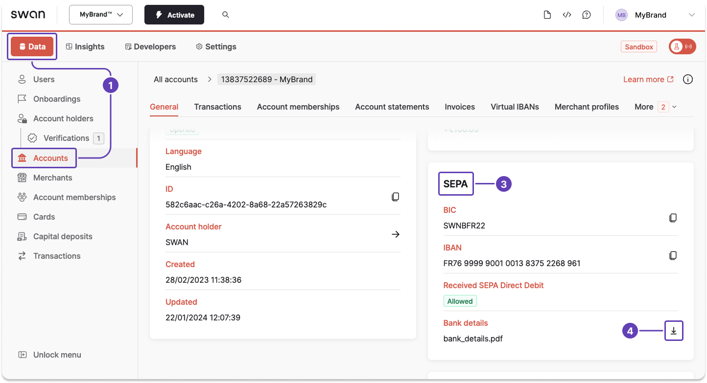
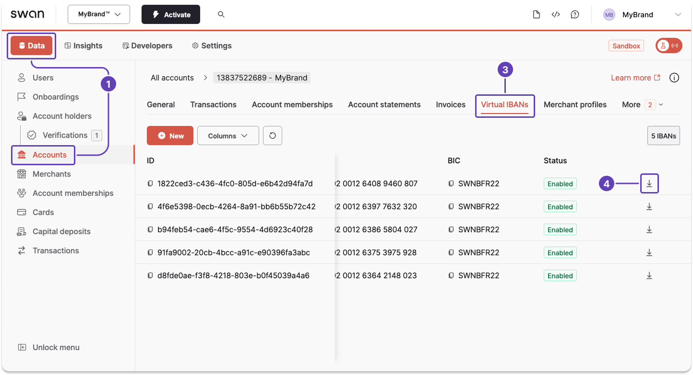

# Get bank details from the Dashboard

Download a PDF of an account's bank details for the main and virtual <Term id="ibans">IBANs</Term> from your Dashboard.

## Main IBAN

1. Go to **Dashboard** > **Data** > **Accounts**.
1. Open the account for which you want to generate a statement (not pictured).
1. Scroll vertically to the **SEPA** section.
1. Click the **download icon** in the bank details row.

## Virtual IBANs

> It takes a few seconds after adding a virtual IBAN to be able to download the bank details PDF.

1. Go to **Dashboard** > **Data** > **Accounts**.
1. Open the account for which you want to generate a statement (not pictured).
1. Go to the **Virtual IBANs** tab.
1. Scroll horizontally, then click the **download icon** for the desired virtual IBAN.

