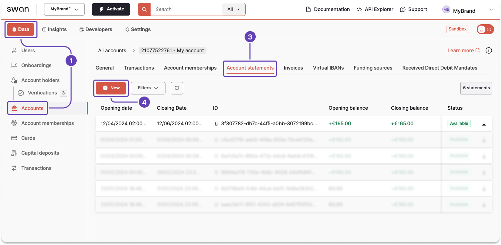
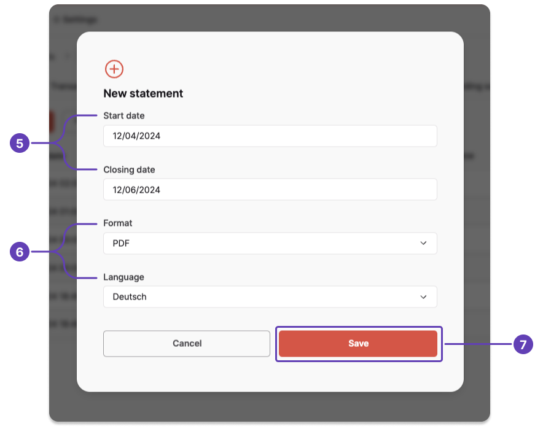
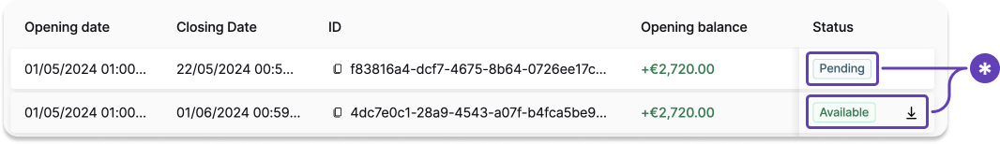

# Generate an account statement from the Dashboard

Generate an account statement for a custom time period from your Dashboard.

## Steps

1. Go to **Dashboard** > **Data** > **Accounts**.
1. Open the account for which you want to generate a statement (not pictured).
1. Go to the **Account statements** tab.
1. Click **+ New**

5. Enter the opening date and closing date. The time period can cover **up to three months**.
1. Choose the format and language.
1. Click **Save**.

Your new statement appears on your list of account statements with the status `Pending`.
After the status changes to `Generated`, you can download your statement.

