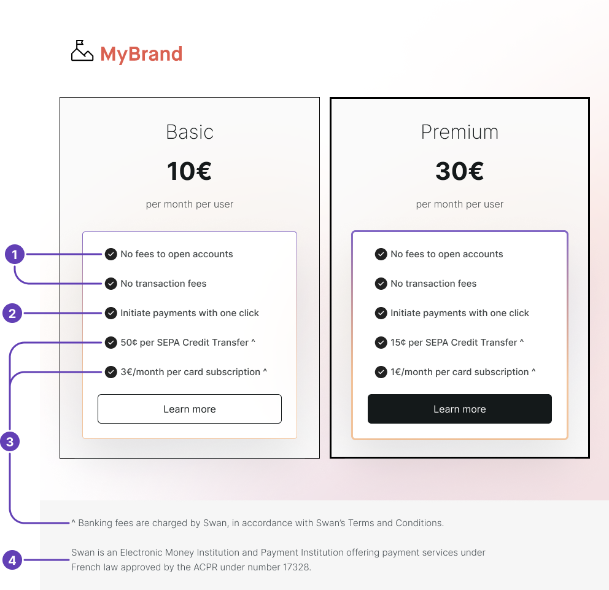

# Build a compliant billing offer

Build a compliant <Term id="billing">billing</Term> offer that charges only qualified fees to your end users, with or without customization.
You can bill your users directly only for [fees not classified as banking fees](/accounts/concepts/billing/regulated-fees).

:::tip Customization
You can customize certain banking fees to adapt your billing offer to your product and user type.
Learn more in [Customizing your offer](#customize-offer).
:::

:::caution Verifying your offer
Swan must **verify your billing offer**, whether standard or customized, regarding the payment-related options before you go live to confirm you aren't billing for unauthorized fees.
:::

## Customizing your offer {#customize-offer}

:::info Subject to approval
You need Swan's approval to customize your billing, as it changes your billing setup. To request it, contact your Strategic Account Manager (SAM).
:::

As a Swan Partner, you decide whether to pay all the banking fees related to your users' operations, or to let Swan charge your users directly.

Swan is always the entity charging the fees. **You never charge these banking fees directly**.

By default, Swan's banking fees are charged according to the following table.
All fees charged to you could be charged to your users instead with a customized billing offer.
**You are ultimately responsible** for any outstanding payments owed by your users.

| Fees charged to | Fee |
| --- | --- |
| Swan Partners (you) | <ul><li>Fee per account</li><li>Fee per SEPA Credit Transfer</li><li>Fee per card transaction</li><li>Card issuing and shipping</li></ul> |
| <Term id="account-holder">Account holders</Term> (your users) | <ul><li>SEPA Direct Debit transactions</li><li>Checks</li><li>Accepting online payments with cards</li><li>Fees for International Credit Transfers</li><li>Incident fees</li></ul> |

### Presenting your customized offer {#customize-offer-present}

How you present your customized billing offer must respect certain guidelines.

Your pricing offer must be transparent to your users, allowing them to compare pricing for various payment products on the market.

1. If you decide to cover your users' fees, you can mention it.
    - For example, you might say "No fees to open accounts" or "No transaction fees".
1. If your product helps prepare payment orders, you can mention it.
    - For example, you might say "Initiate payments with one click".
1. If you choose to mention Swan's banking fees, you must indicate that Swan charges the fees.
    - For example, you could add a symbol (^) referring the user to the following information somewhere on the offer page: "Fees charged by Swan, according to Swan's Terms and Conditions".
1. If Swan's fees are mentioned, the following information about Swan must be included in the footer of your offer page: "Swan is an Electronic Money institution and Payment institution offering payment services under French law approved by the ACPR under number 17328."

:::info Fee labels
**Fee labels**, meaning how fees are displayed to account holders on Web Banking, transaction histories, and account statements, aren't customizable.
When customizing your offer, **you must keep Swan's standardized wording**; you can't change fee wording when presenting your offer.

Refer to your most recent Swan Terms and Conditions for standardized fee wording.
:::

