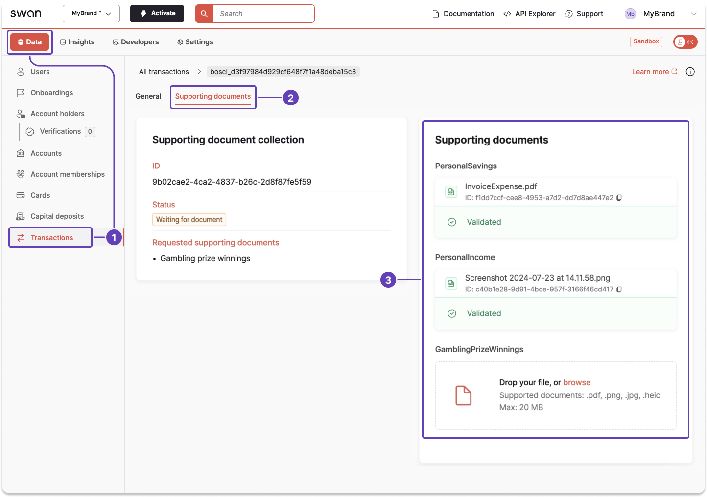

# Get collection or document information from the Dashboard

Review information about a supporting document collection or an individual document on your Dashboard, for a transaction or an account onboarding.

## Transaction documents

Use the Dashboard to review information about a transaction document.

1. Go to **Data** > **Transactions**.
1. Open a transaction, then go to **Supporting documents**.
1. Review all available information about your documents.

## Onboarding documents

Use the Dashboard to review information about an onboarding document.

1. Go to **Data** > **Onboardings**.
1. Open an onboarding, then go to **Supporting documents**.
1. Review all available information about your documents.

