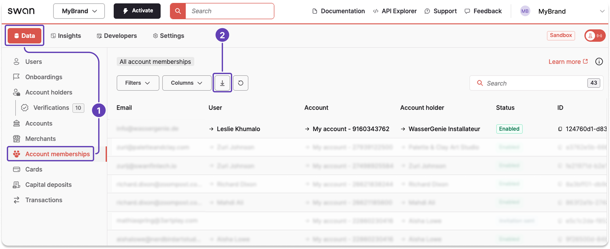

# Export account membership data from the Dashboard

Export account membership data from your Dashboard to review member roles and permissions for each account.

## Steps

1. On your Dashboard, go to **Data** > **Account memberships**.
1. Click the **download icon** to trigger a `.csv` export.
1. A modal appears. Click **Export data** to finalize the request.

