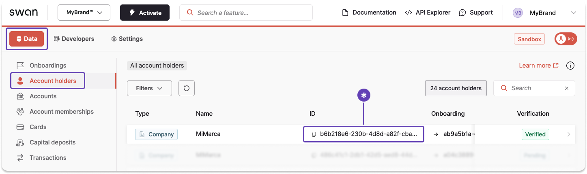
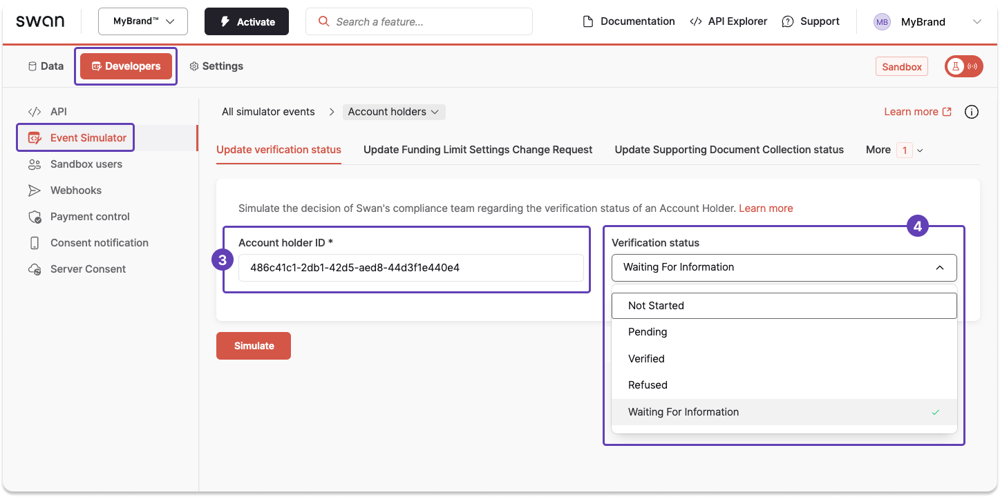

import FirstTransferRequest from '../../../topics/partials/_first-transfer.mdx';

# Account holder tasks

Operational tasks for existing account holders: add another account, check verification status, request a first transfer, export data, and simulate status changes in Sandbox.

## Add an account for an existing account holder {#add-additional-account}

If an account holder already exists, you can add another **individual account** for that account holder.

The account holder still needs to be "officially" verified by Swan, but verification is quick as Swan already knows the account holder.

:::tip Prerequisites
The account holder must be `Verified` with an `Open` account.
:::

1. [Call the `OnboardIndividualAccountHolder` mutation](/accounts/guides/onboarding/individual/create), using the same information as the account holder's existing Swan account.
1. Finalize the onboarding with the new onboarding ID and the user access token.
The account holder doesn't need to do anything.
1. You'll get a new `accountId` immediately with the status `Pending`.
1. Swan will verify the account.
Since Swan already knows the account holder, verification is quicker than for a new account holder.

## Get account holder verification status {#get-status}

Call the `accountHolder` query to get an account holder's verification status.
Add `verificationStatusInfo` to provide more details about specific statuses.
This guide provides more details about an account holder verification with the status `WaitingForInformation`.

### Guide

1. First, [retrieve the required `accountHolderId`](#simulate-status-update-get-id).
1. Call the `accountHolder` query.
1. Enter the `accountHolderId` retrieved in step 1.
1. Add the `verificationStatusInfo` object.
1. Add the `AccountHolderWaitingForInformationVerificationStatusInfo` union to get information about the `WaitingForInformation` status for this account holder verification.
1. Add `verificationRequirements` > `id` and `type`.

:::info `verificationRequirements`
Review possible `verificationRequirements` on the [account holder homepage](/accounts/concepts/account-holders/verification#waiting-for-info).
:::

### Query

<a href="https://explorer.swan.io?query=cXVlcnkgV2FpdGluZ0ZvckluZm9TdGF0dXMgewogIGFjY291bnRIb2xkZXIoaWQ6ICIkQUNDT1VOVF9IT0xERVJfSUQiKSB7CiAgICB2ZXJpZmljYXRpb25TdGF0dXNJbmZvIHsKICAgICAgc3RhdHVzCiAgICAgIC4uLiBvbiBBY2NvdW50SG9sZGVyV2FpdGluZ0ZvckluZm9ybWF0aW9uVmVyaWZpY2F0aW9uU3RhdHVzSW5mbyB7CiAgICAgICAgX190eXBlbmFtZQogICAgICAgIHdhaXRpbmdGb3JJbmZvcm1hdGlvbkF0CiAgICAgICAgc3RhdHVzCiAgICAgICAgdmVyaWZpY2F0aW9uUmVxdWlyZW1lbnRzIHsKICAgICAgICAgIGlkCiAgICAgICAgICB0eXBlCiAgICAgICAgfQogICAgICB9CiAgICB9CiAgfQp9Cg%3D%3D&tab=api" className="explorer-badge">Open in API Explorer</a>

```graphql {2-3,5,9-11} showLineNumbers
query WaitingForInfoStatus {
  accountHolder(id: "$ACCOUNT_HOLDER_ID") {
    verificationStatusInfo {
      status
      ... on AccountHolderWaitingForInformationVerificationStatusInfo {
        __typename
        waitingForInformationAt
        status
        verificationRequirements {
          id
          type
        }
      }
    }
  }
}
```

### Payload

Note the two verification requirements needed from this account holder (lines 11, 15).

```json {5,11,15} showLineNumbers
{
  "data": {
    "accountHolder": {
      "verificationStatusInfo": {
        "status": "WaitingForInformation",
        "__typename": "AccountHolderWaitingForInformationVerificationStatusInfo",
        "waitingForInformationAt": "2024-10-29T13:56:38.972Z",
        "verificationRequirements": [
          {
            "id": "$VERIFICATION_REQUIREMENT_ID_1",
            "type": "FirstTransferRequired"
          },
          {
            "id": "$VERIFICATION_REQUIREMENT_ID_2",
            "type": "LegalRepresentativeDetailsRequired"
          }
        ]
      }
    }
  }
}
```

## Request a first transfer {#request-first-transfer}

<FirstTransferRequest />

Swan can either email your or your users to request the first transfer.
Share your preference with your Account Manager.

:::tip Prerequisite
Thoroughly review [first transfer](/accounts/concepts/account-holders/first-transfer) requirements.
:::

:::warning Limited account transfer restrictions
When sending a first transfer to a limited account, users should send a SEPA Credit Transfer of €50 or less that won't cause the balance to exceed €150.

This is due to the following restrictions that apply while the account remains in `Limited` status:

- SEPA Credit Transfers exceeding €50 are automatically rejected.
- SEPA Credit Transfers that would cause the account balance to exceed €150 are automatically rejected.
- International Credit Transfers, regardless of their amount, are automatically rejected.

Learn more about [limited account transfer restrictions](/accounts/concepts/account-holders/first-transfer#limited-account-restrictions).
:::

### Option 1: Swan emails your user {#guide-swan}

1. Swan emails your user, requesting a first transfer.
1. Swan provides users with their Swan IBAN and BIC via email. We also inform users about account restrictions: transfers must be €50 or less, and the balance cannot exceed €150.
1. Your user sends a first transfer to their Swan account.
1. Swan verifies the transfer source.
1. Swan [updates the account holder verification status](/accounts/concepts/account-holders/first-transfer#first-transfer-waiting) accordingly.

### Option 2: You email your user {#guide-partner}

1. Swan emails you to request a first transfer from your user.
1. You email your user, requesting a first transfer. Make sure to:
    - Include the user's Swan IBAN and BIC in the email.
    - Inform the user that transfers from third-party platforms like Lydia or PayPal aren't accepted.
    - Inform the user that while their account is limited, transfers must be €50 or less, and the balance cannot exceed €150.
1. Your user sends a first transfer to their Swan account.
1. Swan verifies the transfer source.
1. Swan [updates the account holder verification status](/accounts/concepts/account-holders/first-transfer#first-transfer-waiting) accordingly.

## Export account holder data {#export}

You can export account holder data from the Dashboard or with the API. See **[Export account holder data](/accounts/guides/onboarding/account-holder-export)** for both paths.

## Sandbox {#sandbox}

### Simulate updating an account holder’s verification status {#simulate-status-update}

#### Step 1: Get the account holder ID {#simulate-status-update-get-id}

Use the Dashboard to get the account holder ID.

You could also use the `accountHolders` query.
However, since you can only simulate updating one account holder status at a time, and *from your Dashboard*, it's simpler to get the ID from the Dashboard.

1. On your Dashboard, go to **Data** > **Account holders**.
1. Locate the account holder you need.
1. Click to copy their account holder ID.



#### Step 2: Update the status {#simulate-status-update-make-update}

With the account holder ID, use the Event Simulator to change the [account holder verification status](/accounts/concepts/account-holders/verification#verification-process-statuses) to any available status.

1. On your Dashboard, go to **Developers** > **Event Simulator**.
1. Open **Account holders**, then go to the **Update verification status** tab.
1. Enter the account holder ID into the **Account holder ID** field.
1. From the dropdown, choose the status you'd like to simulate.
1. Click **Simulate**.


