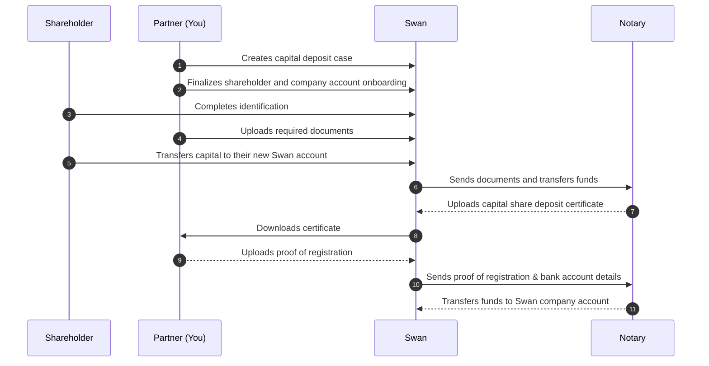

# Capital deposits

import CapitalDepositDefinition from "../../../../topics/definitions/_capital-deposit.mdx";

Deposit your client's share capital before registering their new French company: create a capital deposit case, collect documents, verify shareholders, and transfer funds to the notary.

## In this section

- [Create a case](/accounts/guides/onboarding/capital-deposits/create-case)
- [Upload documents](/accounts/guides/onboarding/capital-deposits/upload-documents)
- [Cancel a case](/accounts/guides/onboarding/capital-deposits/cancel)
- [Update company](/accounts/guides/onboarding/capital-deposits/update-company)
- [Update shareholder amount](/accounts/guides/onboarding/capital-deposits/update-shareholder-amount)

> <CapitalDepositDefinition />

When **creating a new company**, you're required to **deposit your share capital** before registering the company.

## Overview {#overview}

Several key stakeholders are involved in the capital deposit process: **you**; **your client**, their future company, and their shareholders; **Swan** (and Swan's API); and Swan's partner **notary**.

The capital deposit process consists of a few main actions:

- Creating a Swan capital deposit case to collect everything
- Creating Swan accounts
- Verifying identities
- Uploading documents
- Transferring funds

Learn more about the stakeholders and their interactions to complete a capital deposit on this page before continuing to the [guide for 🇫🇷 France](/accounts/guides/onboarding/capital-deposits/#france).

## Capital deposit case {#case}

The [`CapitalDepositCase`](https://api-reference.swan.io/objects/capital-deposit-case) API object compiles all information for a capital deposit case, including:

1. Details about the future company
1. Company account
1. Shareholder information
1. Capital deposit documents

### Case statuses {#case-statuses-leadin}

A capital deposit case moves through several statuses. See [Capital deposit case statuses](/accounts/reference/capital-deposit-reference#case-statuses).

### Cancelation reason codes {#cancelation-reason-codes-leadin}

When a case is canceled, a reason code explains why. See [Cancelation reason codes](/accounts/reference/capital-deposit-reference#cancelation-reason-codes).

## Required documents {#documents}

Processing your capital shares deposit **requires several documents**.
These can be uploaded using the API.
Documents must meet Swan's requirements; otherwise, the document will be assigned the status `Refused` and you'll need to upload the document again.

### List of required documents {#documents-list-leadin}

Several documents are required from shareholders and the future company. See [List of required documents](/accounts/reference/capital-deposit-reference#documents-list).

### Document statuses {#documents-statuses-leadin}

Each document moves through statuses as Swan reviews it. See [Document statuses](/accounts/reference/capital-deposit-reference#documents-statuses).

## Shareholders {#shareholders}

A shareholder is a physical or legal person who deposits funds in exchange for ownership of the future company.
To deposit funds, the shareholder opens a **temporary** Swan payment account.

Because they're opening an account, each shareholder must go through the [onboarding](/accounts/guides/onboarding), [identification](/topics/users/identifications/), and [account holder verification](/accounts/guides/onboarding/account-holders#verification-process) processes.
After completing requirements, the shareholder's account is assigned an IBAN they can use to deposit funds.

As soon as the `CapitalDepositCase` is complete, the shareholder's temporary account **closes automatically**.

Shareholders must provide proof of their residence address.
Only official documents are validated.
Refer to the **list of acceptable documents** in the [Partnership Document Center](/accounts/reference/proof-of-address).

### Shareholder statuses {#shareholders-statuses-leadin}

Each shareholder moves through several statuses as they onboard and transfer funds. See [Shareholder statuses](/accounts/reference/capital-deposit-reference#shareholders-statuses).

## Transfer requirements {#transfer-requirements}

Shareholder accounts have specific transfer requirements for capital deposits.

### SEPA Credit Transfers only {#sepa-only}

:::caution
Shareholder accounts only accept [SEPA Credit Transfers](/topics/payments/credit-transfers/sepa/) for capital deposits.
International credit transfers are **rejected automatically** before settlement, regardless of the amount.
Ensure all transfers are sent from the shareholder's account in their name.
:::

## Sequence diagram {#diagram}

## Updating a shareholder's deposit amount {#update-amount}

You can update a shareholder's deposit amount directly through the API.

import UpdateShareholderPrereqs from './partials/_update-shareholder-prereqs.mdx';

<UpdateShareholderPrereqs />

Updating a shareholder's deposit amount automatically triggers a recalculation of the total capital deposit amount for the case.

Follow the guide to [update a shareholder's capital deposit amount](/accounts/guides/onboarding/capital-deposits/update-shareholder-amount).

## Updating company information {#update-company}

You can update the main company information linked to a capital deposit directly through the API.

This allows you to correct the company name and postal address without contacting the Support team.

import UpdateCompanyPrereqs from './partials/_update-company-prereqs.mdx';

<UpdateCompanyPrereqs />

Updating these fields automatically syncs the data across both the capital deposit case and the associated account holder.

Follow the guide to [update a capital deposit company](/accounts/guides/onboarding/capital-deposits/update-company).

## Canceling a capital deposit {#cancel}

You can cancel an ongoing capital deposit if needed.

import CancelCase from './partials/_cancel-case.mdx';

<CancelCase />

When a capital deposit case is canceled, any associated shareholder accounts are closed automatically.

Follow the guide to [cancel a capital deposit](/accounts/guides/onboarding/capital-deposits/cancel).

## Deposit capital in France {#france}

Depositing share capital in France is a multi-step process involving several key players: you and your end user, Swan, and the notary.

- **You and your end user** are responsible for completing **steps 1 through 5**, as well as **step 8**.
- Swan completes step 6.
- The notary completes steps 7 and 9.

:::info General capital deposit information
Review the [**sequence diagram**](#diagram) on the general capital deposit page to see the interactions in more details, plus find information about **statuses**, **shareholders**, and more.
:::

### Step 1: Create capital deposit case {#create-api-case}

Use the API to create a capital deposit case object.
Everything related to your capital deposit, including shareholder information, transfers, and documents, will be collected in the `case` object.

→ Follow the [detailed guide](/accounts/guides/onboarding/capital-deposits/create-case) to create your case, which includes full API mutation examples.

### Step 2: Upload capital deposit documents {#upload-documents}

Use the API to:

1. Generate a unique upload URL for each document you need to upload, and
1. Upload all required documents.

→ Follow the [detailed guide](/accounts/guides/onboarding/capital-deposits/upload-documents) to generate URLs and upload documents, which includes full API mutation examples.

### Step 3: Finalize account creation {#finalize-account-creation}

Following the guide to create a capital deposit case also launches the account creation process for the future company and individual shareholders.

The individual Swan accounts serve as **escrow accounts**, and are the only acceptable accounts to which shareholders can transfer their capital deposit funds.

To complete the account creation process:

1. Shareholders need to complete the account onboarding process. [Monitor their progress](/accounts/guides/onboarding/manage-onboardings#get-info) if needed.
1. After each shareholder has at least opened their onboarding link, you might choose to use the API to [finalize all account onboardings](/accounts/guides/onboarding/manage-onboardings#finalize). Shareholders can also finalize their own onboardings.

### Step 4: Verify account holders {#verify-account-holders}

After the shareholders complete the onboarding process, they must complete account holder verification.

→ Learn more about the [verification process](/accounts/guides/onboarding/account-holders#verification-process) for new account holders.

:::info Identification level
Swan supports multiple levels to verify your identity.
For capital deposits, please meet the following [identification levels](/topics/users/identifications/#levels-processes):

- Shareholder accounts: PVID
- Company accounts: Expert
:::

### Step 5: Transfer capital funds {#transfer-capital-funds}

Each shareholder must transfer their capital share deposit from an **account in their name** to their new Swan account.

Shareholders must **perform this transfer themselves**, and need their **new IBAN** to do so.

A good practice is to configure your integration to send an **automated email** to shareholders with the new IBANs.
Alternately, they can access the IBAN associated with their Swan account through the Web Banking user interface, or you can access it on the Dashboard and share it with them.

:::caution
After step 5 is complete, it's no longer possible to [cancel the capital deposit](#cancel) with the API.
However, you could still contact Swan and ask to cancel the case.
:::

### Step 6: Swan validates and updates case {#validate-case}

Here's a quick review.
At this point, you've done the following for your `CapitalDepositCase`:

- Created Swan accounts for shareholders and the future company
- Completed the onboarding and account holder verification processes for those accounts
- Transferred the shareholders' capital funds into their individual Swan accounts
- Uploaded all required documents

To complete step 6, Swan:

- Reviews the entire case.
- Validates the capital deposit in Swan's system.
- Updates the [case status](/accounts/reference/capital-deposit-reference#case-statuses) to `WaitingForShareDepositCertificate` so it gets sent to the notary.

### Step 7: Notary uploads certificate {#upload-certificate}

After the notary validates this stage of the capital deposit, they respond with a **capital shares deposit certificate**.
This process is typically quick, taking up to **two business days**.
The certificate is assigned the document type `CapitalShareDepositCertificate`.

View the certificate in the capital deposits section of your Dashboard.
You can also retrieve it with the `capitalDepositCase` API query.
Be sure to add `documents` > `downloadUrl` in the explorer.

### Step 8: Upload the register extract (KBIS) {#upload-kbis}

Upload your KBIS using the same document upload process as in step 4.
Choose document type `RegisterExtract`.

→ Follow the [detailed guide](/accounts/guides/onboarding/capital-deposits/upload-documents) to generate an upload URL and upload your KBIS, which includes full API mutation examples.

### Step 9: Notary transfers funds to company account {#transfer-funds-company}

After the notary validates the register extract, they'll transfer your capital deposit funds to the company account you created at the beginning of this process.
This process usually takes up to **two business days**.

:::success Congratulations
As soon as the capital funds arrive in your company's Swan account, the capital deposit process is complete.
**Best of luck with your endeavor!**
:::
