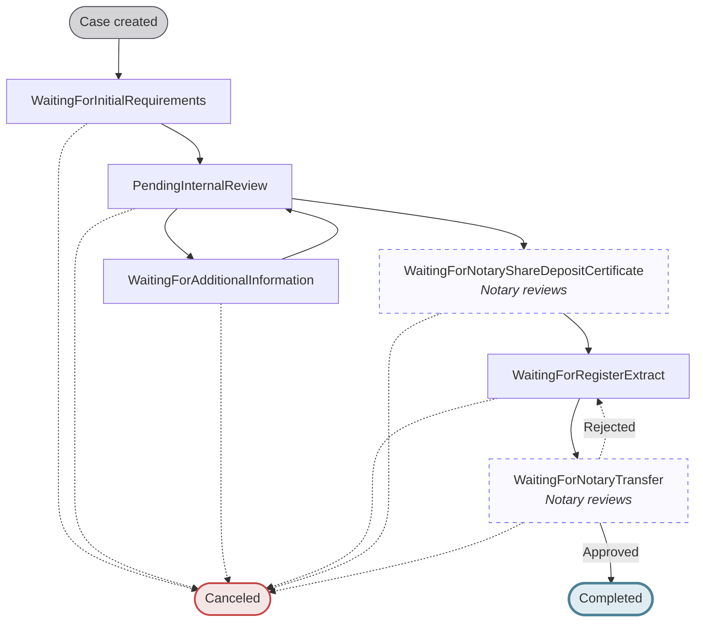
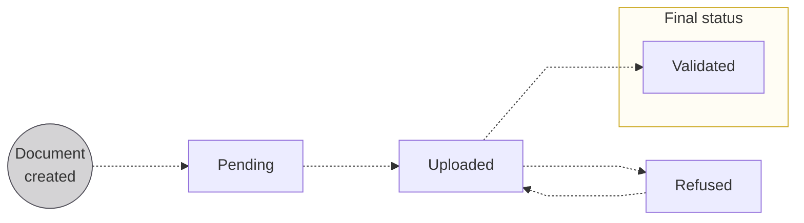
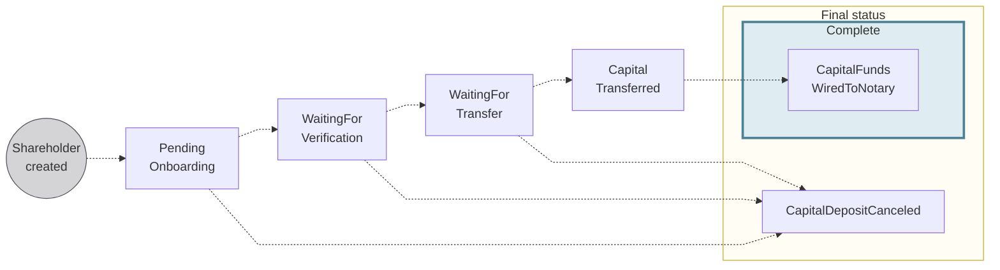
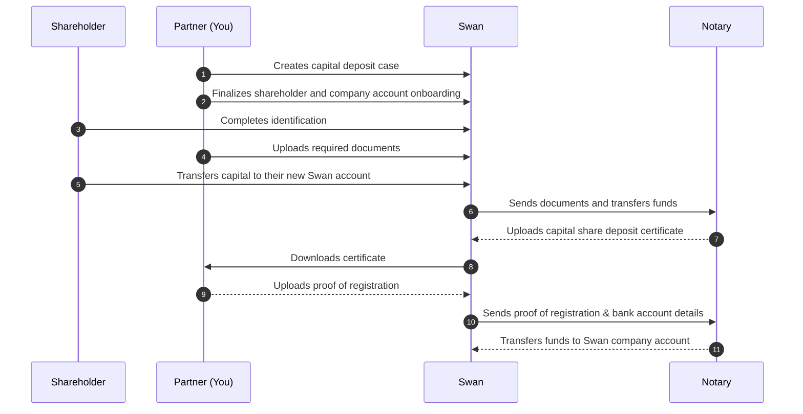

# Capital deposits

import CapitalDepositDefinition from "../../../../topics/definitions/_capital-deposit.mdx";

Deposit your client's share capital before registering their new French company: create a capital deposit case, collect documents, verify shareholders, and transfer funds to the notary.

## In this section

- [Create a case](/accounts/guides/onboarding/capital-deposits/create-case)
- [Upload documents](/accounts/guides/onboarding/capital-deposits/upload-documents)
- [Cancel a case](/accounts/guides/onboarding/capital-deposits/cancel)
- [Update company](/accounts/guides/onboarding/capital-deposits/update-company)
- [Update shareholder amount](/accounts/guides/onboarding/capital-deposits/update-shareholder-amount)

> <CapitalDepositDefinition />

When **creating a new company**, you're required to **deposit your share capital** before registering the company.

## Overview {#overview}

Several key stakeholders are involved in the capital deposit process: **you**; **your client**, their future company, and their shareholders; **Swan** (and Swan's API); and Swan's partner **notary**.

The capital deposit process consists of a few main actions:

- Creating a Swan capital deposit case to collect everything
- Creating Swan accounts
- Verifying identities
- Uploading documents
- Transferring funds

Learn more about the stakeholders and their interactions to complete a capital deposit on this page before continuing to the [guide for 🇫🇷 France](/accounts/guides/onboarding/capital-deposits/#france).

## Capital deposit case {#case}

The [`CapitalDepositCase`](https://api-reference.swan.io/objects/capital-deposit-case) API object compiles all information for a capital deposit case, including:

1. Details about the future company
1. Company account
1. Shareholder information
1. Capital deposit documents

### Case statuses {#case-statuses}

| Case status | Explanation |
| --- | --- |
| `WaitingForInitialRequirements` | The case has been initiated and is waiting for shareholder verification, fund transfers, document uploads, and completion of company onboarding. |
| `PendingInternalReview` | Swan is reviewing the information and documents provided. |
| `WaitingForAdditionalInformation` | After review, Swan has requested additional details or corrections from the customer and is awaiting their response. |
| `WaitingForNotaryShareDepositCertificate` | **_Notary reviews_** _the deposited funds and submitted documents, then creates the certificate and uploads it to Swan_. |
| `WaitingForRegisterExtract` | The end-user uploads their register extract for notary review. |
| `WaitingForNotaryTransfer` | **_Notary reviews_** _the register extract_. If the document is rejected by either Swan or the notary, the case will move back to `WaitingForRegisterExtract`. |
| `Canceled` | The case was canceled before completion by either you or Swan. A [cancelation reason code](#cancelation-reason-codes) is available in the `CapitalDepositCaseCanceledStatusInfo` type. |
| `Completed` | Notary reviewed and approved all elements and transferred the funds to the new company; the process is complete. |

### Cancelation reason codes {#cancelation-reason-codes}

When a capital deposit case has the status `Canceled`, a reason code is available on the [`CapitalDepositCaseCanceledStatusInfo`](https://api-reference.swan.io/objects/capital-deposit-case-canceled-status-info) type.

:::note Backward compatibility
Capital deposit cases canceled before 2 April 2026 have a `null` cancelation reason at the capital deposit level.
For those cases, refer to the account-level deprecated closure reason `CapitalDepositReason`.
:::

| Reason code | Explanation |
| --- | --- |
| `KYCIssue` | Documents missing, incorrect, or no reply. |
| `ForbiddenActivity` | Prohibited business sectors. |
| `DuplicateOnboarding` | A second account was created by mistake. |
| `DeniedCountryResidency` | High-risk UBO or resident. |
| `RefusedIbanCountry` | The account holder was assigned the wrong IBAN country, or the IBAN country isn't allowed. |
| `CompanyRegistrationCountryNotSupported` | The company registration country isn't supported by Swan. |
| `BusinessInactiveOrNotRegistered` | The company is inactive or not registered. |
| `UnsupportedLegalForm` | The legal form can't be onboarded by Swan. |
| `TCViolation` | Terms & Conditions violation. |
| `CapitalDepositCompleted` | Standard closure of a temporary capital deposit account after the company is registered. |
| `CapitalDepositWithdrawn` | The capital deposit has been withdrawn. |
| `CapitalDepositRefusedByNotary` | The notary refused the capital deposit case. |
| `ComplianceReason` | Cancelation for compliance reasons. |
| `RegulatoryRequirement` | Cancelation required by regulation. |

These reason codes are derived from the same list as [account closure reason codes](/topics/accounts/closure/#closure-reason-codes).

## Required documents {#documents}

Processing your capital shares deposit **requires several documents**.
These can be uploaded using the API.
Documents must meet Swan's requirements; otherwise, the document will be assigned the status `Refused` and you'll need to upload the document again.

### List of required documents {#documents-list}

All documents are **mandatory** unless marked _if requested_.

<table>
  <tr>
    <th>Stakeholder </th>
    <th>Document</th>
    <th>API document type</th>
  </tr>
  <tr>
    <td rowspan="2">Individual shareholders</td>
    <td>Proof of address</td>
    <td>
      <code>ProofOfIndividualAddress</code>
       
      <em>
        Refer to <a href="/accounts/reference/proof-of-address">proof of address</a> for acceptable documents
      </em>
    </td>
  </tr>
  <tr>
    <td>
      Identity document proving the shareholder's identity (collected during identification)
    </td>
    <td>
      <code>ProofOfIdentity</code>
    </td>
  </tr>
  <tr>
    <td rowspan="2">Company shareholders</td>
    <td>
      Proof of registration of the company
    </td>
    <td>
      <code>RegisterExtract</code>
       
      <em>
        Refer to <a href="/accounts/reference/country-requirements">proof of registration</a> for acceptable documents
      </em>
    </td>
  </tr>
  <tr>
    <td>
      Identity document proving the identity of the company shareholder's legal representative (collected during identification if they are an account member).
    </td>
    <td>
      <code>ProofOfIdentity</code>
    </td>
  </tr>
  <tr>
    <td rowspan="4">Future company</td>
    <td>Document available only after the notary validates the case, uploaded at a specific time during the capital deposit process</td>
    <td>
      <code>RegisterExtract</code>
    </td>
  </tr>
  <tr>
    <td>Draft of the articles of incorporation</td>
    <td>
      <code>ArticlesOfIncorporation</code>
    </td>
  </tr>
  <tr>
    <td>Lease agreement for official company address ∗</td>
    <td>
      <code>CompanyLeaseAgreement</code>
    </td>
  </tr>
  <tr>
    <td>Lease mandate from legal representative</td>
    <td>
      <code>PowerOfAttorney</code>
       
      <em>Template available in French</em>
    </td>
  </tr>
</table>

  
Specifications for **Future company** > **lease agreement** ∗

  

    
If a future company doesn't have a company lease agreement as proof of the official company address, other elements are required according to their situation.
      All identity documents must be in full color and include the front and back of the document.

    | Official company address is... | Elements required |
| --- | --- |
| Legal representative's address | <ul><li>Business address affidavit *(domiciliation statement)* from the legal representative</li><li>If the legal representative *isn't* a shareholder:<ul><li>Identity document for the legal representative</li><li>Proof of address for the legal representative</li></ul></li></ul> |
| Legal representative's address, but they're renting or hosted by someone else | <ul><li>Business address affidavit *(domiciliation statement)* from the host</li><li>If the legal representative *isn't* a shareholder:<ul><li>Identity document for the legal representative</li><li>Identity document for the host</li><li>Proof of address for the host</li></ul></li></ul> |
| Another company's office address | <ul><li>KBIS of host company issued within the last three months</li><li>Business address affidavit *(domiciliation statement)* from the host company's legal representative</li><li>Identity document for the legal representative who provided the business address affidavit</li></ul> |
  

### Document statuses {#documents-statuses}

| Document status | Explanation |
| --- | --- |
| `Pending`   | Place for the document is created, but the document isn't uploaded yet. |
| `Uploaded`  | Document successfully uploaded; you can change and re-upload the document as long it retains the status `Uploaded`  **Next step**: Swan reviews the document and either validates or refuses it. |
| `Validated` | Swan validated the document. |
| `Refused`   | Document doesn't meet requirements. Review `reasonCode` for a refusal category and the optional `reason` for a plain-text explanation. Both are visible on your Dashboard and available through the API.  **Next step**: Upload a new document, then the status returns to `Uploaded`. |

## Shareholders {#shareholders}

A shareholder is a physical or legal person who deposits funds in exchange for ownership of the future company.
To deposit funds, the shareholder opens a **temporary** Swan payment account.

Because they're opening an account, each shareholder must go through the [onboarding](/accounts/guides/onboarding), [identification](/topics/users/identifications/), and [account holder verification](/accounts/guides/onboarding/account-holders#verification-process) processes.
After completing requirements, the shareholder's account is assigned an IBAN they can use to deposit funds.

As soon as the `CapitalDepositCase` is complete, the shareholder's temporary account **closes automatically**.

Shareholders must provide proof of their residence address.
Only official documents are validated.
Refer to the **list of acceptable documents** in the [Partnership Document Center](/accounts/reference/proof-of-address).

### Shareholder statuses {#shareholders-statuses}

| Shareholder status | Explanation |
| --- | --- |
| `PendingOnboarding` | Default status after the shareholder is created; shareholder must **complete their onboarding** and their **account must be created** to continue. |
| `WaitingForVerification` | Possible status if the account holder verification isn't complete at the moment the shareholder's account is created.  _Status bypassed if the [account holder status](/accounts/guides/onboarding/account-holders#verification-process) is already `Verified`_. |
| `WaitingForTransfer` | Waiting for the shareholder to deposit the full share capital in their Swan account created during onboarding, which **must** be transferred from an account belonging to the shareholder. The transfer must be a [SEPA Credit Transfer](#transfer-requirements); international credit transfers aren't accepted and are rejected automatically. |
| `CapitalTransferred` | Waiting for the rest of the capital deposit case to be ready and the funds to be transferred to the notary. |
| `CapitalFundsWiredToNotary` | Still waiting for the rest of the capital deposit case to be ready, but now the funds are with the notary. |
| `CapitalDepositCanceled` | When a [`CapitalDepositCase` is `Canceled`](#case-statuses), the shareholder status changes to `CapitalDepositCanceled`.  If an account was already created for the shareholder, the account is also closed automatically. |

## Transfer requirements {#transfer-requirements}

Shareholder accounts have specific transfer requirements for capital deposits.

### SEPA Credit Transfers only {#sepa-only}

:::caution
Shareholder accounts only accept [SEPA Credit Transfers](/topics/payments/credit-transfers/sepa/) for capital deposits.
International credit transfers are **rejected automatically** before settlement, regardless of the amount.
Ensure all transfers are sent from the shareholder's account in their name.
:::

## Sequence diagram {#diagram}

## Updating a shareholder's deposit amount {#update-amount}

You can update a shareholder's deposit amount directly through the API.

import UpdateShareholderPrereqs from './partials/_update-shareholder-prereqs.mdx';

<UpdateShareholderPrereqs />

Updating a shareholder's deposit amount automatically triggers a recalculation of the total capital deposit amount for the case.

Follow the guide to [update a shareholder's capital deposit amount](/accounts/guides/onboarding/capital-deposits/update-shareholder-amount).

## Updating company information {#update-company}

You can update the main company information linked to a capital deposit directly through the API.

This allows you to correct the company name and postal address without contacting the Support team.

import UpdateCompanyPrereqs from './partials/_update-company-prereqs.mdx';

<UpdateCompanyPrereqs />

Updating these fields automatically syncs the data across both the capital deposit case and the associated account holder.

Follow the guide to [update a capital deposit company](/accounts/guides/onboarding/capital-deposits/update-company).

## Canceling a capital deposit {#cancel}

You can cancel an ongoing capital deposit if needed.

import CancelCase from './partials/_cancel-case.mdx';

<CancelCase />

When a capital deposit case is canceled, any associated shareholder accounts are closed automatically.

Follow the guide to [cancel a capital deposit](/accounts/guides/onboarding/capital-deposits/cancel).

## Deposit capital in France {#france}

Depositing share capital in France is a multi-step process involving several key players: you and your end user, Swan, and the notary.

- **You and your end user** are responsible for completing **steps 1 through 5**, as well as **step 8**.
- Swan completes step 6.
- The notary completes steps 7 and 9.

:::info General capital deposit information
Review the [**sequence diagram**](#diagram) on the general capital deposit page to see the interactions in more details, plus find information about **statuses**, **shareholders**, and more.
:::

### Step 1: Create capital deposit case {#create-api-case}

Use the API to create a capital deposit case object.
Everything related to your capital deposit, including shareholder information, transfers, and documents, will be collected in the `case` object.

→ Follow the [detailed guide](/accounts/guides/onboarding/capital-deposits/create-case) to create your case, which includes full API mutation examples.

### Step 2: Upload capital deposit documents {#upload-documents}

Use the API to:

1. Generate a unique upload URL for each document you need to upload, and
1. Upload all required documents.

→ Follow the [detailed guide](/accounts/guides/onboarding/capital-deposits/upload-documents) to generate URLs and upload documents, which includes full API mutation examples.

### Step 3: Finalize account creation {#finalize-account-creation}

Following the guide to create a capital deposit case also launches the account creation process for the future company and individual shareholders.

The individual Swan accounts serve as **escrow accounts**, and are the only acceptable accounts to which shareholders can transfer their capital deposit funds.

To complete the account creation process:

1. Shareholders need to complete the account onboarding process. [Monitor their progress](/accounts/guides/onboarding/#get-info) if needed.
1. After each shareholder has at least opened their onboarding link, you might choose to use the API to [finalize all account onboardings](/accounts/guides/onboarding/#finalize). Shareholders can also finalize their own onboardings.

### Step 4: Verify account holders {#verify-account-holders}

After the shareholders complete the onboarding process, they must complete account holder verification.

→ Learn more about the [verification process](/accounts/guides/onboarding/account-holders#verification-process) for new account holders.

:::info Identification level
Swan supports multiple levels to verify your identity.
For capital deposits, please meet the following [identification levels](/topics/users/identifications/#levels-processes):

- Shareholder accounts: PVID
- Company accounts: Expert
:::

### Step 5: Transfer capital funds {#transfer-capital-funds}

Each shareholder must transfer their capital share deposit from an **account in their name** to their new Swan account.

Shareholders must **perform this transfer themselves**, and need their **new IBAN** to do so.

A good practice is to configure your integration to send an **automated email** to shareholders with the new IBANs.
Alternately, they can access the IBAN associated with their Swan account through the Web Banking user interface, or you can access it on the Dashboard and share it with them.

:::caution
After step 5 is complete, it's no longer possible to [cancel the capital deposit](#cancel) with the API.
However, you could still contact Swan and ask to cancel the case.
:::

### Step 6: Swan validates and updates case {#validate-case}

Here's a quick review.
At this point, you've done the following for your `CapitalDepositCase`:

- Created Swan accounts for shareholders and the future company
- Completed the onboarding and account holder verification processes for those accounts
- Transferred the shareholders' capital funds into their individual Swan accounts
- Uploaded all required documents

To complete step 6, Swan:

- Reviews the entire case.
- Validates the capital deposit in Swan's system.
- Updates the [case status](#case-statuses) to `WaitingForShareDepositCertificate` so it gets sent to the notary.

### Step 7: Notary uploads certificate {#upload-certificate}

After the notary validates this stage of the capital deposit, they respond with a **capital shares deposit certificate**.
This process is typically quick, taking up to **two business days**.
The certificate is assigned the document type `CapitalShareDepositCertificate`.

View the certificate in the capital deposits section of your Dashboard.
You can also retrieve it with the `capitalDepositCase` API query.
Be sure to add `documents` > `downloadUrl` in the explorer.

### Step 8: Upload the register extract (KBIS) {#upload-kbis}

Upload your KBIS using the same document upload process as in step 4.
Choose document type `RegisterExtract`.

→ Follow the [detailed guide](/accounts/guides/onboarding/capital-deposits/upload-documents) to generate an upload URL and upload your KBIS, which includes full API mutation examples.

### Step 9: Notary transfers funds to company account {#transfer-funds-company}

After the notary validates the register extract, they'll transfer your capital deposit funds to the company account you created at the beginning of this process.
This process usually takes up to **two business days**.

:::success Congratulations
As soon as the capital funds arrive in your company's Swan account, the capital deposit process is complete.
**Best of luck with your endeavor!**
:::

## Related

- [Create a capital deposit case](/accounts/guides/onboarding/capital-deposits/create-case)
- [Account onboarding](/accounts/guides/onboarding) · [Company onboarding](/accounts/guides/onboarding/company)
- [Proof of address](/accounts/reference/proof-of-address) · [Country requirements](/accounts/reference/country-requirements)
