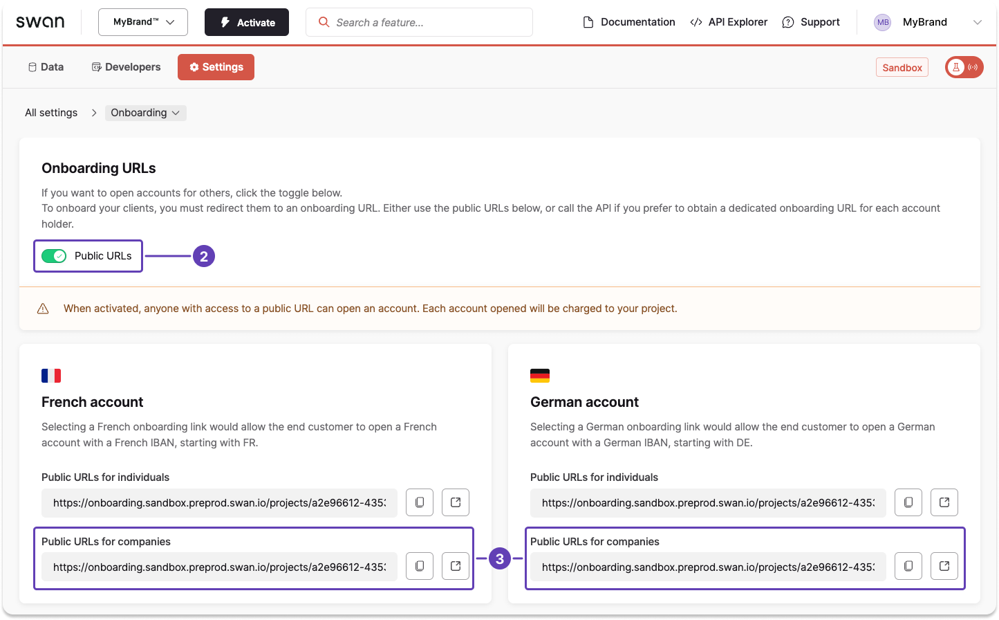

import PublicOnboardingUrl from '../../partials/_create-public-url.mdx';

# Create a company onboarding link from the Dashboard

Share your project's public company onboarding link from your Dashboard.

## Public link {#public-link}

<PublicOnboardingUrl />

