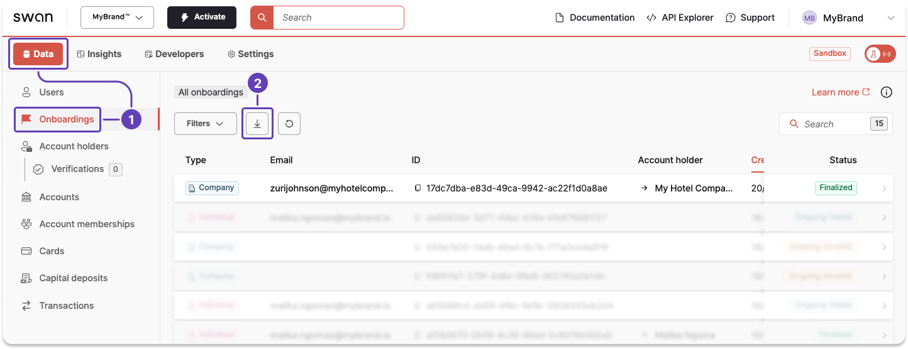

# Export onboarding data from the Dashboard

Export the onboarding data available on your Dashboard as a `.csv` file.

## Steps

1. On your Dashboard, go to **Data** > **Onboardings**.
1. Click the **download icon** to trigger a `.csv` export.
1. A modal appears. Click **Export data** to finalize the request.

