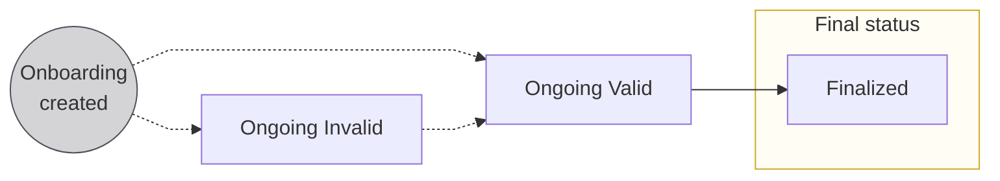
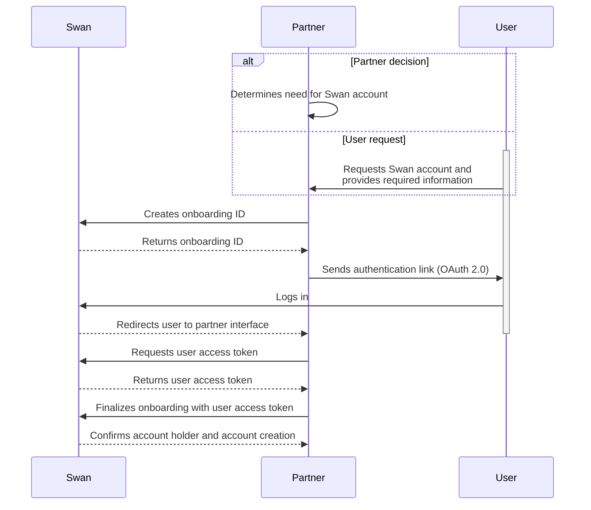

import DeprecationTimeline from './partials/_deprecated-mutation-timeline.mdx';
import PublicOnboardingLinks from './partials/_public-onboarding-links.mdx';
import NotificationBranding from '../../../topics/partials/_notification-branding.mdx';
import ExportNextSteps from '../../../topics/partials/_export-next-steps.mdx';

# Account onboarding

<p className="ia-lede">Account onboarding is the process to create account holders and open their first Swan account. This section covers the shared onboarding concept model, the cross-cutting operations that apply to both individual and company onboarding, and links to each onboarding type.</p>

## In this section

- [Individual onboarding](/accounts/guides/onboarding/individual)
- [Company onboarding](/accounts/guides/onboarding/company)
- [Account holders](/accounts/guides/onboarding/account-holders)
- [Capital deposits](/accounts/guides/onboarding/capital-deposits)

## Overview {#overview}

Account onboarding is, at its core, the **process to create [account holders](/accounts/guides/onboarding/account-holders)**.

One end result of onboarding is also creating the first account for the new account holder.
Account holders complete a new onboarding to open another account.

:::info Cross reference
During onboarding, users also [complete an account holder verification](/accounts/guides/onboarding/account-holders#verification-process) process and [authenticate](/dev-tools/using-api/authentication) (log in) for the first time.
They might also [sign up for Swan](/topics/users/#signup) if they haven't already.
:::

:::info New onboarding API
Swan has released a new version of the onboarding API.
New mutations use a nested input structure and return typed responses (`IndividualAccountHolderOnboarding` or `CompanyAccountHolderOnboarding`).
<DeprecationTimeline />
All guides on this site now present the new API as the primary option.
Follow the [migration guide](/accounts/guides/onboarding/#migrate) for step-by-step instructions.
:::

### Types of onboarding {#types}

There are two types of onboarding, individual and company, directly linked to the two types of accounts Swan offers.
Each onboarding has a unique `onboardingId`.

The individual and company onboarding processes are similar.
However, they're split in the documentation to prevent mixing up small but important details.

| Type | Explanation |
| --- | --- |
| [Individual onboarding](/accounts/guides/onboarding/individual) | <ul><li>Create a new **individual** account holder.</li><li>Open a new **individual** Swan account for that account holder.</li></ul> |
| [Company onboarding](/accounts/guides/onboarding/company) | <ul><li>Create a new **company** account holder.</li><li>Open a new **company** Swan account for that account holder.</li></ul> |

:::tip Swan Banking Frontend
If you'd like to customize the onboarding experience for your users (while respecting local regulations), check out the open source [Swan Banking Frontend](https://swan-io.github.io/swan-partner-frontend/specs/onboarding/).
:::

### Purpose of onboarding {#purpose}

Completing the onboarding process serves several purposes.

1. A new **account holder** is created.
1. The account holder's **Swan account** is created.
1. The person who performed the onboarding process becomes the legal representative of the account. They're also the account's first member with [full permissions](/accounts/reference/membership-permissions).
1. Your relationship with the account holder is stored in the `partnershipStatusInfo` field of the `account` object.

## Onboarding links {#links}

Consider a few details about Swan onboarding links.

1. You can **generate unique links** using the **API**, or use **public links** from your **Dashboard**. Learn how to generate onboarding links in the guides for [individuals](/accounts/guides/onboarding/individual#create) and [companies](/accounts/guides/onboarding/company#create).
1. Unique **onboarding links are single-use**. If you get an HTTP 500 Internal Server Error when submitting the onboarding form, it's because an onboarding was already finalized using that link. You need to generate a new link.
1. The true purpose of the `state` parameter is to prevent Cross-Site Request Forgery (CSRF) and related attacks. Consider using it to your advantage. It includes your user's onboarding ID by default, so you can save this onboarding ID when generating the link. 

<PublicOnboardingLinks />

## Requirements {#requirements}

### Country requirements {#country-reqs}

Onboarding is a **highly localized experience**.
Everything from **what to include in your API request** to how to ask **users to verify their identity** to whether Swan **requires certain ID numbers or documents** depends on the [account country](/topics/accounts/#account-country).

Account onboarding country requirements are described in the [individual](/accounts/guides/onboarding/individual#country-reqs) and [company](/accounts/guides/onboarding/company#country-reqs) onboarding sections.
Please follow the requirements for your target countries closely.

### Supporting documents {#documents}

Collecting [supporting documents](/topics/accounts/documents/) impacts multiple elements of the onboarding process.
Consider these steps, including the statuses of both [account holder verification](/accounts/guides/onboarding/account-holders#verification-process-statuses) and the [supporting document collection](/topics/accounts/documents/#collection-statuses).

<table>
  <tr>
    <th>Step</th>
    <th>Event</th>
    <th>Account holder<br />verification status</th>
    <th>Supporting document<br />collection status</th>
  </tr>
  <tr>
    <td><center>1</center></td>
    <td>Onboarding created</td>
    <td><center>Not yet created</center></td>
    <td><center>`WaitingForDocument`</center></td>
  </tr>
  <tr>
    <td><center>2</center></td>
    <td>Onboarding finalized</td>
    <td><center>`NotStarted`</center></td>
    <td><center>`PendingReview`</center></td>
  </tr>
  <tr>
    <td><center>3</center></td>
    <td>Legal representative completes [identification](/topics/users/identifications/)</td>
    <td><center>`Pending`</center></td>
    <td><center>`PendingReview`</center></td>
  </tr>
  <tr>
    <td><center>4</center></td>
    <td>Swan requests [supporting documents](/topics/accounts/documents/)<br /><br />💡 *[Subscribe to the webhook](/dev-tools/using-api/webhooks) `supportingDocumentCollection.updated`. You'll be notified when a request is sent to collect documents.*</td>
    <td><center>`WaitingForInformation`</center></td>
    <td><center>`WaitingForDocuments`</center></td>
  </tr>
  <tr>
    <td><center>5</center></td>
    <td>Partner uploads new documents<br /><br />💡 *If needed, [get a list of required documents](/accounts/guides/onboarding/#get-list). Then, [upload missing documents](/topics/accounts/documents/guide-upload-onboarding).*</td>
    <td><center>`WaitingForInformation`</center></td>
    <td><center>`WaitingForDocuments`</center></td>
  </tr>
  <tr>
    <td><center>6</center></td>
    <td>Partner requests a collection review<br /><br />💡 *Partners (you) need to request a supporting document collection review after all supporting documents are uploaded. [Request a review](/topics/accounts/documents/guide-request-collection-review) with the API or from your Dashboard.*</td>
    <td><center>`Pending`</center></td>
    <td><center>`PendingReview`</center></td>
  </tr>
  <tr>
    <td><center>7</center></td>
    <td>Swan reviews supporting documents</td>
    <td><center>`Pending`</center></td>
    <td><center>`PendingReview`</center></td>
  </tr>
  <tr>
    <td rowspan="2"><center>8</center></td>
    <td>(a) Swan **approves** the account holder</td>
    <td><center>`Verified`</center></td>
    <td><center>`Approved`</center></td>
  </tr>
  <tr>
    <td>(b) Swan **needs more documents** to verify the account holder<br /><br />💡 *[Get the list of required documents](/accounts/guides/onboarding/#get-list) and review the rejection reason. Then, return to step 4.*</td>
    <td><center>`WaitingForInformation`</center></td>
    <td><center>`WaitingForDocuments`</center></td>
  </tr>
</table>

:::caution Mandatory documents
All requested supporting documents are mandatory to finalize an onboarding.
Upload every document Swan requests before requesting a collection review.
:::

## Statuses {#statuses}



| Status | Explanation |
|---|---|
| `Ongoing (Invalid)` | <ul><li>This is the first status assigned to an onboarding when **using the frontend**.</li><li>If using the **API**, this is the first status if **not all required information** is included with your mutation.</li><li>Status might change to `Invalid` if required information is removed or if some information is incorrect.</li></ul>**Next step**: Submit or update required information to advance to `Ongoing (Valid)` (both you and the end user can submit or update information) |
| `Ongoing (Valid)` | <ul><li>This is the first status assigned to an onboarding if **using the API** and you **included all required information** with your mutation.</li><li>Status changes to `Valid` when missing required information is submitted or if incorrect information is updated.</li></ul>**Next step**: User completes form, clicks "Finalize," and provides consent to complete the onboarding process |
| `Finalized` | Onboarding completed |

## API sequence diagram {#diagram}

Review this sequence diagram that depicts the onboarding flow with the API.



## Notifications {#notifications}

Swan sends email notifications to users during the onboarding process.

<NotificationBranding />

### Your account terms and conditions {#notification-terms}

When a user finalizes their onboarding, Swan automatically sends an email containing Swan's terms and conditions along with your Partnership Conditions.

**Trigger**: Automatic when the onboarding status switches to `Finalized`.

**Configuration**: This notification is always sent by Swan and can't be configured. The recipient is the email address provided during the onboarding flow by the account's legal representative, and the language used is the one selected during the onboarding flow.

**Template**: This notification always uses your project logo and accent color.

## Migrate to the current onboarding API {#migrate}

Swan's current onboarding API replaces the previous one with cleaner naming, structured inputs, typed responses, and improved data collection.

This guide walks you through migrating your integration.

:::info Deprecation timeline
Previous onboarding mutations and queries are deprecated and will be removed at the **end of September 2026**.

Migrate to the current API before this date to avoid disruption.
:::

### What's changing

The current API introduces changes across naming, input structure, data requirements, response types, and registry data handling.

Review the full comparison on the [account onboarding enhancements](/preview/new-onboarding) page, which covers:

- Mutation and query renames (for example, `onboardIndividualAccountHolder` becomes `createIndividualAccountHolderOnboarding`).
- Nested input structure with `accountInfo`, `accountAdmin`, and `company` objects instead of flat inputs.
- Typed response types (`IndividualAccountHolderOnboarding`, `CompanyAccountHolderOnboarding`) instead of the generic `Onboarding` type.
- New required fields for enhanced risk assessment and compliance.
- Explicit registry data retrieval with `companyInfoRegistryData` instead of automatic population.

#### Field mapping

For a complete field-by-field comparison between the previous and current APIs, refer to the field reference pages:

- [Individual onboarding fields](/accounts/guides/onboarding/individual#fields)
- [Company onboarding fields](/accounts/guides/onboarding/company#fields)

These pages include API mapping tables that show each previous field alongside its current equivalent.
The mapping tables will be available until the previous mutations are retired at the end of September 2026.

### Coexistence

The previous and current onboarding APIs can run in parallel in the same project.
You don't need to migrate all at once.

- New onboardings can use either the previous or current mutations.
- In-progress onboardings created with the previous API can continue to be updated and finalized using the previous mutations.
- You can create new onboardings with the current API while still managing existing onboardings through the previous API.

### Migration steps

Follow these steps to migrate your integration.
Test thoroughly in Sandbox before switching in Live.

#### Step 1: Update mutation names

Replace each deprecated mutation and query with its current equivalent.

| Previous mutation or query | Current mutation or query |
|---|---|
| `onboardIndividualAccountHolder` | `createIndividualAccountHolderOnboarding` |
| `unauthenticatedOnboardPublicIndividualAccountHolder` | `createPublicIndividualAccountHolderOnboarding` |
| `updateIndividualOnboarding` | `updateIndividualAccountHolderOnboarding` |
| `unauthenticatedUpdateIndividualOnboarding` | `updatePublicIndividualAccountHolderOnboarding` |
| `onboardCompanyAccountHolder` | `createCompanyAccountHolderOnboarding` |
| `unauthenticatedOnboardPublicCompanyAccountHolder` | `createPublicCompanyAccountHolderOnboarding` |
| `updateCompanyOnboarding` | `updateCompanyAccountHolderOnboarding` |
| `unauthenticatedUpdateCompanyOnboarding` | `updatePublicCompanyAccountHolderOnboarding` |
| `finalizeOnboarding` | `finalizeAccountHolderOnboarding` |
| `onboarding` (query) | `accountHolderOnboarding` |
| `onboardingInfo` (public query) | `publicAccountHolderOnboarding` |
| `onboardings` (list query) | `accountHolderOnboardings` |

#### Step 2: Update input structure

The current API uses a nested input structure instead of flat inputs.

For **individual** onboardings, group fields into two objects:

- `accountInfo`: account-level details such as `country` and `name`.
- `accountAdmin`: the individual's personal information such as `email`, `employmentStatus`, and `monthlyIncome`.

For **company** onboardings, group fields into three objects:

- `accountInfo`: account-level details such as `country` and `name`.
- `accountAdmin`: personal information for the person opening the account.
- `company`: company details including `registrationNumber`, `name`, `legalForm`, and `relatedIndividuals`.

Refer to the [individual](/accounts/guides/onboarding/individual#create) and [company](/accounts/guides/onboarding/company#create) creation guides for complete mutation examples.

#### Step 3: Handle new required fields

The current API collects additional data for risk assessment and compliance.
Some fields that were optional or didn't exist in the previous API are now required.

Check the field reference pages for the complete list of requirements by country:

- [Individual onboarding fields](/accounts/guides/onboarding/individual#fields)
- [Company onboarding fields](/accounts/guides/onboarding/company#fields)

#### Step 4: Update response handling

The current API returns typed responses instead of the generic `Onboarding` type.

- Individual mutations return `IndividualAccountHolderOnboarding`.
- Company mutations return `CompanyAccountHolderOnboarding`.
- The `finalizeAccountHolderOnboarding` mutation returns a `FinalizeAccountHolderOnboardingPayload`. On success, the payload contains a `FinalizeAccountHolderOnboardingSuccessPayload` with an `onboarding` field of type `AccountHolderOnboarding` (union).

Update your response parsing to handle the new type names and field structure.

#### Step 5: Update registry data handling (French company onboardings)

This step applies only if you onboard French companies. If you don't, skip to Step 6.

Previously, Swan auto-populated empty onboarding fields with data from the French National Business Register (RNE). The current API doesn't.

Instead, call the `companyInfoRegistryData` query with the company's `registrationNumber` and `residencyAddressCountry`, then pass the results to the create or update mutation.

#### Step 6: Test in Sandbox

Validate your updated integration in Sandbox before going live.
Refer to the [testing checklist](#testing-checklist) for key scenarios.

#### Step 7: Switch in Live

After successful Sandbox testing, deploy your changes to your Live environment.

### In-progress onboardings

The migration doesn't affect in-progress onboardings created with the previous API.

- Continue to update and finalize them using the previous mutations.
- They don't need to be recreated with the current API.
- Once finalized, any future onboardings should use the current API.

After the previous mutations are removed at the end of September 2026, you'll no longer be able to update or finalize onboardings through them. Make sure your integration is fully migrated by then.

### Deprecation timeline

| Date | Event |
|---|---|
| March 2026 | Current onboarding API available in beta. |
| April 2026 | Documentation updated. Previous mutations marked as deprecated across all guide pages. |
| End of September 2026 | Previous mutations and queries removed. |

### Testing checklist {#testing-checklist}

Before going live with the current API, validate the following scenarios in Sandbox:

1. Create an individual onboarding with all required fields for your target countries.
1. Create a company onboarding with `relatedIndividuals` (at least one legal representative and one UBO).
1. Update an existing onboarding to confirm nested input structure works correctly.
1. Finalize an onboarding and confirm the typed response (`IndividualAccountHolderOnboarding` or `CompanyAccountHolderOnboarding`).
1. For French companies: call `companyInfoRegistryData` and use the results to pre-fill the create mutation.
1. Test public onboarding mutations if you use public onboarding links.
1. Confirm that [webhook payloads](/dev-tools/using-api/webhooks) for `Onboarding.Created` and `Onboarding.Updated` still match your expectations.
1. Verify error handling for new rejection types (`OnboardingNotFoundRejection`, `OnboardingAlreadyFinalizedRejection`, `OnboardingNotReadyForFinalizationRejection`).

## Get information about an onboarding {#get-info}

Use the `accountHolderOnboardings` query to get information about your onboardings, allowing you to monitor progress or share information with your end user.

Queries are highly customizable, so use the `accountHolderOnboardings` query to retrieve any information that will help you follow along with your users.
You can also use it to retrieve onboarding IDs.

After getting information about an onboarding, you might want to **update that onboarding** if it is still ongoing.
Refer to the guides to update an [individual](/accounts/guides/onboarding/individual#update) or [company](/accounts/guides/onboarding/company#update) onboarding.

:::tip Prerequisites
To monitor onboarding progress, you must have at least one existing onboarding, either [individual](/accounts/guides/onboarding/individual#create) or [company](/accounts/guides/onboarding/company#create).
The onboarding can have [any status](/accounts/guides/onboarding/#statuses).
:::

:::note Deprecated queries
`onboardings` is deprecated. Use `accountHolderOnboardings` for all new integrations.
<DeprecationTimeline />
For single-onboarding lookups, use `accountHolderOnboarding` (replaces `onboarding`).
:::

### Guide

1. Call the `accountHolderOnboardings` query.
1. Add all the query options you'd like to monitor.
    * For this exercise, add: `createdAt`, `accountAdmin { email }`, `onboardingUrl`, `statusInfo` > `status`, `id`, and `totalCount`.
    * To `statusInfo` > `status`, add a **rejection** as well: `OnboardingInvalidStatusInfo` with `errors`, `field`, and `status`.
1. You can only get information for up to **100 onboardings** at a time. Add [pagination](/dev-tools/using-api/pagination) to tailor your response to the information you need.

### Query

<a href="https://explorer.swan.io?query=cXVlcnkgTW9uaXRvck9uYm9hcmRpbmcgewogIGFjY291bnRIb2xkZXJPbmJvYXJkaW5ncyhmaXJzdDogMTApIHsKICAgIGVkZ2VzIHsKICAgICAgbm9kZSB7CiAgICAgICAgLi4uIG9uIEluZGl2aWR1YWxBY2NvdW50SG9sZGVyT25ib2FyZGluZyB7CiAgICAgICAgICBpZAogICAgICAgICAgY3JlYXRlZEF0CiAgICAgICAgICBvbmJvYXJkaW5nVXJsCiAgICAgICAgICBzdGF0dXNJbmZvIHsKICAgICAgICAgICAgc3RhdHVzCiAgICAgICAgICAgIC4uLiBvbiBPbmJvYXJkaW5nSW52YWxpZFN0YXR1c0luZm8gewogICAgICAgICAgICAgIF9fdHlwZW5hbWUKICAgICAgICAgICAgICBlcnJvcnMgewogICAgICAgICAgICAgICAgZmllbGQKICAgICAgICAgICAgICAgIGVycm9ycwogICAgICAgICAgICAgIH0KICAgICAgICAgICAgICBzdGF0dXMKICAgICAgICAgICAgfQogICAgICAgICAgfQogICAgICAgICAgYWNjb3VudEFkbWluIHsKICAgICAgICAgICAgZW1haWwKICAgICAgICAgIH0KICAgICAgICB9CiAgICAgICAgLi4uIG9uIENvbXBhbnlBY2NvdW50SG9sZGVyT25ib2FyZGluZyB7CiAgICAgICAgICBpZAogICAgICAgICAgY3JlYXRlZEF0CiAgICAgICAgICBvbmJvYXJkaW5nVXJsCiAgICAgICAgICBzdGF0dXNJbmZvIHsKICAgICAgICAgICAgc3RhdHVzCiAgICAgICAgICAgIC4uLiBvbiBPbmJvYXJkaW5nSW52YWxpZFN0YXR1c0luZm8gewogICAgICAgICAgICAgIF9fdHlwZW5hbWUKICAgICAgICAgICAgICBlcnJvcnMgewogICAgICAgICAgICAgICAgZmllbGQKICAgICAgICAgICAgICAgIGVycm9ycwogICAgICAgICAgICAgIH0KICAgICAgICAgICAgICBzdGF0dXMKICAgICAgICAgICAgfQogICAgICAgICAgfQogICAgICAgICAgYWNjb3VudEFkbWluIHsKICAgICAgICAgICAgZW1haWwKICAgICAgICAgIH0KICAgICAgICAgIGNvbXBhbnkgewogICAgICAgICAgICBuYW1lCiAgICAgICAgICB9CiAgICAgICAgfQogICAgICB9CiAgICB9CiAgICB0b3RhbENvdW50CiAgfQp9Cg==&tab=api" className="explorer-badge">Open in API Explorer</a>

The response returns an `AccountHolderOnboarding` union. Use inline fragments to access type-specific fields for `IndividualAccountHolderOnboarding` and `CompanyAccountHolderOnboarding`.

```graphql {} showLineNumbers
query MonitorOnboarding {
  accountHolderOnboardings(first: 10) {
    edges {
      node {
        ... on IndividualAccountHolderOnboarding {
          id
          createdAt
          onboardingUrl
          statusInfo {
            status
            ... on OnboardingInvalidStatusInfo {
              __typename
              errors {
                field
                errors
              }
              status
            }
          }
          accountAdmin {
            email
          }
        }
        ... on CompanyAccountHolderOnboarding {
          id
          createdAt
          onboardingUrl
          statusInfo {
            status
            ... on OnboardingInvalidStatusInfo {
              __typename
              errors {
                field
                errors
              }
              status
            }
          }
          accountAdmin {
            email
          }
          company {
            name
          }
        }
      }
    }
    totalCount
  }
}
```

### Payload

Review the sample payload with two onboardings: one `Invalid` company onboarding and one `Valid` individual onboarding.

```json {} showLineNumbers
{
  "data": {
    "accountHolderOnboardings": {
      "edges": [
        {
          "node": {
            "id": "$ONBOARDING_ID",
            "createdAt": "2023-06-20T14:10:39.286Z",
            "onboardingUrl": "https://api.banking.swan.io/projects/$PROJECT_ID/onboardings/$ONBOARDING_ID?lang=es",
            "statusInfo": {
              "status": "Invalid",
              "__typename": "OnboardingInvalidStatusInfo",
              "errors": [
                {
                  "field": "company.relatedIndividuals[0].birthInfo.birthDate",
                  "errors": [
                    "Missing"
                  ]
                }
              ]
            },
            "accountAdmin": {
              "email": "alberto.moreno@mimarca.io"
            },
            "company": {
              "name": "MiMarca"
            }
          }
        },
        {
          "node": {
            "id": "$ONBOARDING_ID",
            "createdAt": "2023-06-20T14:00:20.207Z",
            "onboardingUrl": "https://api.banking.swan.io/projects/$PROJECT_ID/onboardings/$ONBOARDING_ID?lang=en",
            "statusInfo": {
              "status": "Valid"
            },
            "accountAdmin": {
              "email": "sofia.ramos@mybrand.io"
            }
          }
        }
      ],
      "totalCount": 2
    }
  }
}
```

## Get a list of required onboarding documents {#get-list}

Get a list of required [supporting documents](/topics/accounts/documents/) for your onboarding using the API.
Add information about collecting supporting documents to the success payload when creating an onboarding link.

:::info Empty list
The mutation might return an **empty list of required documents**.
This is expected behavior, meaning no supporting documents are required for this onboarding at this time.
:::

### Guide

1. Create your onboarding link for an [individual](/accounts/guides/onboarding/individual#create) or a [company](/accounts/guides/onboarding/company#create).
1. Add the `supportingDocumentCollection` field and the `requiredSupportingDocumentPurposes` subfield to the success payload.
You might also choose to add collection status info.

### Mutation

:::caution Partial mutation
Add this information to the full mutation when creating an [individual](/accounts/guides/onboarding/individual#create) or [company](/accounts/guides/onboarding/company#create) onboarding link.
Note that the example features company onboarding.
:::

```graphql {4,11-14,16-17} showLineNumbers
mutation ListRequiredDocuments {
  createCompanyAccountHolderOnboarding {
  {...}
    ... on CreateCompanyAccountHolderOnboardingSuccessPayload {
      __typename
      onboarding {
        id
        statusInfo {
          status
        }
        supportingDocumentCollection {
          requiredSupportingDocumentPurposes {
            acceptableSupportingDocumentTypes
            name
          }
          statusInfo {
            status
          }
        }
      }
    }
  {...}
  }
}

```

### Payload

Review this full success payload for a company account holder onboarding.

Notice the documents listed (lines 10-22), as well as the collection status `WaitingForDocument` (line 26).

```json {11-28} showLineNumbers
{
  "data": {
    "createCompanyAccountHolderOnboarding": {
      "__typename": "CreateCompanyAccountHolderOnboardingSuccessPayload",
      "onboarding": {
        "id": "$ONBOARDING_ID",
        "statusInfo": {
          "status": "Valid"
        },
        "supportingDocumentCollection": {
          "requiredSupportingDocumentPurposes": [
            {
              "acceptableSupportingDocumentTypes": [
                "UBODeclaration"
              ],
              "name": "UBODeclaration"
            },
            {
              "acceptableSupportingDocumentTypes": [
                "SwornStatement"
              ],
              "name": "SwornStatement"
            }
          ],
          "statusInfo": {
            "status": "WaitingForDocument"
          }
        }
      }
    }
  }
}
```

## Export onboarding data {#export-onboarding-data}

You can export the onboarding data available on the Dashboard, either from your Dashboard or with the API.
Review the next steps to understand what happens after finalizing your export.

### Dashboard

1. On your Dashboard, go to **Data** > **Onboardings**.
1. Click the **download icon** to trigger a `.csv` export.
1. A modal appears. Click **Export data** to finalize the request.


### API

1. Call the `exportOnboardingData` mutation.
1. Add your `email`. A link to download the `.csv` export is sent to the email address you provide.
1. If required, add filters to your export.
    - The following mutation is filtered to `Ongoing (Invalid)` `Company` onboardings (line 5).
1. Add the success payload and rejections.

#### Mutation

<a href="https://explorer.swan.io?query=bXV0YXRpb24gRXhwb3J0T25ib2FyZGluZ3MgewogIGV4cG9ydE9uYm9hcmRpbmdEYXRhKAogICAgaW5wdXQ6IHsKICAgICAgZW1haWw6ICIkWU9VUl9FTUFJTF9BRERSRVNTIgogICAgICBmaWx0ZXJzOiB7IHR5cGVzOiBDb21wYW55LCBzdGF0dXM6IEludmFsaWQgfQogICAgfQogICkgewogICAgLi4uIG9uIEV4cG9ydERhdGFTdWNjZXNzUGF5bG9hZCB7CiAgICAgIF9fdHlwZW5hbWUKICAgICAgZXhwb3J0SWQKICAgIH0KICAgIC4uLiBvbiBNYXhpbXVtU2ltdWx0YW5lb3VzRXhwb3J0c1JlamVjdGlvbiB7CiAgICAgIF9fdHlwZW5hbWUKICAgICAgbWVzc2FnZQogICAgfQogICAgLi4uIG9uIE1heGltdW1EYWlseUV4cG9ydHNSZWFjaGVkUmVqZWN0aW9uIHsKICAgICAgX190eXBlbmFtZQogICAgICBtZXNzYWdlCiAgICB9CiAgfQp9Cg%3D%3D&tab=api" className="explorer-badge">Open in API Explorer</a>

```graphql {4,5,10} showLineNumbers
mutation ExportOnboardings {
  exportOnboardingData(
    input: {
      email: "$YOUR_EMAIL_ADDRESS"
      filters: { types: Company, status: Invalid }
    }
  ) {
    ... on ExportDataSuccessPayload {
      __typename
      exportId
    }
    ... on MaximumSimultaneousExportsRejection {
      __typename
      message
    }
    ... on MaximumDailyExportsReachedRejection {
      __typename
      message
    }
  }
}
```
#### Payload

The payload returns the export ID.

```json {5} showLineNumbers
{
  "data": {
    "exportOnboardingData": {
      "__typename": "ExportDataSuccessPayload",
      "exportId": "$EXPORT_ID"
    }
  }
}
```

### Next steps

<ExportNextSteps />

## Finalize an onboarding {#finalize}

You can finalize onboardings in several ways:

- **Using the API**.
- Your **end users** can also finalize their own onboardings **using the onboarding URLs** you create for [individuals](/accounts/guides/onboarding/individual#create) or [companies](/accounts/guides/onboarding/company#create).
- If you use Swan's Web Banking interface, they can finalize their onboarding themselves with the app.

:::tip Prerequisites
To finalize an onboarding using the API:

* You must have a [user access token](/dev-tools/using-api/authentication#tokens-user) for the user whose onboarding you're finalizing, and the user must have accessed their authentication URL at least one time.
* The [onboarding status](/accounts/guides/onboarding/#statuses) must be `Ongoing (Valid)`.

If you need to update an onboarding before finalizing it, follow the guides for updating an [individual](/accounts/guides/onboarding/individual#update) or [company](/accounts/guides/onboarding/company#update) onboarding.
:::

### Guide

Finalize an onboarding using the API.

1. First, [retrieve the ID](/accounts/guides/onboarding/#get-info) for the onboarding you're finalizing.
1. Call the `finalizeAccountHolderOnboarding` mutation.
1. Enter the onboarding ID retrieved in step 1.
1. Add optional messages to the success payload, either for validation or in case of rejection.
1. Confirm you're using the user access token to run the mutation.

:::note Deprecated mutation
The previous `finalizeOnboarding` mutation is deprecated.
<DeprecationTimeline />
Use `finalizeAccountHolderOnboarding` for all new integrations.
:::

### Mutation

<a href="https://explorer.swan.io?query=bXV0YXRpb24gRmluYWxpemVPbmJvYXJkaW5nIHsKICBmaW5hbGl6ZUFjY291bnRIb2xkZXJPbmJvYXJkaW5nKGlucHV0OiB7IG9uYm9hcmRpbmdJZDogIiRPTkJPQVJESU5HX0lEIiB9KSB7CiAgICAuLi4gb24gRmluYWxpemVBY2NvdW50SG9sZGVyT25ib2FyZGluZ1N1Y2Nlc3NQYXlsb2FkIHsKICAgICAgX190eXBlbmFtZQogICAgICBvbmJvYXJkaW5nIHsKICAgICAgICAuLi4gb24gSW5kaXZpZHVhbEFjY291bnRIb2xkZXJPbmJvYXJkaW5nIHsKICAgICAgICAgIGlkCiAgICAgICAgICBhY2NvdW50IHsKICAgICAgICAgICAgaWQKICAgICAgICAgIH0KICAgICAgICAgIHN0YXR1c0luZm8gewogICAgICAgICAgICBzdGF0dXMKICAgICAgICAgIH0KICAgICAgICB9CiAgICAgICAgLi4uIG9uIENvbXBhbnlBY2NvdW50SG9sZGVyT25ib2FyZGluZyB7CiAgICAgICAgICBpZAogICAgICAgICAgYWNjb3VudCB7CiAgICAgICAgICAgIGlkCiAgICAgICAgICB9CiAgICAgICAgICBzdGF0dXNJbmZvIHsKICAgICAgICAgICAgc3RhdHVzCiAgICAgICAgICB9CiAgICAgICAgfQogICAgICB9CiAgICB9CiAgICAuLi4gb24gT25ib2FyZGluZ05vdEZvdW5kUmVqZWN0aW9uIHsKICAgICAgX190eXBlbmFtZQogICAgfQogICAgLi4uIG9uIE9uYm9hcmRpbmdBbHJlYWR5RmluYWxpemVkUmVqZWN0aW9uIHsKICAgICAgX190eXBlbmFtZQogICAgfQogICAgLi4uIG9uIE9uYm9hcmRpbmdOb3RSZWFkeUZvckZpbmFsaXphdGlvblJlamVjdGlvbiB7CiAgICAgIF9fdHlwZW5hbWUKICAgIH0KICB9Cn0K&tab=api" className="explorer-badge">Open in API Explorer</a>

Notice the request to include the account ID, as well as the onboarding status, in the success payload. The response is an `AccountHolderOnboarding` union — use inline fragments to select fields for `IndividualAccountHolderOnboarding` and `CompanyAccountHolderOnboarding`.

```graphql {2,6-13,15-22} showLineNumbers
mutation FinalizeOnboarding {
  finalizeAccountHolderOnboarding(input: { onboardingId: "$ONBOARDING_ID" }) {
    ... on FinalizeAccountHolderOnboardingSuccessPayload {
      __typename
      onboarding {
        ... on IndividualAccountHolderOnboarding {
          id
          account {
            id
          }
          statusInfo {
            status
          }
        }
        ... on CompanyAccountHolderOnboarding {
          id
          account {
            id
          }
          statusInfo {
            status
          }
        }
      }
    }
    ... on OnboardingNotFoundRejection {
      __typename
    }
    ... on OnboardingAlreadyFinalizedRejection {
      __typename
    }
    ... on OnboardingNotReadyForFinalizationRejection {
      __typename
    }
  }
}
```

### Payload

Notice the ID for the newly-created account and the onboarding status `Finalized`. Both union types return the same field structure; the example below shows an individual onboarding.

```json {4,8,10,14} showLineNumbers
{
  "data": {
    "finalizeAccountHolderOnboarding": {
      "__typename": "FinalizeAccountHolderOnboardingSuccessPayload",
      "onboarding": {
        "id": "$ONBOARDING_ID",
        "account": {
          "id": "$NEW_ACCOUNT_ID"
        },
        "statusInfo": {
          "status": "Finalized"
        }
      }
    }
  }
}
```

## Related

- [Individual onboarding](/accounts/guides/onboarding/individual) · [Company onboarding](/accounts/guides/onboarding/company)
- [Account holders](/accounts/guides/onboarding/account-holders) · [Capital deposits](/accounts/guides/onboarding/capital-deposits)
- [Country requirements](/accounts/reference/country-requirements) · [Authentication](/dev-tools/using-api/authentication)
