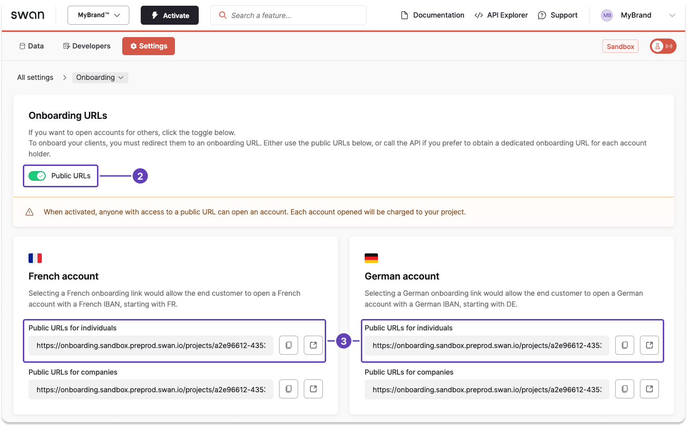

import PublicOnboardingUrl from '../../partials/_create-public-url.mdx';

# Create an individual onboarding link from the Dashboard

Share your project's public individual onboarding link from your Dashboard.

## Public link {#public-link}

<PublicOnboardingUrl />

