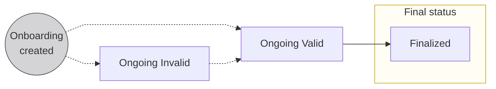
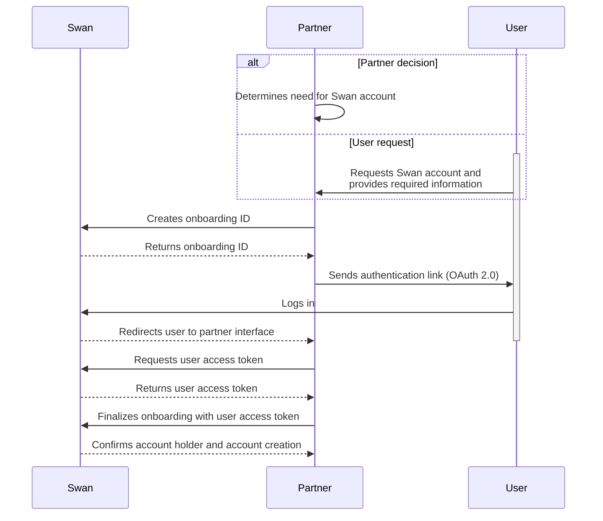

# Statuses

| Status | Explanation |
|---|---|
| `Ongoing (Invalid)` | <ul><li>This is the first status assigned to an onboarding when **using the frontend**.</li><li>If using the **API**, this is the first status if **not all required information** is included with your mutation.</li><li>Status might change to `Invalid` if required information is removed or if some information is incorrect.</li></ul>**Next step**: Submit or update required information to advance to `Ongoing (Valid)` (both you and the end user can submit or update information) |
| `Ongoing (Valid)` | <ul><li>This is the first status assigned to an onboarding if **using the API** and you **included all required information** with your mutation.</li><li>Status changes to `Valid` when missing required information is submitted or if incorrect information is updated.</li></ul>**Next step**: User completes form, clicks "Finalize," and provides consent to complete the onboarding process |
| `Finalized` | Onboarding completed |

## API sequence diagram {#diagram}

Review this sequence diagram that depicts the onboarding flow with the API.

