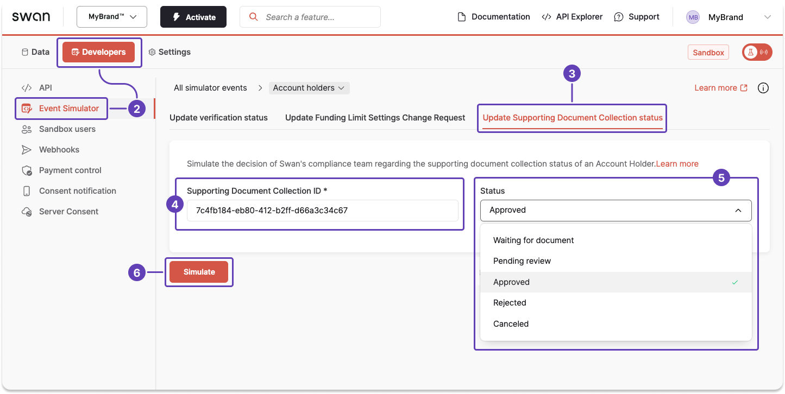
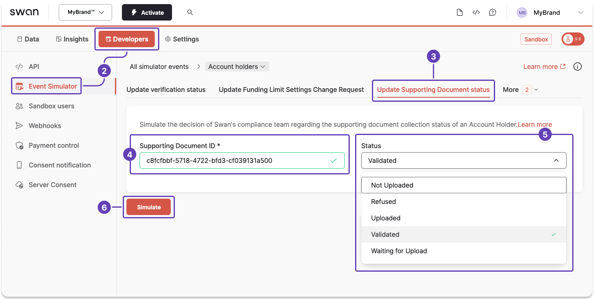
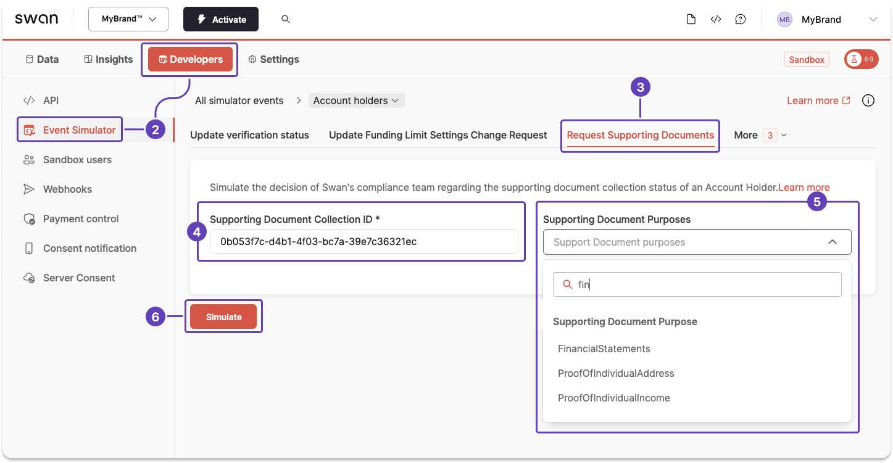

# Sandbox: supporting document collection

<p className="ia-lede">Simulate <Term id="supporting-documents">supporting document</Term> collection in Sandbox: update collection and document statuses, and request documents.</p>

## Simulate updating a collection status {#simulate-collection-status}

With the supporting document collection ID, use the Event Simulator to change the [supporting document collection status](/accounts/concepts/documents/statuses#collection-statuses) to any available status.

1. Get the [supporting document collection ID](/accounts/guides/documents/get-ids#get-collection-id).
1. On your Dashboard, go to **Developers** > **Event Simulator**.
1. Open **Account holders**, then go to the **Update Supporting Document Collection status** tab.
1. Copy the document collection ID from the success payload you received in step 1, then paste it into the **Supporting Document Collection ID** field in the Event Simulator.
1. From the dropdown, choose the status you'd like to simulate.
1. Click **Simulate**.



## Simulate updating a document status {#simulate-document-status}

### Event Simulator {#simulate-document-status-dashboard}

With the supporting document ID, use the Event Simulator to change the [document status](/accounts/concepts/documents/statuses#document-statuses) to any available status.

1. Get the [supporting document ID](/accounts/guides/documents/get-ids#get-document-id).
1. On your Dashboard, go to **Developers** > **Event Simulator**.
1. Open **Account holders**, then go to the **Update Supporting Document status** tab.
1. Copy the document ID from the success payload you received in step 1, then paste it into the **Supporting Document ID** field in the Event Simulator.
1. From the dropdown, choose the status you'd like to simulate.
1. Click **Simulate**.



### Testing API {#simulate-document-status-api}

You can also simulate a document status update with the Testing API.
The example below shows the success payload only; the Explorer link also includes the rejection fragments.

<a href="https://explorer.swan.io?query=bXV0YXRpb24gU2ltdWxhdGVEb2N1bWVudFN0YXR1c1VwZGF0ZSB7CiAgdXBkYXRlU3VwcG9ydGluZ0RvY3VtZW50U3RhdHVzKAogICAgaW5wdXQ6IHsgc3VwcG9ydGluZ0RvY3VtZW50SWQ6ICIkRE9DVU1FTlRfSUQiLCBzdGF0dXM6IFZhbGlkYXRlZCB9CiAgKSB7CiAgICAuLi4gb24gVXBkYXRlU3VwcG9ydGluZ0RvY3VtZW50U3RhdHVzU3VjY2Vzc1BheWxvYWQgewogICAgICBfX3R5cGVuYW1lCiAgICAgIHN1cHBvcnRpbmdEb2N1bWVudCB7CiAgICAgICAgY3JlYXRlZEF0CiAgICAgICAgaWQKICAgICAgICBzdGF0dXNJbmZvIHsKICAgICAgICAgIHN0YXR1cwogICAgICAgIH0KICAgICAgICBzdXBwb3J0aW5nRG9jdW1lbnRQdXJwb3NlCiAgICAgICAgc3VwcG9ydGluZ0RvY3VtZW50VHlwZQogICAgICAgIHVwZGF0ZWRBdAogICAgICB9CiAgICB9CiAgICAuLi4gb24gRm9yYmlkZGVuUmVqZWN0aW9uIHsKICAgICAgX190eXBlbmFtZQogICAgICBtZXNzYWdlCiAgICB9CiAgICAuLi4gb24gSW50ZXJuYWxFcnJvclJlamVjdGlvbiB7CiAgICAgIF9fdHlwZW5hbWUKICAgICAgbWVzc2FnZQogICAgfQogICAgLi4uIG9uIFN1cHBvcnRpbmdEb2N1bWVudENvbGxlY3Rpb25Ob3RGb3VuZFJlamVjdGlvbiB7CiAgICAgIGlkCiAgICAgIG1lc3NhZ2UKICAgIH0KICAgIC4uLiBvbiBTdXBwb3J0aW5nRG9jdW1lbnRDb2xsZWN0aW9uU3RhdHVzRG9lc05vdEFsbG93VXBkYXRlUmVqZWN0aW9uIHsKICAgICAgX190eXBlbmFtZQogICAgICBtZXNzYWdlCiAgICAgIHN1cHBvcnRpbmdEb2N1bWVudENvbGxlY3Rpb25TdGF0dXMKICAgIH0KICAgIC4uLiBvbiBTdXBwb3J0aW5nRG9jdW1lbnROb3RGb3VuZFJlamVjdGlvbiB7CiAgICAgIGlkCiAgICAgIG1lc3NhZ2UKICAgIH0KICAgIC4uLiBvbiBTdXBwb3J0aW5nRG9jdW1lbnRTdGF0dXNEb2VzTm90QWxsb3dVcGRhdGVSZWplY3Rpb24gewogICAgICBfX3R5cGVuYW1lCiAgICAgIG1lc3NhZ2UKICAgICAgc3RhdHVzCiAgICB9CiAgICAuLi4gb24gVmFsaWRhdGlvblJlamVjdGlvbiB7CiAgICAgIF9fdHlwZW5hbWUKICAgICAgbWVzc2FnZQogICAgfQogIH0KfQo%3D&tab=test-api" className="explorer-badge">Open in API Explorer</a>

```graphql {3} showLineNumbers
mutation SimulateDocumentStatusUpdate {
  updateSupportingDocumentStatus(
    input: { supportingDocumentId: "$DOCUMENT_ID", status: Validated }
  ) {
    ... on UpdateSupportingDocumentStatusSuccessPayload {
      __typename
      supportingDocument {
        createdAt
        id
        statusInfo {
          status
        }
        supportingDocumentPurpose
        supportingDocumentType
        updatedAt
      }
    }
  }
}
```

```json title="Payload" showLineNumbers
{
  "data": {
    "updateSupportingDocumentStatus": {
      "__typename": "UpdateSupportingDocumentStatusSuccessPayload",
      "supportingDocument": {
        "createdAt": "2024-02-15T10:08:32.792Z",
        "id": "$DOCUMENT_ID",
        "statusInfo": {
          "status": "Validated"
        },
        "supportingDocumentPurpose": "AssociationRegistration",
        "supportingDocumentType": "Other",
        "updatedAt": "2024-03-11T16:24:22.041Z"
      }
    }
  }
}
```

## Simulate requesting a document {#simulate-document-request}

With the supporting document collection ID, use the Event Simulator to [request a supporting document](/accounts/concepts/documents/purposes-and-types) with a specific purpose.

1. Get the [supporting document collection ID](/accounts/guides/documents/get-ids#get-collection-id).
1. On your Dashboard, go to **Developers** > **Event Simulator**.
1. Open **Account holders**, then go to the **Request Supporting Documents** tab.
1. Copy the document collection ID from the success payload you received in step 1, then paste it into the **Supporting Document Collection ID** field in the Event Simulator.
1. From the dropdown, choose the purpose of the document you need to collect. Use the search if needed.
1. Click **Simulate**.



