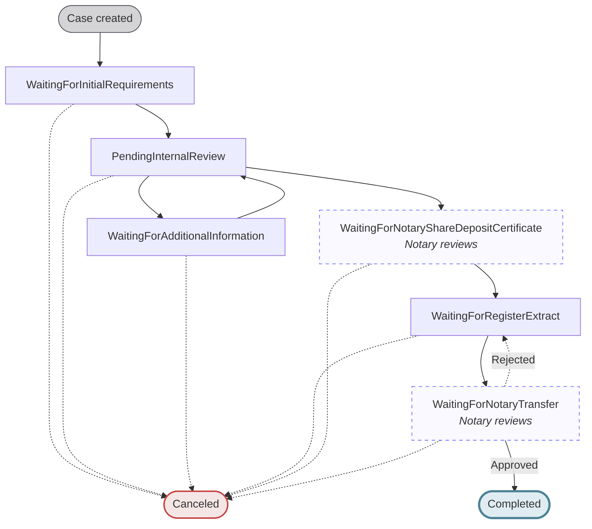
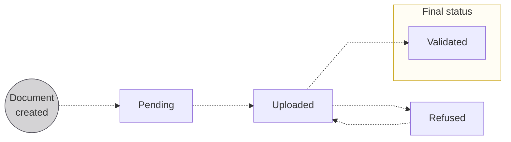
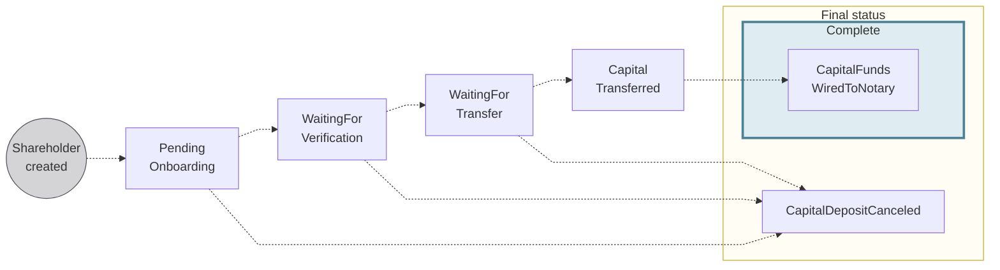

# Capital deposit reference

Status models, cancelation reason codes, and required documents for capital deposit cases.

## Case statuses {#case-statuses}

{/* TODO:PM — predates live CapitalDepositCaseStatus enum, see ledger */}

| Case status | Explanation |
| --- | --- |
| `WaitingForInitialRequirements` | The case has been initiated and is waiting for shareholder verification, fund transfers, document uploads, and completion of company onboarding. |
| `PendingInternalReview` | Swan is reviewing the information and documents provided. |
| `WaitingForAdditionalInformation` | After review, Swan has requested additional details or corrections from the customer and is awaiting their response. |
| `WaitingForNotaryShareDepositCertificate` | **_Notary reviews_** _the deposited funds and submitted documents, then creates the certificate and uploads it to Swan_. |
| `WaitingForRegisterExtract` | The end-user uploads their register extract for notary review. |
| `WaitingForNotaryTransfer` | **_Notary reviews_** _the register extract_. If the document is rejected by either Swan or the notary, the case will move back to `WaitingForRegisterExtract`. |
| `Canceled` | The case was canceled before completion by either you or Swan. A [cancelation reason code](#cancelation-reason-codes) is available in the `CapitalDepositCaseCanceledStatusInfo` type. |
| `Completed` | Notary reviewed and approved all elements and transferred the funds to the new company; the process is complete. |

## Cancelation reason codes {#cancelation-reason-codes}

When a capital deposit case has the status `Canceled`, a reason code is available on the [`CapitalDepositCaseCanceledStatusInfo`](https://api-reference.swan.io/objects/capital-deposit-case-canceled-status-info) type.

:::note Backward compatibility
Capital deposit cases canceled before 2 April 2026 have a `null` cancelation reason at the capital deposit level.
For those cases, refer to the account-level deprecated closure reason `CapitalDepositReason`.
:::

| Reason code | Explanation |
| --- | --- |
| `KYCIssue` | Documents missing, incorrect, or no reply. |
| `ForbiddenActivity` | Prohibited business sectors. |
| `DuplicateOnboarding` | A second account was created by mistake. |
| `DeniedCountryResidency` | High-risk UBO or resident. |
| `RefusedIbanCountry` | The account holder was assigned the wrong IBAN country, or the IBAN country isn't allowed. |
| `CompanyRegistrationCountryNotSupported` | The company registration country isn't supported by Swan. |
| `BusinessInactiveOrNotRegistered` | The company is inactive or not registered. |
| `UnsupportedLegalForm` | The legal form can't be onboarded by Swan. |
| `TCViolation` | Terms & Conditions violation. |
| `CapitalDepositCompleted` | Standard closure of a temporary capital deposit account after the company is registered. |
| `CapitalDepositWithdrawn` | The capital deposit has been withdrawn. |
| `CapitalDepositRefusedByNotary` | The notary refused the capital deposit case. |
| `ComplianceReason` | Cancelation for compliance reasons. |
| `RegulatoryRequirement` | Cancelation required by regulation. |

These reason codes are derived from the same list as [account closure reason codes](/accounts/concepts/closure/reason-codes).

## List of required documents {#documents-list}

All documents are **mandatory** unless marked _if requested_.

<table>
  <tr>
    <th>Stakeholder </th>
    <th>Document</th>
    <th>API document type</th>
  </tr>
  <tr>
    <td rowspan="2">Individual shareholders</td>
    <td>Proof of address</td>
    <td>
      <code>ProofOfIndividualAddress</code>
       
      <em>
        Refer to <a href="/accounts/reference/onboarding/proof-of-address">proof of address</a> for acceptable documents
      </em>
    </td>
  </tr>
  <tr>
    <td>
      Identity document proving the shareholder's identity (collected during identification)
    </td>
    <td>
      <code>ProofOfIdentity</code>
    </td>
  </tr>
  <tr>
    <td rowspan="2">Company shareholders</td>
    <td>
      Proof of registration of the company
    </td>
    <td>
      <code>RegisterExtract</code>
       
      <em>
        Refer to <a href="/accounts/reference/onboarding/country-requirements">proof of registration</a> for acceptable documents
      </em>
    </td>
  </tr>
  <tr>
    <td>
      Identity document proving the identity of the company shareholder's legal representative (collected during identification if they are an account member).
    </td>
    <td>
      <code>ProofOfIdentity</code>
    </td>
  </tr>
  <tr>
    <td rowspan="4">Future company</td>
    <td>Document available only after the notary validates the case, uploaded at a specific time during the capital deposit process</td>
    <td>
      <code>RegisterExtract</code>
    </td>
  </tr>
  <tr>
    <td>Draft of the articles of incorporation</td>
    <td>
      <code>ArticlesOfIncorporation</code>
    </td>
  </tr>
  <tr>
    <td>Lease agreement for official company address ∗</td>
    <td>
      <code>CompanyLeaseAgreement</code>
    </td>
  </tr>
  <tr>
    <td>Lease mandate from legal representative</td>
    <td>
      <code>PowerOfAttorney</code>
       
      <em>Template available in French</em>
    </td>
  </tr>
</table>

  
Specifications for **Future company** > **lease agreement** ∗

  

    
If a future company doesn't have a company lease agreement as proof of the official company address, other elements are required according to their situation.
      All identity documents must be in full color and include the front and back of the document.

    | Official company address is... | Elements required |
| --- | --- |
| Legal representative's address | <ul><li>Business address affidavit *(domiciliation statement)* from the legal representative</li><li>If the legal representative *isn't* a shareholder:<ul><li>Identity document for the legal representative</li><li>Proof of address for the legal representative</li></ul></li></ul> |
| Legal representative's address, but they're renting or hosted by someone else | <ul><li>Business address affidavit *(domiciliation statement)* from the host</li><li>If the legal representative *isn't* a shareholder:<ul><li>Identity document for the legal representative</li><li>Identity document for the host</li><li>Proof of address for the host</li></ul></li></ul> |
| Another company's office address | <ul><li>KBIS of host company issued within the last three months</li><li>Business address affidavit *(domiciliation statement)* from the host company's legal representative</li><li>Identity document for the legal representative who provided the business address affidavit</li></ul> |
  

## Document statuses {#documents-statuses}

| Document status | Explanation |
| --- | --- |
| `Pending`   | Place for the document is created, but the document isn't uploaded yet. |
| `Uploaded`  | Document successfully uploaded; you can change and re-upload the document as long it retains the status `Uploaded`  **Next step**: Swan reviews the document and either validates or refuses it. |
| `Validated` | Swan validated the document. |
| `Refused`   | Document doesn't meet requirements. Review `reasonCode` for a refusal category and the optional `reason` for a plain-text explanation. Both are visible on your Dashboard and available through the API.  **Next step**: Upload a new document, then the status returns to `Uploaded`. |

## Shareholder statuses {#shareholders-statuses}

| Shareholder status | Explanation |
| --- | --- |
| `PendingOnboarding` | Default status after the shareholder is created; shareholder must **complete their onboarding** and their **account must be created** to continue. |
| `WaitingForVerification` | Possible status if the account holder verification isn't complete at the moment the shareholder's account is created.  _Status bypassed if the [account holder status](/accounts/concepts/account-holders/verification#verification-process) is already `Verified`_. |
| `WaitingForTransfer` | Waiting for the shareholder to deposit the full share capital in their Swan account created during onboarding, which **must** be transferred from an account belonging to the shareholder. The transfer must be a [SEPA Credit Transfer](/accounts/guides/onboarding/capital-deposits/#transfer-requirements); international credit transfers aren't accepted and are rejected automatically. |
| `CapitalTransferred` | Waiting for the rest of the capital deposit case to be ready and the funds to be transferred to the notary. |
| `CapitalFundsWiredToNotary` | Still waiting for the rest of the capital deposit case to be ready, but now the funds are with the notary. |
| `CapitalDepositCanceled` | When a [`CapitalDepositCase` is `Canceled`](#case-statuses), the shareholder status changes to `CapitalDepositCanceled`.  If an account was already created for the shareholder, the account is also closed automatically. |
