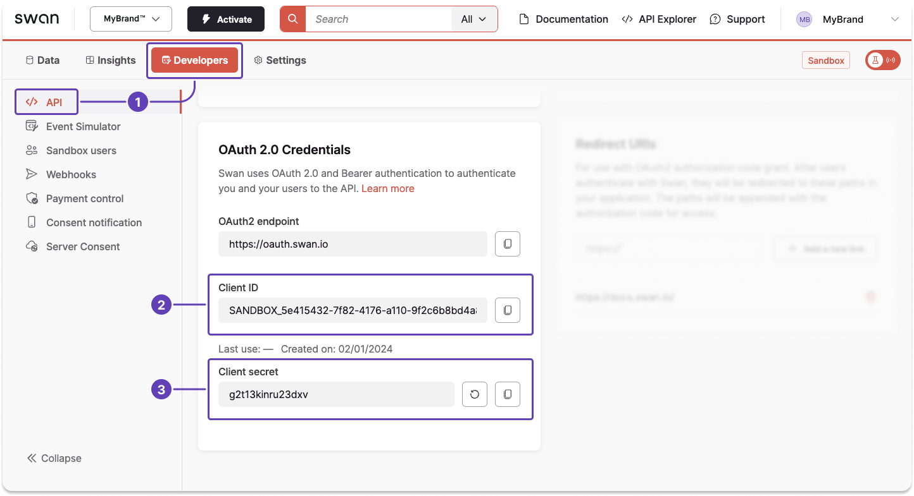
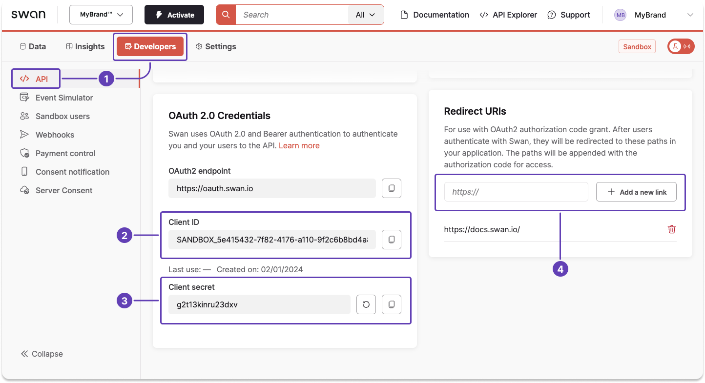

# Authentication

Swan uses OAuth 2.0 and Bearer authentication to authenticate both you and your users to the API.

## OAuth 2.0 {#oauth2}

[**OAuth 2.0**](https://oauth.net/2/), an authorization protocol, grants limited access to user data on a web server for an API client.
Major platforms like GitHub, Google, and Facebook use OAuth 2.0.
The protocol relies on authentication scenarios, known as flows, allowing the resource owner to **share protected content** from the resource server **without disclosing their credentials**.

The OAuth 2.0 protocol is defined in [RFC 6749](https://datatracker.ietf.org/doc/html/rfc6749).

## Bearer authentication {#bearer-auth}

Bearer authentication, also known as **token authentication**, functions as an [HTTP authentication protocol](https://developer.mozilla.org/en-US/docs/Web/HTTP/Authentication) using access tokens.
In the context of Swan, access tokens are generated in response to OAuth 2.0 authorization requests. These tokens consist of a cryptic string, enabling you to **access protected resources** on behalf of the resource owner.

The Bearer authentication protocol, integral to OAuth 2.0, is defined in [RFC 6750](https://datatracker.ietf.org/doc/html/rfc6750).

## Overview of access tokens {#tokens}

You can generate two types of access tokens: **user** and **project**.
You then provide your token in an HTTP authorization header, such as `Authorization: Bearer {access token}`.

<SupportStatusLegend />

| Can call →<br />↓ Token type | Queries | Non-sensitive<br/>mutations | Sensitive<br/>mutations |
| --- | --- | --- | --- |
| User access token | <Supported /> ∗ | <Supported /> | <Supported /> |
| Project access token | <Supported /> | <Supported /> | <Unsupported /> |
| Impersonate user with<br/>project access token  | <Supported /> ∗ | <Supported /> | <Supported /> |

∗ *User access tokens, as well as project access tokens used to impersonate a user, **can't be used** to call `transactions` queries.*

## User access tokens {#tokens-user}

User access tokens allow you to act on behalf of an individual user in your project, often with the goal of [executing sensitive operations](/users/concepts/consent#sensitive).
They must use the grant type **authorization code**.

User access tokens are **valid for one hour** (3600 seconds), after which you can refresh it or get a new token.
When API calls are made with an **expired token**, the API **returns an invalid grant or authentication failure** (HTTP 401 Unauthorized).

Swan doesn't store your user access tokens.
Consider storing them at the **user level** (not the project level) in your database.

### Refresh tokens {#tokens-user-refresh}

To prolong the validity of your user access token, Swan provides refresh tokens with every successful user access token request.
Refresh tokens can be used one time to refresh, or extend, your user access token.

The best time to use a refresh token is either:

1. When **logging into the app**, or
1. When a **request returns an error** because the token is expired.

Because refresh tokens are single-use, a new one is provided each time you refresh your user access token.
Store your refresh token securely, replacing it with the new one each time.

Learn about refreshing your user access tokens in the [user access token guide](#refresh-token).

:::caution Using refresh tokens responsibly
**Swan discourages frequent use of refresh tokens** due to high resource consumption.
It's also often unnecessary, considering that a project access token can be used for most of Swan's API operations.

Consider **reserving the use** of user access tokens to **sensitive operations**.
This practice ensures responsible consumption of resources and aligns with best practices for efficient API usage.
:::

### Redirect URIs {#tokens-user-uri}

Before using a user access token, you must add your pre-approved URIs (Uniform Resource Identifiers) to your Dashboard.
This step is essential for maintaining the integrity and security of the OAuth 2.0 flow.

Adding URIs creates an allowlist to which your users can be redirected, thus ensuring that your users are redirected securely.
This minimizes the security risk of being redirected to a malicious endpoint and compromising sensitive data.

Note that it's **against OAuth 2.0 specifications to use a domain instead of redirect URIs**.
It is okay, though, to use one URI per feature, such as one for onboarding, another for logging in, and another for consent.

You'll be prompted to add a redirect URI in [step 1](#get-credentials-add-uri) of the guide to get a user access token.

## Project access tokens {#tokens-project}

Project access tokens allow you to **act on your own behalf** rather than on behalf of a user.
Use them to read information and execute non-sensitive operations.

Project access tokens must use the grant type **client credential**, intended for server-to-server authentication.
They're **valid for one hour** (3600 seconds), after which you need to get a new token.

### Impersonation {#tokens-project-impersonate}

You can also use a project access token to act as a user within your project, referred to as **impersonation**.

User access tokens are necessary to know who is connected (`userId`) and who is performing sensitive operations, but they expire.
If expiring user access tokens interrupt your automations, consider impersonating the user with a project access token instead.

- [Impersonate a user](#impersonate)

## Get a project access token {#get-token-project}

# Get a project access token

Learn how to get [project access tokens](#tokens-project).

:::tip Prerequisites
You have a Swan project and you have access to your Dashboard.
:::

### Step 1: Get your credentials {#get-credentials}

1. Go to **Dashboard** > **Developers** > **API**.
1. Locate your client ID.
1. Locate your client secret, or generate a new secret if needed.

Keep this page open; you'll need these values for the next step.



### Step 2: Request your access token {#request-token}

**Send a cURL request** with your **client ID** and **secret** (lines 2-3) to get your project access token.

```curl title="Request project access token" showLineNumbers
curl -v -X POST <https://oauth.swan.io/oauth2/token> \\
     -d "client_id=$YOUR_CLIENT_ID" \\
     -d "client_secret=$YOUR_CLIENT_SECRET" \\
     -d "grant_type=client_credentials"
```

### Step 3: Get your access token {#get-token}

Assuming the credentials provided were correct, you'll receive a response with a project access token.

The example response explains that you're receiving a [bearer token](#bearer-auth), which is a cryptic string, and that the token provides project-level access for one hour.

```json title="Response" showLineNumbers
{
  "access_token": "$YOUR_PROJECT_ACCESS_TOKEN",
  "token_type": "bearer",
  "expires_in": 3600,
  "scope": ""
}
```

:::danger Troubleshooting
If your request returns an error, your **client secret might be invalid**.
Generate a new secret on your Dashboard, then try again.
:::

## Get a user access token {#get-token-user}

import UseImmediately from './_use-uat-immediately.mdx';

# Get a user access token

Learn how to get [user access tokens](#tokens-user), including getting your authorization code, requesting and getting your token, and using a refresh token.

:::tip Prerequisites
You have a Swan project and you have access to your Dashboard.
:::

<UseImmediately overview="After getting a user access token in step 4" />

### Step 1: Get your credentials and add a redirect URI {#get-credentials-add-uri}

1. Go to **Dashboard** > **Developers** > **API**.
1. Locate your client ID.
1. Locate your client secret, or generate a new secret if needed.
1. Enter your redirect URI, then click **+ Add a new link**.

Keep this page open; you'll need these values for subsequent steps.



### Step 2: Get an authorization code {#auth-code}

You need an authorization code to request a user access token.

Follow steps 2.1 through 2.3 to get your code.
Note that **authorization codes are single-use**.

#### 2.1 Construct authorization URL {#code-construct-url}

Construct a URL with the required query parameters, adding any optional parameters you'd like.
Query parameters are case sensitive.

1. **Review the example URL** in the code block. Note that the example features hard returns for readability, which you should remove before sharing your URL.
1. Add your **client ID** and **redirect URI** to your URL.
1. Add any **optional parameters** to the end of your URL following the model `&parameter=value`.
1. **Send the URL** to your user.

```bash title="Authorization URL example" showLineNumbers
# Model
&parameter=value

# Spaced-out example
https://oauth.swan.io/oauth2/auth?
response_type=code
&client_id=$YOUR_CLIENT_ID
&redirect_uri=$YOUR_REDIRECT_URI
&scope=openid%20offline
&state=kdqsjdlkjsqdlkqjsdlkjsqd
&onboardingId=$ONBOARDINGID_OF_YOUR_CUSTOMER
&accountMembershipId=$ACCOUNTMEMBERSHIPID_OF_YOUR_CUSTOMER
&identificationLevel=Auto
&firstName=Jules
&lastName=Fleury

# Example URL including the `onboardingId`
https://oauth.swan.io/oauth2/auth?response_type=code&client_id=$YOUR_CLIENT_ID&redirect_uri=$YOUR_REDIRECT_URI&scope=openid%20offline&state=kdqsjdlkjsqdlkqjsdlkjsqd&onboardingId=$ONBOARDINGID_OF_YOUR_CUSTOMER&identificationLevel=Auto&firstName=Jules&lastName=Fleury

# Example URL including the `accountMembershipId`
https://oauth.swan.io/oauth2/auth?response_type=code&client_id=$YOUR_CLIENT_ID&redirect_uri=$YOUR_REDIRECT_URI&scope=openid%20offline&state=kdqsjdlkjsqdlkqjsdlkjsqd&accountMembershipId=$ACCOUNTMEMBERSHIPID_OF_YOUR_CUSTOMER&identificationLevel=Auto&firstName=Jules&lastName=Fleury
```

##### Required parameters {#url-parameters-required}

| Parameter | Description |
| --- | --- |
| `response_type=code`<br/>(line 6) |  Initiates the authorization code flow. |
| `client_id`<br/>(line 7) |  Public identifier for the Swan app, obtained from your Dashboard in step 1. |
| `redirect_uri`<br/>(line 8) |  Specifies where the authorization server should send the user after approval, added to your Dashboard in step 1. |
| `scope=openid%20offline`<br/>(line 9) |  Defines the requested scopes for the user authorization.<br/><br/><ul><li>`openid`: User will connect to Swan through the Partner</li><li>`offline`: Access is continuous</li></ul> |
| `state`<br/>(line 10) |  A value to be retransmitted in the query string when redirecting back to you. |

##### Optional parameters {#url-parameters-optional}

| Parameter | Description |
| --- | --- |
| `onboardingId`<br/>(line 11) |  Avoids asking the customer to enter their own residence address if they provide that information during onboarding. |
| `email` | If you include the `email` parameter, it triggers an [email verification](/accounts/concepts/memberships/inviting#invite) flow automatically. If you include the parameter *and* the email address, it triggers the email verification flow with the email address pre-filled.<br /><br />Email addresses must be **encoded**, for example `email=jules%40email.com`. |
| `identificationLevel`<br/>(line 13) |  Indicate your preferred [identification level](/users/concepts/identifications#levels-processes): `PVID`, `QES`, `Expert` or `Auto`.<br /><br />Swan recommends setting `Auto` as your preferred identification level when guiding users through an identification flow, reengaging them to complete it, or inviting account members.<br /><br /> `Auto` allows Swan to direct your users to the best identification flow for their situation.  If your project is configured to [bypass identification](/accounts/concepts/memberships/statuses#remove-identification), eligible users will automatically skip it.<br /><br /> If you use the `Auto` identification level, make sure you include the `onboardingId` (line 11) or the `accountMembershipId` (line 12) in the authorization URL.|
| `phoneNumber`<br />`firstName`<br />(line 14)<br/>`lastName`<br />(line 15)<br/>`birthDate`<br />`birthCity`<br />`birthCountry`<br />`nationality`<br />`language`<br />`birthPlacePostalCode`<br />`residencyAddress`<br />`residencyAddressCity`<br />`residencyAddressCountry`<br />`residencyAddressPostalCode` |  Avoids asking the customer to enter this information during user registration.<br /><br />Required formats: <ul><li>`phoneNumber`: **encoded**, including the plus `+` sign in the country code *(`phoneNumber=%2B3312345678901`, where `%2B` represents the plus sign)*</li><li>`birthDate`: YYYY-MM-DD *(year-month-day)*</li><li>`birthCountry`, `nationality`, and `residencyAddressCountry`: ISO 3166-1 alpha-3 *(France = `FRA`)*</li><li>`language`: ISO 639-1 (alpha 2) *(Spanish = `es`)*</li></ul> |

#### 2.2 Receive approval from user {#code-approve}

If you didn't send your authorization URL to your user, send it now.

When clicked, the URL opens an authorization page explaining how to connect with Swan and why the user's phone number is required.

- If the user is on a **mobile device**, they validate their phone number with a 6-digit code sent by Swan in a text message.
- If the user is using a **computer**, they enter their phone number, then receive a link on their mobile phone that opens a browser.

:::info Displaying authorization page
You can choose to display the authorization page in **fullscreen** or as a **native popup**.
A native popup is more challenging to implement but provides a better user experience.

Note that you **can't use webviews or iFrames**.
Read about why in the overview of the [integrate Strong Customer Authentication](/users/guides/consent/integrate-sca#overview) guide.
:::

#### 2.3 Receive authorization code {#code-receive}

If the user approves the request, the authorization server redirects the browser back to your redirect URI.
Your authorization code **expires 10 minutes** after being created, so use it immediately to request your user access token.

1. Copy the full URL from your browser. It contains your **authorization code** and **state** in the query string.
1. Confirm that the `state` in the URL matches the initial state to protect against Cross-Site Request Forgery (CSRF) and related attacks.

```bash title="Authorization code example" showLineNumbers
# Full URL
https://$YOUR_REDIRECT_URI?code=$YOUR_AUTHORIZATION_CODE&state=kdqsjdlkjsqdlkqjsdlkjsqd

# Spaced-out example
https://$YOUR_REDIRECT_URI?
code=$YOUR_AUTHORIZATION_CODE
&state=kdqsjdlkjsqdlkqjsdlkjsqd
```

### Step 3: Request your access token {#request-token}

To get your user access token, **send a cURL request** with the following information:

1. The **user authorization code** you received in step 2 (line 2).
1. Your **client ID** and **secret** from your Swan Dashboard, explained in step 1 (lines 3-4).
1. The **URI** you added to your Swan Dashboard in step 1 (line 5).

```curl title="Request user access token" showLineNumbers
curl -v -X POST <https://oauth.swan.io/oauth2/token> \\
     -d "code=$YOUR_AUTHORIZATION_CODE" \\
     -d "client_id=$YOUR_CLIENT_ID" \\
     -d "client_secret=$YOUR_CLIENT_SECRET" \\
     -d "redirect_uri=$YOUR_REGISTERED_URI" \\
     -d "grant_type=authorization_code"
```

### Step 4: Get your access token {#get-token}

Assuming the information provided was correct, you'll receive a response with a user access token.

:::tip
The user access token is encoded. 
After it's decoded, you can use the `sub` field to identify the user. The `sub` in the `id_token` represents the Live `userID`, even for [Sandbox](/build/tools/sandbox-users) users.
:::

The example response explains that you're receiving a [bearer token](#bearer-auth), which is a cryptic string, and that the token provides user-level access for one hour.
The token scope lets you know you can use the token for OpenID Connect purposes.

The response also provides a [refresh token](#tokens-user-refresh) that you can use one time to extend the validity of your user access token.
**Store the refresh token** to use later.

```json title="Response" showLineNumbers
{
  "access_token": "$YOUR_USER_ACCESS_TOKEN",
  "expires_in": 3600,
  "id_token": "$YOUR_ID_TOKEN",
  "refresh_token": "$YOUR_USER_REFRESH_TOKEN",
  "scope": "openid offline",
  "token_type": "bearer"
}
```

:::danger Troubleshooting
If your request returns an error, your **authorization code** from step 2 might already be expired, or your **client secret might be invalid**.
Use a new authorization code or a new client secret (or both) to try your request again.
:::

### Step 5: Verify which user is logged in {#verify-user}

After getting the token, **use it immediately** to **verify which user is logged in**.

Adding a `phoneNumber` to the OAuth 2.0 URL in step 2.1 **isn't sufficient** to know which user is logged in.
Sometimes, a phone number might have been used by a [deactivated user](/users/concepts/user#deactivate) before being used for a new user.
Additionally, your user might have replaced the number you provided with a different number, or gone through the process to [update their phone number](https://support.swan.io/hc/en-150/articles/16332148291741-Updating-your-phone-number) with Swan.

It's impossible to detect these changes when getting a user access token, so it's **crucial to verify** that the user associated with the token is the logged-in user.

Use the user access token to run [this query](https://explorer.swan.io?query=cXVlcnkgTXlRdWVyeSB7CiAgdXNlciB7CiAgICBpZAogICAgZmlyc3ROYW1lCiAgICBsYXN0TmFtZQogICAgam9pbmVkQXQKICAgIGJpcnRoRGF0ZQogICAgY3JlYXRlZEF0CiAgICBzdGF0dXMKICB9Cn0K&tab=api) in the API Explorer and retrieve the associated `userID`.

### Step 6: Refresh your access token {#refresh-token}

:::tip
Consider using [impersonation](#impersonate) because:
- You don't need to manage or refresh user access tokens.
- You can use a project access token with a `userID` to perform user-level actions.
- It helps maintain security while creating a smoother user experience.
:::

When your user access token expires, you can use the refresh token provided in the cURL response to extend the usage of your user access token.
While they don't expire, **refresh tokens are single-use**.

To refresh your user access token, **send a cURL request** to the same endpoint as step 3 with the following information:

1. The **refresh token** you received in step 4 (line 2).
1. Your **client ID** and **secret** from your Swan Dashboard, retrieved in step 1 (lines 3-4).

```curl title="Refresh user access token" showLineNumbers
curl -v -X POST <https://oauth.swan.io/oauth2/token> \\
     -d "refresh_token=$YOUR_REFRESH_TOKEN" \\
     -d "client_id=$YOUR_CLIENT_ID" \\
     -d "client_secret=$YOUR_CLIENT_SECRET" \\
     -d "grant_type=refresh_token"
```

The response is the same as in step 4, but with a **new refresh token**.
**Store the new refresh token** to use later, but **delete the refresh token you already used** because refresh tokens are single-use.

```json title="Response" showLineNumbers
{
  "access_token": "$YOUR_USER_ACCESS_TOKEN",
  "expires_in": 3600,
  "id_token": "$YOUR_ID_TOKEN",
  "refresh_token": "$YOUR_USER_REFRESH_TOKEN",
  "scope": "openid offline",
  "token_type": "bearer"
}
```

:::danger Troubleshooting
If your refresh request returns an error, your single-use **refresh token** might have been used already, or your **client secret** might be invalid.

1. First, generate a new secret on your Dashboard and try your request again.
1. If your request still returns an error, your refresh token isn't working. Return to step 2 of this guide to get a new user access token.
:::

## Impersonate a user {#impersonate}

# Impersonate a user

[Impersonation](#impersonate) simplifies authentication and improves the user experience. Instead of managing or refreshing user access tokens, you can use a project access token with a `userID` to securely perform user-level actions.

You can add information in your HTTP header to any GraphQL API request to [impersonate the specified user](#tokens-project-impersonate).  
However, this method doesn't work with the OAuth 2.0 API.

:::tip Approved use cases
1. Act as the legal representative to perform [server-to-server consent](/users/concepts/consent#s2s) operations.
1. Get updated or refreshed user data with a [webhook notification](/build/using-api/webhooks) on the `user` object.
1. Illustrate a user's problem to Partners and Swan support teams.
1. Use the Swan API on behalf of a user:
    - Without a user access token
    - Without asking the user to reconnect
    - Without using the refresh token
:::

### Guide {#guide}

To impersonate a user with a project access token:

1. Verify the user has signed into your project at least one time.
1. Collect the Swan `userId` from the OAuth 2.0 [guide to get a user access token](#get-token-user).
1. Bind it with your own `userId` in your system.
1. Add the HTTP header `x-swan-user-id` **with the `userId`** (sample HTTP header line 2).

Then, you'll experience the environment as if you had used a user access token.

:::caution Impersonating Sandbox users 
If a [Sandbox user](/build/tools/sandbox-users#add) isn't linked to your project, you can't impersonate them.
:::

### HTTP header sample {#http-header}

```curl showLineNumbers
curl --location 'https://api.swan.io/live-partner/graphql' \
--header 'x-swan-user-id: 4d102f73-cc4a-4f2e-8734-e2885df95abd' \
--header 'Content-Type: application/json' \
--header 'Authorization: Bearer $PROJECT_ACCESS_TOKEN' \
--data '{"query":"query accounts {\n user {\n firstName\n lastName\n mobilePhoneNumber\n id\n }\n \n \n}\n","variables":{}}'
```

## Related

- [Errors and rejections](/build/using-api/errors-rejections) · [Webhooks](/build/using-api/webhooks) · [Pagination](/build/using-api/pagination)
- [Build](/build)
