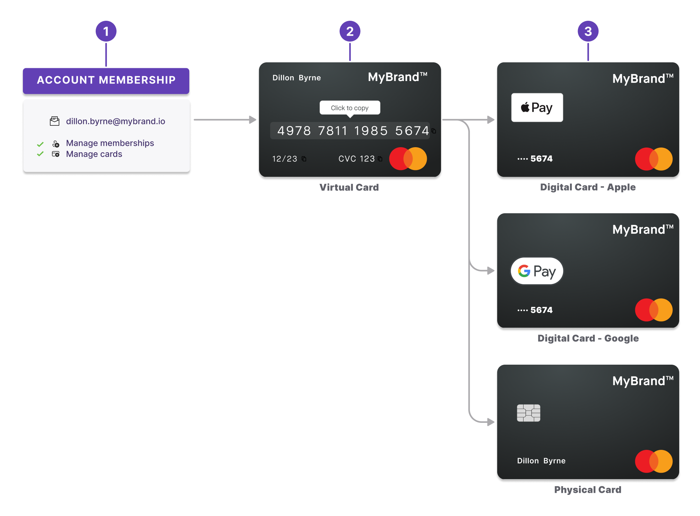
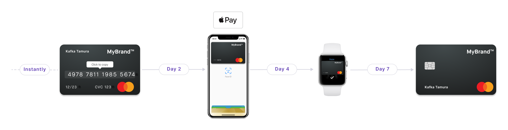
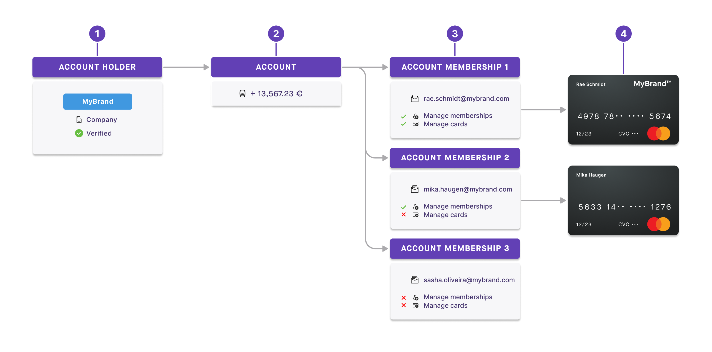
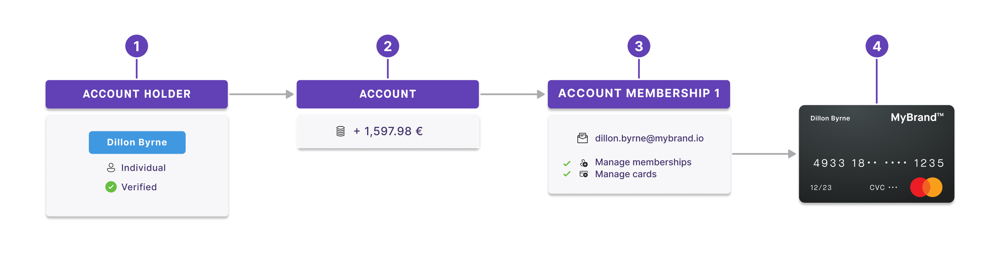

import VirtualCardsDefinition from '../../topics/definitions/_cards-virtual.mdx';
import PhysicalCardsDefinition from '../../topics/definitions/_cards-physical.mdx';
import DigitalCardsDefinition from '../../topics/definitions/_cards-digital.mdx';

# Card formats

Swan's three card formats, the order they're created in, and how cards attach to account members.

## Security and consent {#security-consent}

To keep the cards you supply secure, all card-related mutations that initiate a sensitive action require consent.
Review the list of all [sensitive operations that require consent](/users/concepts/consent#sensitive) with Swan.

## Card formats {#formats}

Swan offers three card formats.

| Card formats | Description |
| --- | --- |
| [Virtual](/cards/concepts/virtual) | <VirtualCardsDefinition /> |
| [Physical](/cards/concepts/physical) | <PhysicalCardsDefinition /> |
| [Digital](/cards/concepts/digital) | <DigitalCardsDefinition /> |

### Creation order {#formats-order}

Swan is enthusiastically **virtual first** (similar to digital first), meaning the priority is on a **dematerialized user experience**.

1. Create **account memberships** before creating cards.
1. Create **virtual cards** before physical cards.
1. Create **physical** and **digital cards**. Note that physical cards aren't required to create digital cards. You can add a virtual card directly into your favorite digital wallet.

Consider the example of Kafka Tamura:

1. **Instantly**: Kafka requests and receives a virtual card, usable right away for e-commerce transactions.
1. **Day 2**: Kafka adds his virtual card to Apple Wallet, digitizing the card. He uses it to make contactless payments.
1. **Day 4**: Kafka decides to add the virtual card to his Apple watch as well.
1. **Day 7**: Finally, Kafka decides to order a physical card, just in case.

### API card types {#formats-api}

There are three options for the [API enum `CardType`](https://api-reference.swan.io/enums/card-type/#cardtypevirtualandphysical).
These differ from the card formats for your users.

- `Virtual`: only the default [virtual card](/cards/concepts/virtual) is issued for the card contract.
- `VirtualAndPhysical`: both a [virtual](/cards/concepts/virtual) and [physical](/cards/concepts/physical) card are issued for the card contract.
- `SingleUseVirtual`: the card is a [single-use virtual card](/cards/concepts/virtual/single-use-cards).

## Cards and account memberships {#cards-account-memberships}

No matter how many members are attached to an account (1, 50, or 500), you can issue cards to each member.
Every member has access to the same pot of money.
Any payments made with the card are debited from the account the member belongs to.

Thus, an account membership must be created *before* adding a card for an account member.

Account members can also add cards for themselves or other account members, determined by their [membership permissions](/accounts/reference/memberships/membership-permissions#permissions-cards).

### Multiple memberships, multiple cards {#cards-account-memberships-example-multiple}

1. MyBrand is a verified account holder with a company account.
1. As an account holder, MyBrand has one account with money in it.
1. Attached to the account are three account members: Rae, Mika, and Sasha.
    1. Each member is identified by their email address.
    1. They all have different permissions.
1. Only two members, Rae and Mika, have cards associated with their account membership. Any money spent with these cards is taken from the MyBrand company account.

### One membership, one card {#cards-account-memberships-example-one}

1. Dillon is a verified account holder with an individual account.
1. As an account holder, Dillon has one account with money in it.
1. Dillon is the only account member, identified by her email address. She has membership and card permissions automatically.
1. Dillon also has a card associated with her account membership.

## Card statuses {#statuses}

Card statuses **depend on the card format**.
Refer to the corresponding sections for [virtual](/cards/concepts/virtual/statuses), [physical](/cards/concepts/physical/statuses), and [digital](/cards/concepts/digital/statuses) cards.
