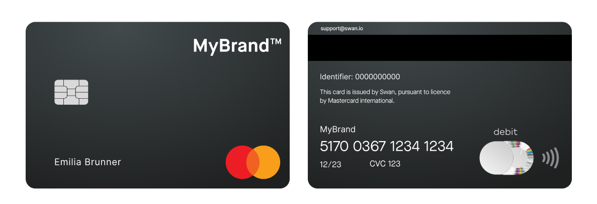
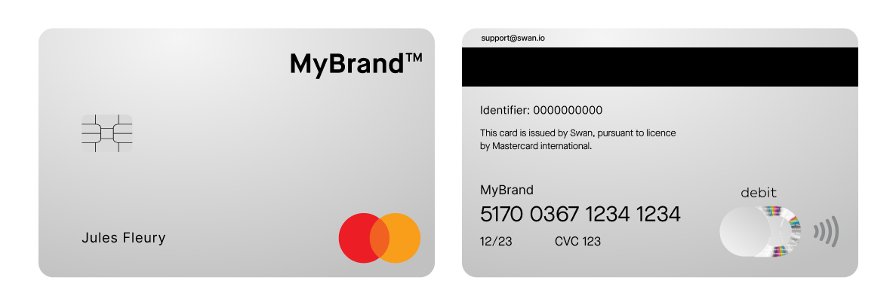

import CustomCardDesign from '../partials/_custom-card-timeline.mdx';
import CustomCardLockedElements from '../partials/_custom-locked-elements.mdx';
import Packaging from '../partials/_packaging.mdx';

# Card design

The look of your cards, shown in Web Banking, printed on physical cards, and displayed in digital wallets: standard designs, custom designs, and packaging.

Your card design appears several times during your cardholders' user experience.
Your design is:

- Featured in the Web Banking interface for virtual and physical cards
- Printed on physical cards
- Displayed in digital wallets

Each card design belongs to a [card product](/cards/concepts/card-products).

## Standard card design {#standard}

Swan proposes two standard card designs that are already validated by Mastercard.

Personalize standard cards with your logo on the front of the card.
See it now in Swan's [card design studio](https://swan-io.github.io/card-design-studio/).

### Black

Black cards are made of black recycled plastic with a sleek matte finish and feature your logo in **silver monochrome**.
There are additional particles added to the plastic to minimize scratches.

### Silver

Silver cards feature your logo in **black monochrome**.

### Metal

Metal cards are available with the **Premium** card package. The cards are made from **stainless steel and tungsten** and weigh 22 grams. They feature a textured dark protective layer on each side and exposed metal edges. Your logo will be laser-printed on the cards, revealing the metal underneath.

## Custom card design {#custom}

If the standard black or silver designs won't meet your needs, or you want customize more to your brand's style, Swan also offers [custom card designs](/cards/guides/design/custom).
The process includes both your PIM (Product Integration Manager) and your general Account Manager.

<CustomCardDesign />

Note that the following elements **can't be customized**:

<CustomCardLockedElements />

## Packaging {#packaging}

<Packaging />
