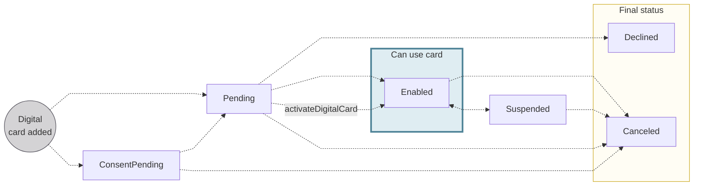

# Digital card statuses

## Status flow {#status-flow}

## Status definitions {#status-definitions}

| Digital card status | Explanation |
|---|---|
| `ConsentPending` | Request to add a digital card was sent with the `addDigitalCard` mutation and is waiting for the cardholder's consent  **Next steps**:<ul><li>If the cardholder consents, the status moves to `Pending`</li><li>If the cardholder doesn't consent, the status moves to `Canceled`</li><li>If you use the API to cancel the card, the status moves to `Canceled`</li></ul> |
| `Pending` | Cardholder added the card to their digital wallet manually, or they provided consent after you added the card with the API  **Next steps**:<ul><li>If the card is added to their wallet successfully, the status moves to `Enabled`</li><li>If the card is declined during provisioning, the status moves to `Declined`</li><li>You can use the `activateDigitalCard` mutation to help complete the provisioning process</li></ul> |
| `Enabled` | Digital card is available for use  **Next steps**:<ul><li>Cards can retain the status `Enabled` indefinitely</li><li>`Enabled` cards can also be `Suspended` and `Canceled`</li></ul> |
| `Suspended` | Digital card is suspended and not available for use  *Cards can be suspended for various reasons, including a request from you or the cardholder, or a Swan action in the case of suspicious activity.*  **Next steps**:<ul><li>Restore the card's previous status with the API</li><li>Cancel the card with the API</li></ul> |
| `Canceled` | Card is canceled, no longer available for use, and can't be reactivated |
| `Declined` | Card was declined during the provisioning process |

:::tip Transitioning from Manual to In-App Provisioning
If a digital card is stuck in `Pending` status after manual provisioning (for example, the cardholder didn't complete OTP verification), you can use the `activateDigitalCard` mutation to help them complete the process without restarting. Learn more in the [transitioning from manual to in-app provisioning guide](/cards/guides/digital/add#manual-to-inapp).
:::
