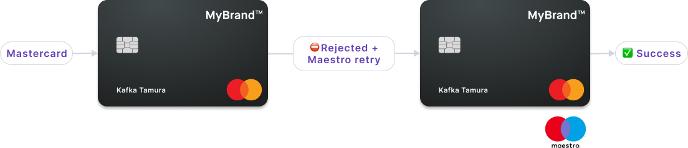

# Delivery and shipping

How printed cards reach cardholders: the delivery address, Swan's France and Spain printing hubs, and the Netherlands Maestro fallback.

When [printing physical cards](/cards/guides/physical/print) with the `printPhysicalCard`, `addCards`, and `addCardsWithGroupDelivery` mutations, use the [address fields](https://api-reference.swan.io/inputs/complete-address-input/) according to the [delivery address guidelines](/cards/reference/shipping-and-delivery#delivery-address).

## Printing and shipping hubs {#hubs}

Delivery time for physical cards depends on the type of card material you select and your cardholders' location.
It typically takes **2-5 business days** for cards to be delivered.
Please note that the delivery times listed here are estimates and aren't contractual.

Swan has **two printing hubs**: one in France and the other in Spain.
**France is Swan's default hub**.
To **choose the Spain hub**, tell your PIM and they'll configure it.

:::info Two card products
The printing hub is defined in the [card product ID](/cards/concepts/card-products).
If you'd like to ship cards out of both hubs, you need two card products: one with France as the hub, and the other with Spain.
:::

If your cardholder reports not receiving their physical card, please refer them to the [Swan Support Center](https://support.swan.io/hc/en-150/articles/5503032519837).

### 🇫🇷 France hub {#hubs-france}

The France hub prints and ships out of **Dijon, France**, and ships using either **La Poste** (France's postal service) or **DHL**.
The hub has several intended destinations:

- France
- Belgium
- Italy
- Northern Europe
- French overseas departments and territories (DROM-COM):
    - French Southern Territories (ATF), Saint Barthélemy (BLM), Faroe Islands (FRO), Guadeloupe (GLP), French Guiana (GUF), Saint Martin (Dutch part) (MAF), Martinique (MTQ), Mayotte (MYT), New Caledonia (NCL), French Polynesia (PYF), Réunion (REU), Saint Pierre and Miquelon (SPM), and Wallis and Futuna (WLF)

You have the option of **group** or **non-group delivery**.

| Delivery type | Destination | Shipping provider |
| --- | --- | --- |
| Group delivery | All locations | DHL |
| Tracked non-group delivery | France and DROM-COM | La Poste |
| Tracked non-group delivery | Northern Europe and unlisted locations | DHL |
| Untracked non-group delivery | Northern Europe and unlisted locations | La Poste |

### 🇪🇸 Spain hub {#hubs-spain}

The Spain hub prints and ships out of **Madrid, Spain**, and ships using either **Correos** (Spain's postal service) or **Nacex**.
The hub has two intended destinations:

- Spain
- Portugal

You have the option of **group** or **non-group delivery**.

| Delivery type | Destination | Shipping provider |
| --- | --- | --- |
| Group delivery | Spain and Portugal | Nacex ∗ |
| Tracked non-group delivery | Spain and Portugal | Correos |

### Shipping methods {#shipping-methods}

You can set the shipping method for your users' physical cards. To do so, select the `shippingProvider` option in the `physicalCardCustomOptions` input when you [add a card](https://api-reference.swan.io/mutations/add-cards/), or use the [`printPhysicalCard`](https://api-reference.swan.io/mutations/print-physical-card) mutation.

For the list of providers, which hub each one ships from, and compatibility rules, refer to [shipping providers](/cards/reference/shipping-and-delivery#shipping-providers).

## Netherlands Maestro fallback {#maestro}

In the 🇳🇱 Netherlands, some physical card terminals refuse transactions with Mastercard Business cards, but accept Maestro.
Therefore, Swan offers Mastercard cards with Maestro fallback for qualified physical cards.

By default, the Maestro secondary card application is embedded in the physical card's chip as a fallback option when the qualified card is bring printed.
The application isn't visible to cardholders and doesn't impact other card capabilities.

When a terminal refuses the primary Mastercard application but detects the secondary Maestro application, the terminal automatically retries the transaction with Maestro.
Transactions processed with Maestro include the masked Maestro card number in the transaction details and receipts.

The Maestro card number isn't printed on the physical card.
Cardholders can't add the secondary Maestro application to digital wallets, meaning the Maestro application can't be tokenized or digitized.

### Maestro qualifications {#maestro-qualifications}

The Maestro secondary card application is **embedded by default** for qualified cards.
Cards that meet all of the following requirements qualify for Maestro:

1. Available for [company account cards](/accounts/guides/onboarding/company) only.
1. Issued in the Netherlands ([account country](/accounts/concepts/account/country) is the Netherlands).
1. Printed from the [France printing hub](#hubs-france).
1. [Printed](/cards/guides/physical/print) by calling one of the following API mutations: `printPhysicalCard`, `addCards`, or `addCardsWithGroupDelivery`.
1. Design is Swan's [standard black card](/cards/concepts/design#black), or a [custom design](/cards/guides/design/custom) with the plastic component Dual SF42. Standard silver cards aren't eligible for this feature.
