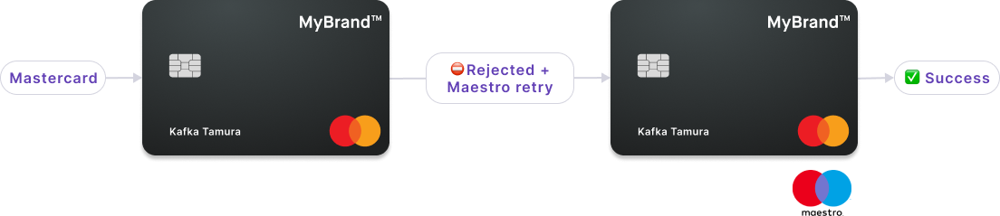

# Netherlands Maestro fallback

A secondary Maestro application embedded in qualified <Term id="cards-physical">physical cards</Term> for the Netherlands, where some terminals refuse Mastercard Business cards.

In the 🇳🇱 Netherlands, some physical card terminals refuse transactions with Mastercard Business cards, but accept Maestro.
So Swan offers Mastercard cards with Maestro fallback for qualified physical cards.

By default, the Maestro secondary card application is embedded in the physical card's chip as a fallback option when the qualified card is being printed.
The application isn't visible to cardholders and doesn't impact other card capabilities.

When a terminal refuses the primary Mastercard application but detects the secondary Maestro application, the terminal automatically retries the transaction with Maestro.
Transactions processed with Maestro include the masked Maestro card number in the transaction details and receipts.

The Maestro card number isn't printed on the physical card.
Cardholders can't add the secondary Maestro application to digital wallets, meaning the Maestro application can't be tokenized or digitized.

## Maestro qualifications {#maestro-qualifications}

The Maestro secondary card application is embedded by default for qualified cards.
Cards that meet all of the following requirements qualify for Maestro:

1. Available for [company account cards](/accounts/guides/onboarding/company) only.
1. Issued in the Netherlands ([account country](/accounts/concepts/account/country) is the Netherlands).
1. Printed from the [France printing hub](/cards/concepts/physical/delivery-and-shipping#hubs-france).
1. [Printed](/cards/guides/physical/print) by calling one of the following API mutations: `printPhysicalCard`, `addCards`, or `addCardsWithGroupDelivery`.
1. Design is Swan's [standard black card](/cards/concepts/design#black), or a [custom design](/cards/guides/design/custom) with the plastic component Dual SF42. Standard silver cards aren't eligible for this feature.
