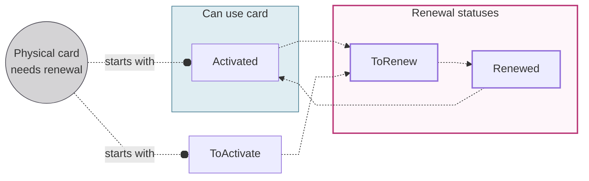

# Renewing physical cards

The automatic 3-year renewal cycle: what changes, the 10-week and 8-week checkpoints, and the renewal statuses.

Physical cards are **renewed automatically** before the expiry date.
By default, cards expire three years after the card is printed, and are renewed for an additional three years.

When a physical card is renewed, the **card numbers**, **CVV**, **identifier**, and **expiry date change**.
The four-digit **PIN doesn't change** for a continuous user experience.
If your user prefers to [choose their PIN](/cards/concepts/physical/pin#pin-choose), they need to [cancel the expiring card](/cards/guides/physical/cancel) and order a new one.
It's not possible to choose a new PIN during renewal.

## Subscriptions {#renew-subscriptions}

After the new card is enabled, Swan uses [Mastercard's Account Billing Updater](https://developer.mastercard.com/product/automatic-billing-updater-abu/) to update the details about the tokenized card.
If a merchant adheres to Mastercard's Account Billing Updater, they receive the tokenized card's updated details automatically through this service.

Therefore, certain existing subscriptions can be transferred to the new card without any action from the cardholder.

## Card delivery {#renew-delivery}

New physical cards are shipped between the eleventh and fifteenth of the month before the card expires.
For example, if the card expires on the **last day of March**, the new card ships between **February 11-15** of the same year.

**Delivery details** are available in the `PhysicalCardRenewedStatus` object.
The estimated delivery date can be found in the `estimatedDeliveryDate` field.
You'll find the carrier and tracking number in the fields `shippingProvider` and `trackingNumber` as soon as they're available.

## Verify delivery address {#renew-address}

**10 weeks before** the original card expires, **verify the delivery address** with your cardholder.

:::info No update provided
If Swan doesn't receive updated address information at least 8 weeks before the card renews, the renewed card is shipped to the same address as the original card.
:::

| Interface | Address update method |
| --- | --- |
| Swan's Web Banking app | Cardholders confirm or update their address in the app at least 8 weeks before renewal. |
| Custom integration | Send the updated address to Swan at least 8 weeks before the card renews.  <ol><li>First, provide a way for your cardholders to verify their address. For example, this could be from your app, with a notification system, or through your own support team.</li><li>Then, send Swan the updated address with the API by calling the `confirmPhysicalCardRenewal` mutation.</li></ol> |

## Card renewal statuses {#renew-statuses}

Two statuses exist that only apply to physical card renewal: `ToRenew` and `Renewed`.

This diagram illustrates how the two renewal statuses interact with the main [physical card statuses](/cards/concepts/physical/statuses).
Note that renewal statuses are only accessed from the statuses `ToActivate` and `Activated`.

| Card renewal status | Explanation |
|---|---|
| `ToRenew` | Triggered **10 weeks before the last day of the card's expiry month**, at midnight Coordinated Universal Time (UTC). This status schedules the renewal. You can stop the process by [canceling](/cards/guides/physical/cancel) the card, which permanently ends the renewal, or by [suspending](#renew-suspended) it, which temporarily pauses the process. The card won't be renewed if it remains `Suspended` past 8 weeks. |
| `Renewed` | Triggered automatically **8 weeks before the last day of the expiry month**, at midnight UTC. At this point, the new card is created and queued for printing. No updates to the delivery address can be made after this status is triggered. Once the status changes to Renewed, the previous card's information is automatically available in the `previousPhysicalCards` field, even if the new card hasn't yet arrived or expired. |

:::info Reference date for renewal checkpoints
Swan calculates the 10-week and 8-week checkpoints from the **last day of the card's expiry month**, not from the date printed on the card.
For example, if a card's expiry date is `10/26`, Swan uses **31 October 2026** as the reference date.
Swan evaluates both checkpoints at **midnight UTC**. There is no grace period.
:::

## Suspended physical cards {#renew-suspended}

The renewal process for a suspended physical card depends on **when the card is resumed**, compared to two renewal checkpoints.
Swan evaluates both checkpoints at midnight UTC, calculated from the last day of the card's expiry month.
- **10 weeks before expiry**: eligible cards move to `ToRenew`. If the card is `Suspended` at this checkpoint, it doesn't move to `ToRenew`, so it doesn't enter the renewal flow.
- **8 weeks before expiry**: cards in `ToRenew` move to `Renewed`. Swan then creates and ships the new card. If the card is `Suspended` at this checkpoint, it doesn't move to `Renewed`.

Between these two checkpoints, you have a 2-week window to [update the delivery address](/cards/guides/physical/renew).

:::warning Renewal status requirement
If a physical card isn't in `ToRenew` by the 8-week checkpoint (midnight UTC), Swan won't issue a new card.
The existing card is canceled when it expires.
There's no way to manually trigger the renewal after this deadline passes.
:::

| Scenario | Physical card status at 10 weeks | Physical card status at 8 weeks | Physical card status at expiry |
|---|---|---|---|
| Suspended and resumed more than **10 weeks** before expiry | `ToRenew` | `Renewed` | `Renewed` |
| Suspended and not resumed more than **10 weeks** before expiry | `Suspended` | `Suspended` | `Canceled` |
| Suspended and resumed between **10 and 8 weeks** before expiry | `ToRenew` | `Renewed` | `Renewed` |
| Suspended and not resumed between **10 and 8 weeks** before expiry | `ToRenew` | `Suspended` | `Canceled` |
| Suspended between **10 and 8 weeks** before expiry and resumed less than **8 weeks** before expiry | `ToRenew` | `Suspended` | `Canceled` |

If a card is already in `Renewed` and is then `Suspended`, **both the existing and new card** will be `Suspended`.
This doesn't affect the shipping of the new card, it will still be sent.
You must resume the new card before it can be `Activated`.

### Example scenario

Sofia Ramos has a physical card with an expiry date of `10/26`. The **reference date** is 31 October 2026 (the last day of the expiry month).

What happens at each checkpoint:

1. 10-week checkpoint (22 August 2026, midnight UTC).
- If the card is `Activated` or `ToActivate`, it moves to `ToRenew`.
- If the card is `Suspended`, it stays `Suspended` and doesn't enter the renewal flow.
2. 8-week checkpoint (5 September 2026, midnight UTC).
- If the card is `ToRenew`, it moves to `Renewed`. Swan creates the new card and starts shipping.
- If the card is `Suspended`, it stays `Suspended` and doesn't renew. The card is canceled when it expires.

**Delivery**: The new card ships between 11-15 September 2026.

:::tip
Subscribe to the `Card.Updated` [webhook](/build/using-api/webhooks#events-cards) to get notified when the card moves to `ToRenew`, giving you time to verify the delivery address with your cardholder.
:::

## Activating the new card {#renew-activate}

After the cardholder makes an in-person transaction with the new card using the Chip and PIN payment method, the new card's status changes from `Renewed` to `Activated`.
You could also [use the API](/cards/guides/physical/activate).

The old card is then marked `isExpired=true` because only one card can be activated at a time.
Details about expired physical cards are available in the `card` query (`card` > `physicalCard` > `previousPhysicalCards`).
