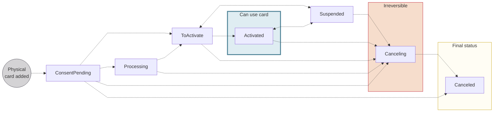

# Physical card statuses

Every physical card moves through the following statuses over its lifetime, from consent through activation, suspension, and cancellation.

## Status flow {#status-flow}

:::warning renewal statuses
The statuses `ToRenew` and `Renewed` don't appear in the status diagram intentionally.
Refer to the [card renewal statuses](/cards/concepts/physical/renewal#renew-statuses) to understand how they interact with the main physical card statuses.
:::

## Status definitions {#status-definitions}

| Physical card status | Explanation |
|---|---|
| `ConsentPending` | Request to print a physical card was received and is waiting for the cardholder's consent.  **Next steps**:<ul><li>If you used the `addCards` mutation and the cardholder consents, the status moves to `Processing`.</li><li>If you used the `printPhysicalCard` mutation and the cardholder consents, the status moves to `Activated`.</li><li>If you cancel the card with the API *before* consent, the status moves to `Canceling`.</li><li>If consent is refused or consent fails, the status moves directly to `Canceled`.</li></ul> |
| `Processing` | The card is in the process of being created with Swan's card issuing provider.  **Next steps**:<ul><li>After the card is created successfully in the card issuing provider's system, the status moves to `ToActivate`.</li><li>If you cancel the card with the API *before* the card issuing provider creates the card, the status moves to `Canceling`.</li></ul> |
| `ToActivate` | The card is being printed by Swan's card issuing provider, then delivered to the cardholder.  After the cardholder receives the physical card, they need to activate it by performing a first transaction and entering the PIN. You can also activate the card with the `activatePhysicalCard` mutation.  **Next steps**:<ul><li>If the cardholder performs the transaction successfully, or you activate the card with the API, the status moves to `Activated`.</li><li>If the cardholder makes **three incorrect attempts** to enter their PIN, the status moves to `Suspended`.</li></ul> |
| `Activated` | Physical card is available for use.  **Next steps**:<ul><li>Cards can retain the status `Activated` until the renewal period.</li><li>`Activated` cards can also be `Suspended` and `Canceled` (example: if three incorrect attempts are made to enter the PIN, the card is automatically `Suspended`).</li></ul> |
| `Suspended`  Also referred to as *Blocked* | Physical card is suspended and not available for use. Cardholders can still view card information and use digital cards (not virtual cards) when a physical card is `Suspended`.  *Cards can be suspended for various reasons, including a request from you or the cardholder, or a Swan action in the case of suspicious activity.*  **Next steps**:<ul><li>Restore the card's previous status with the API.</li><li>Cancel the card with the API.</li></ul> |
| `Canceling` | Card is in the process of being canceled.  **Next steps**: Card is `Canceled`. After a card is assigned the `Canceling` status, the process can't be reversed. |
| `Canceled` | Card is canceled, no longer available for use, and can't be reactivated. |
