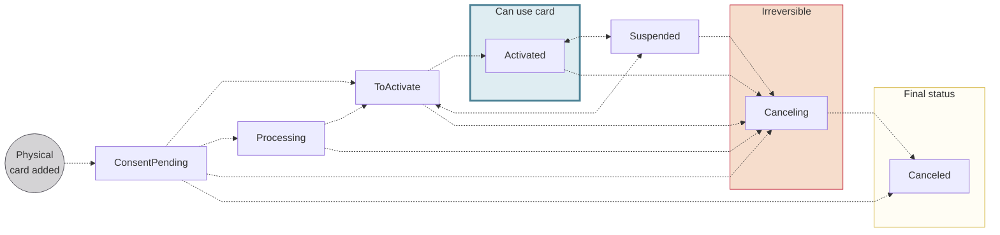
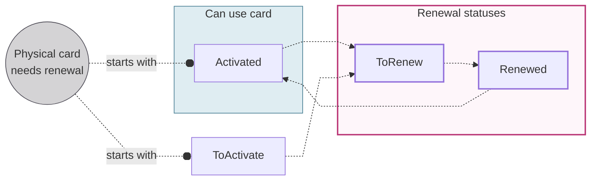

# Physical card statuses

Every <Term id="cards-physical">physical card</Term> moves through the following statuses over its lifetime, from consent through activation, suspension, and cancelation.

## Statuses {#statuses}

```mermaid
%%{ init: { 'flowchart': { 'curve': 'linear' } } }%%
flowchart LR
    PCA((Physical<br/>card added)) -.-> CP[ConsentPending]
    CP -.-> TA
    CP -.-> P[Processing]
    P -.-> TA[ToActivate]
    TA -.-> A[Activated]
    TA <-.-> S
    A <-.-> S[Suspended]
    A -.-> CL
    S -.-> CL[Canceling]
    CL -.-> CD[Canceled]
    CP -.-> CL
    CP -.-> CD
    P -.-> CL
    TA -.-> CL
    subgraph U[Can use card]
        A
    end
    subgraph IR[Irreversible]
        CL
    end
    subgraph F[Final status]
        CD
    end
    style PCA fill:#D4D3D5,stroke:#514F59
    style F fill:#fffdf4,stroke:#cca922
    style U fill:#dfedf2,stroke:#4d8296,stroke-width:3px
    style IR fill:#f6ddcc,stroke:#c12236
```

| Physical card status | Explanation |
|---|---|
| `ConsentPending` | Request to print a physical card was received and is waiting for the cardholder's consent.  **Next steps**:<ul><li>If you used the `addCards` mutation and the cardholder consents, the status moves to `Processing`.</li><li>If you used the `printPhysicalCard` mutation and the cardholder consents, the status moves to `Activated`.</li><li>If you cancel the card with the API **before** consent, the status moves to `Canceling`.</li><li>If consent is refused or consent fails, the status moves directly to `Canceled`.</li></ul> |
| `Processing` | The card is in the process of being created with Swan's card issuing provider.  **Next steps**:<ul><li>After the card is created successfully in the card issuing provider's system, the status moves to `ToActivate`.</li><li>If you cancel the card with the API **before** the card issuing provider creates the card, the status moves to `Canceling`.</li></ul> |
| `ToActivate` | The card is being printed by Swan's card issuing provider, then delivered to the cardholder.  After the cardholder receives the physical card, they need to activate it by performing a first transaction and entering the PIN. You can also activate the card with the `activatePhysicalCard` mutation.  **Next steps**:<ul><li>If the cardholder performs the transaction successfully, or you activate the card with the API, the status moves to `Activated`.</li><li>If the cardholder makes **three incorrect attempts** to enter their PIN, the status moves to `Suspended`.</li></ul> |
| `Activated` | Physical card is available for use.  **Next steps**:<ul><li>Cards can retain the status `Activated` until the renewal period.</li><li>`Activated` cards can also be `Suspended` and `Canceled` (example: if three incorrect attempts are made to enter the PIN, the card is automatically `Suspended`).</li></ul> |
| `Suspended`  Also referred to as "blocked" | Physical card is suspended and not available for use. Cardholders can still view card information and use digital cards (not virtual cards) when a physical card is `Suspended`.  Cards can be suspended for various reasons, including a request from you or the cardholder, or a Swan action in the case of suspicious activity.  **Next steps**:<ul><li>Restore the card's previous status with the API.</li><li>Cancel the card with the API.</li></ul> |
| `Canceling` | Card is in the process of being canceled.  **Next steps**: Card is `Canceled`. After a card is assigned the `Canceling` status, the process can't be reversed. |
| `Canceled` | Card is canceled, no longer available for use, and can't be reactivated. |

## Renewal statuses {#renew-statuses}

Two statuses exist that only apply to [physical card renewal](/cards/concepts/physical/renewal): `ToRenew` and `Renewed`.

This diagram illustrates how the two renewal statuses interact with the main physical card statuses.
Renewal statuses are only accessed from the statuses `ToActivate` and `Activated`.

```mermaid
%%{ init: { 'flowchart': { 'curve': 'linear' } } }%%
flowchart LR
    PCNR((Physical card<br/>needs renewal)) -.starts with.-o A[Activated]
    PCNR -.starts with.-o TA
    A -.-> TR[ToRenew]
    TR -.-> R[Renewed]
    R -.-> A
    TA[ToActivate] -.-> TR
    subgraph U[Can use card]
        A
    end
    subgraph RS[Renewal statuses]
        TR
        R
    end
    style PCNR fill:#D4D3D5,stroke:#514F59
    style RS fill:#fef6fa,stroke:#ba3676,stroke-width:2px
    style U fill:#dfedf2,stroke:#4d8296
    style TR stroke-width:2px
    style R stroke-width:2px
```

| Card renewal status | Explanation |
|---|---|
| `ToRenew` | Triggered **10 weeks before the last day of the card's expiry month**, at midnight Coordinated Universal Time (UTC). This status schedules the renewal. You can stop the process by [canceling](/cards/guides/physical/cancel) the card, which permanently ends the renewal, by calling the [`cancelPhysicalCardRenewal` mutation](/cards/guides/physical/renew#cancel-renewal), which lets the card stay active until it expires without being renewed, or by [suspending](#renew-suspended) it, which temporarily pauses the process. The card won't be renewed if it remains `Suspended` past 8 weeks. |
| `Renewed` | Triggered automatically **8 weeks before the last day of the expiry month**, at midnight UTC. At this point, the new card is created and queued for printing. No updates to the delivery address can be made after this status is triggered. Once the status changes to `Renewed`, the previous card's information is automatically available in the `previousPhysicalCards` field, even if the new card hasn't yet arrived or expired. |

:::info Reference date for renewal checkpoints
Swan calculates the 10-week and 8-week checkpoints from the **last day of the card's expiry month**, not from the date printed on the card.
For example, if a card's expiry date is `10/26`, Swan uses **31 October 2026** as the reference date.
Swan evaluates both checkpoints at **midnight UTC**. There is no grace period.
:::

## Suspended cards and renewal {#renew-suspended}

The renewal process for a suspended physical card depends on **when the card is resumed**, compared to two renewal checkpoints.
Swan evaluates both checkpoints at midnight UTC, calculated from the last day of the card's expiry month.
- **10 weeks before expiry**: eligible cards move to `ToRenew`. If the card is `Suspended` at this checkpoint, it doesn't move to `ToRenew`, so it doesn't enter the renewal flow.
- **8 weeks before expiry**: cards in `ToRenew` move to `Renewed`. Swan then creates and ships the new card. If the card is `Suspended` at this checkpoint, it doesn't move to `Renewed`.

Between these two checkpoints, you have a 2-week window to [update the delivery address](/cards/guides/physical/renew).

:::warning Renewal status requirement
If a physical card isn't in `ToRenew` by the 8-week checkpoint (midnight UTC), Swan won't issue a new card.
The existing card is canceled when it expires.
There's no way to manually trigger the renewal after this deadline passes.
:::

| Scenario | Physical card status at 10 weeks | Physical card status at 8 weeks | Physical card status at expiry |
|---|---|---|---|
| Suspended and resumed more than **10 weeks** before expiry | `ToRenew` | `Renewed` | `Renewed` |
| Suspended and not resumed more than **10 weeks** before expiry | `Suspended` | `Suspended` | `Canceled` |
| Suspended and resumed between **10 and 8 weeks** before expiry | `ToRenew` | `Renewed` | `Renewed` |
| Suspended and not resumed between **10 and 8 weeks** before expiry | `ToRenew` | `Suspended` | `Canceled` |
| Suspended between **10 and 8 weeks** before expiry and resumed less than **8 weeks** before expiry | `ToRenew` | `Suspended` | `Canceled` |

If a card is already in `Renewed` and is then `Suspended`, **both the existing and new card** will be `Suspended`.
This doesn't affect the shipping of the new card. It's still sent.
You must resume the new card before it can be `Activated`.

### Example scenario {#renew-example}

Sofia Ramos has a physical card with an expiry date of `10/26`. The **reference date** is 31 October 2026 (the last day of the expiry month).

What happens at each checkpoint:

1. 10-week checkpoint (22 August 2026, midnight UTC).
    - If the card is `Activated` or `ToActivate`, it moves to `ToRenew`.
    - If the card is `Suspended`, it stays `Suspended` and doesn't enter the renewal flow.
2. 8-week checkpoint (5 September 2026, midnight UTC).
    - If the card is `ToRenew`, it moves to `Renewed`. Swan creates the new card and starts shipping.
    - If the card is `Suspended`, it stays `Suspended` and doesn't renew. The card is canceled when it expires.

**Delivery**: The new card ships between 11-15 September 2026.

For the full renewal process, including delivery windows and address verification, refer to the [renewal concept](/cards/concepts/physical/renewal).
