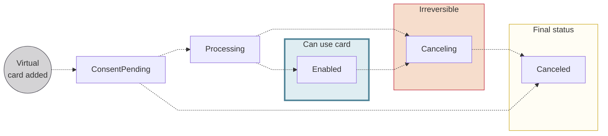

# Virtual card statuses

*These statuses also represent the status of the Swan card contract.*

## Status flow {#status-flow}

## Status definitions {#status-definitions}

| Virtual card status | Explanation |
|---|---|
| `ConsentPending` | Virtual card was added and is waiting for the cardholder's consent.  **Next steps**:<ul><li>If consent is refused or fails, the status moves directly to `Canceled`.</li><li>Otherwise, the status moves to `Processing`.</li></ul> |
| `Processing` | Consent has been received and the card is being prepared. This status only applies when adding multiple virtual cards (`addCards` mutation). |
| `Enabled` | Virtual card is available for use. |
| `Canceling` | Card is in the process of being canceled. After a card is assigned the `Canceling` status, the process can't be reversed. |
| `Canceled` | Card is canceled, no longer available for use, and can't be re-enabled. |
